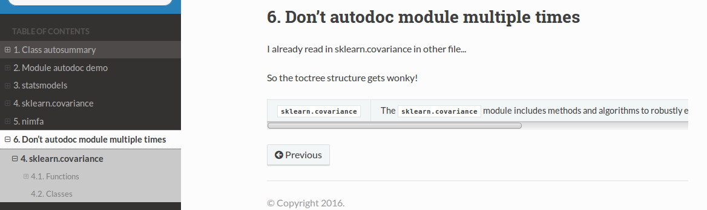
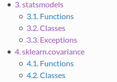
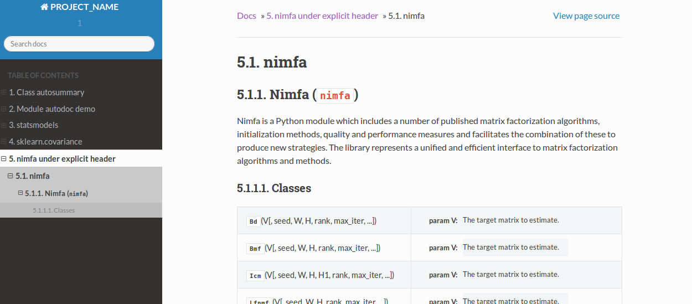

Skeleton for creating documentations using Sphinx.

.. code-block:: bash

    sphinx-quickstart --quiet --sep --project=PROJNAME --author=WWW -v 1 --ext-autodoc --ext-mathjax --no-batchfile 

############
Some caveats
############

Don't include autosummary of the same module/class/function in different rst files (messes up the toctree structure on the sidebar)

So for example, don't have this code-block at two different files:

**(but then again, it's only the toc-counter that gets messed up...)

.. code-block:: rst

    .. autosummary::
       :toctree: generated/
       :template: module_custom.rst

       sklearn.cluster

################
Header structure
################

*****
demo1
*****
The top-level toctree counter can be incremented with a single rst file.

For instance, having below gives toctree structure like this:

.. code-block:: rst

    .. autosummary::
       :toctree: generated/
       :template: module_custom.rst

       statsmodels

    .. autosummary::
       :toctree: generated/
       :template: module_custom.rst

       sklearn.covariance

*****
demo2
*****
Sometimes, having an explicit heading in an rst file creates redundant heading
level.

We get something like this using an rst file like below:

.. code-block:: rst

    ################################
    nimfa under explicit header
    ################################
    Demo of compiling docstring for entire module

    Also interested in seeing the TOC structure on the sidebar.

    .. autosummary::
       :toctree: generated/
       :template: module_custom.rst

       nimfa

    .. don't include statsmodel again here if statsmodel is already in the toctree...
       messes up the toctree structure...(the siderbar gets wonky)