Ch2 Introduction to R
"""""""""""""""""""""
The source R script available :download:`here <ch2.R>`

.. include:: /table-template-knitr.rst

.. contents:: `Contents`
    :depth: 2
    :local:

Codes from http://www-bcf.usc.edu/~gareth/ISL/All%20Labs.txt

.. code-block:: R

    options(show.error.locations = TRUE)

Basic Commands
==============

.. code-block:: R

    x <- c(1,3,2,5)
    x

::

    ## [1] 1 3 2 5

.. code-block:: R

    x = c(1,6,2)
    x

::

    ## [1] 1 6 2

.. code-block:: R

    y = c(1,4,3)
    length(x)

::

    ## [1] 3

.. code-block:: R

    length(y)

::

    ## [1] 3

.. code-block:: R

    x+y

::

    ## [1]  2 10  5

.. code-block:: R

    ls()

::

    ## [1] "x" "y"

.. code-block:: R

    rm(x,y)
    ls()

::

    ## character(0)

.. code-block:: R

    rm(list=ls())
    ?matrix

::

    ## starting httpd help server ...

::

    ##  done

.. code-block:: R

    x=matrix(data=c(1,2,3,4), nrow=2, ncol=2)
    x

::

    ##      [,1] [,2]
    ## [1,]    1    3
    ## [2,]    2    4

.. code-block:: R

    x=matrix(c(1,2,3,4),2,2)
    matrix(c(1,2,3,4),2,2,byrow=TRUE)

::

    ##      [,1] [,2]
    ## [1,]    1    2
    ## [2,]    3    4

.. code-block:: R

    sqrt(x)

::

    ##          [,1]     [,2]
    ## [1,] 1.000000 1.732051
    ## [2,] 1.414214 2.000000

.. code-block:: R

    x^2

::

    ##      [,1] [,2]
    ## [1,]    1    9
    ## [2,]    4   16

.. code-block:: R

    x=rnorm(50)
    y=x+rnorm(50,mean=50,sd=.1)
    cor(x,y)

::

    ## [1] 0.992221

.. code-block:: R

    set.seed(1303)
    rnorm(50)

::

    ##  [1] -1.1439763145  1.3421293656  2.1853904757  0.5363925179  0.0631929665
    ##  [6]  0.5022344825 -0.0004167247  0.5658198405 -0.5725226890 -1.1102250073
    ## [11] -0.0486871234 -0.6956562176  0.8289174803  0.2066528551 -0.2356745091
    ## [16] -0.5563104914 -0.3647543571  0.8623550343 -0.6307715354  0.3136021252
    ## [21] -0.9314953177  0.8238676185  0.5233707021  0.7069214120  0.4202043256
    ## [26] -0.2690521547 -1.5103172999 -0.6902124766 -0.1434719524 -1.0135274099
    ## [31]  1.5732737361  0.0127465055  0.8726470499  0.4220661905 -0.0188157917
    ## [36]  2.6157489689 -0.6931401748 -0.2663217810 -0.7206364412  1.3677342065
    ## [41]  0.2640073322  0.6321868074 -1.3306509858  0.0268888182  1.0406363208
    ## [46]  1.3120237985 -0.0300020767 -0.2500257125  0.0234144857  1.6598706557

.. code-block:: R

    set.seed(3)
    y=rnorm(100)
    mean(y)

::

    ## [1] 0.01103557

.. code-block:: R

    var(y)

::

    ## [1] 0.7328675

.. code-block:: R

    sqrt(var(y))

::

    ## [1] 0.8560768

.. code-block:: R

    sd(y)

::

    ## [1] 0.8560768

Graphics
========

.. code-block:: R

    x=rnorm(100)
    y=rnorm(100)
    plot(x,y)

|image0|\ 

.. code-block:: R

    plot(x,y,xlab="this is the x-axis",ylab="this is the y-axis",main="Plot of X vs Y")

|image1|\ 

.. code-block:: R

    pdf("Figure.pdf")
    plot(x,y,col="green")
    dev.off()

::

    ## png 
    ##   2

.. code-block:: R

    x=seq(1,10)
    x

::

    ##  [1]  1  2  3  4  5  6  7  8  9 10

.. code-block:: R

    x=1:10
    x

::

    ##  [1]  1  2  3  4  5  6  7  8  9 10

.. code-block:: R

    x=seq(-pi,pi,length=50)
    y=x
    f=outer(x,y,function(x,y)cos(y)/(1+x^2))
    contour(x,y,f)
    contour(x,y,f,nlevels=45,add=T)

|image2|\ 

.. code-block:: R

    fa=(f-t(f))/2
    contour(x,y,fa,nlevels=15)

|image3|\ 

.. code-block:: R

    image(x,y,fa)

|image4|\ 

.. code-block:: R

    persp(x,y,fa)

|image5|\ 

.. code-block:: R

    persp(x,y,fa,theta=30)

|image6|\ 

.. code-block:: R

    persp(x,y,fa,theta=30,phi=20)

|image7|\ 

.. code-block:: R

    persp(x,y,fa,theta=30,phi=70)

|image8|\ 

.. code-block:: R

    persp(x,y,fa,theta=30,phi=40)

|image9|\ 

Indexing Data
=============

.. code-block:: R

    A=matrix(1:16,4,4)
    A

::

    ##      [,1] [,2] [,3] [,4]
    ## [1,]    1    5    9   13
    ## [2,]    2    6   10   14
    ## [3,]    3    7   11   15
    ## [4,]    4    8   12   16

.. code-block:: R

    A[2,3]

::

    ## [1] 10

.. code-block:: R

    A[c(1,3),c(2,4)]

::

    ##      [,1] [,2]
    ## [1,]    5   13
    ## [2,]    7   15

.. code-block:: R

    A[1:3,2:4]

::

    ##      [,1] [,2] [,3]
    ## [1,]    5    9   13
    ## [2,]    6   10   14
    ## [3,]    7   11   15

.. code-block:: R

    A[1:2,]

::

    ##      [,1] [,2] [,3] [,4]
    ## [1,]    1    5    9   13
    ## [2,]    2    6   10   14

.. code-block:: R

    A[,1:2]

::

    ##      [,1] [,2]
    ## [1,]    1    5
    ## [2,]    2    6
    ## [3,]    3    7
    ## [4,]    4    8

.. code-block:: R

    A[1,]

::

    ## [1]  1  5  9 13

.. code-block:: R

    A[-c(1,3),]

::

    ##      [,1] [,2] [,3] [,4]
    ## [1,]    2    6   10   14
    ## [2,]    4    8   12   16

.. code-block:: R

    A[-c(1,3),-c(1,3,4)]

::

    ## [1] 6 8

.. code-block:: R

    dim(A)

::

    ## [1] 4 4

Loading Data
============

.. code-block:: R

    Auto=read.table("Auto.data")

    # fix(Auto)
    Auto=read.table("Auto.data",header=T,na.strings="?")

.. code-block:: R

    print(xtable::xtable(head(Auto,n=10)), type='html')

.. raw:: html

   <!-- html table generated in R 3.3.1 by xtable 1.8-2 package -->

.. raw:: html

   <!-- Sat Nov 05 15:57:49 2016 -->

.. raw:: html

   <table border="1">

.. raw:: html

   <tr>

.. raw:: html

   <th>

.. raw:: html

   </th>

.. raw:: html

   <th>

mpg

.. raw:: html

   </th>

.. raw:: html

   <th>

cylinders

.. raw:: html

   </th>

.. raw:: html

   <th>

displacement

.. raw:: html

   </th>

.. raw:: html

   <th>

horsepower

.. raw:: html

   </th>

.. raw:: html

   <th>

weight

.. raw:: html

   </th>

.. raw:: html

   <th>

acceleration

.. raw:: html

   </th>

.. raw:: html

   <th>

year

.. raw:: html

   </th>

.. raw:: html

   <th>

origin

.. raw:: html

   </th>

.. raw:: html

   <th>

name

.. raw:: html

   </th>

.. raw:: html

   </tr>

.. raw:: html

   <tr>

.. raw:: html

   <td align="right">

1

.. raw:: html

   </td>

.. raw:: html

   <td align="right">

18.00

.. raw:: html

   </td>

.. raw:: html

   <td align="right">

8

.. raw:: html

   </td>

.. raw:: html

   <td align="right">

307.00

.. raw:: html

   </td>

.. raw:: html

   <td align="right">

130.00

.. raw:: html

   </td>

.. raw:: html

   <td align="right">

3504.00

.. raw:: html

   </td>

.. raw:: html

   <td align="right">

12.00

.. raw:: html

   </td>

.. raw:: html

   <td align="right">

70

.. raw:: html

   </td>

.. raw:: html

   <td align="right">

1

.. raw:: html

   </td>

.. raw:: html

   <td>

chevrolet chevelle malibu

.. raw:: html

   </td>

.. raw:: html

   </tr>

.. raw:: html

   <tr>

.. raw:: html

   <td align="right">

2

.. raw:: html

   </td>

.. raw:: html

   <td align="right">

15.00

.. raw:: html

   </td>

.. raw:: html

   <td align="right">

8

.. raw:: html

   </td>

.. raw:: html

   <td align="right">

350.00

.. raw:: html

   </td>

.. raw:: html

   <td align="right">

165.00

.. raw:: html

   </td>

.. raw:: html

   <td align="right">

3693.00

.. raw:: html

   </td>

.. raw:: html

   <td align="right">

11.50

.. raw:: html

   </td>

.. raw:: html

   <td align="right">

70

.. raw:: html

   </td>

.. raw:: html

   <td align="right">

1

.. raw:: html

   </td>

.. raw:: html

   <td>

buick skylark 320

.. raw:: html

   </td>

.. raw:: html

   </tr>

.. raw:: html

   <tr>

.. raw:: html

   <td align="right">

3

.. raw:: html

   </td>

.. raw:: html

   <td align="right">

18.00

.. raw:: html

   </td>

.. raw:: html

   <td align="right">

8

.. raw:: html

   </td>

.. raw:: html

   <td align="right">

318.00

.. raw:: html

   </td>

.. raw:: html

   <td align="right">

150.00

.. raw:: html

   </td>

.. raw:: html

   <td align="right">

3436.00

.. raw:: html

   </td>

.. raw:: html

   <td align="right">

11.00

.. raw:: html

   </td>

.. raw:: html

   <td align="right">

70

.. raw:: html

   </td>

.. raw:: html

   <td align="right">

1

.. raw:: html

   </td>

.. raw:: html

   <td>

plymouth satellite

.. raw:: html

   </td>

.. raw:: html

   </tr>

.. raw:: html

   <tr>

.. raw:: html

   <td align="right">

4

.. raw:: html

   </td>

.. raw:: html

   <td align="right">

16.00

.. raw:: html

   </td>

.. raw:: html

   <td align="right">

8

.. raw:: html

   </td>

.. raw:: html

   <td align="right">

304.00

.. raw:: html

   </td>

.. raw:: html

   <td align="right">

150.00

.. raw:: html

   </td>

.. raw:: html

   <td align="right">

3433.00

.. raw:: html

   </td>

.. raw:: html

   <td align="right">

12.00

.. raw:: html

   </td>

.. raw:: html

   <td align="right">

70

.. raw:: html

   </td>

.. raw:: html

   <td align="right">

1

.. raw:: html

   </td>

.. raw:: html

   <td>

amc rebel sst

.. raw:: html

   </td>

.. raw:: html

   </tr>

.. raw:: html

   <tr>

.. raw:: html

   <td align="right">

5

.. raw:: html

   </td>

.. raw:: html

   <td align="right">

17.00

.. raw:: html

   </td>

.. raw:: html

   <td align="right">

8

.. raw:: html

   </td>

.. raw:: html

   <td align="right">

302.00

.. raw:: html

   </td>

.. raw:: html

   <td align="right">

140.00

.. raw:: html

   </td>

.. raw:: html

   <td align="right">

3449.00

.. raw:: html

   </td>

.. raw:: html

   <td align="right">

10.50

.. raw:: html

   </td>

.. raw:: html

   <td align="right">

70

.. raw:: html

   </td>

.. raw:: html

   <td align="right">

1

.. raw:: html

   </td>

.. raw:: html

   <td>

ford torino

.. raw:: html

   </td>

.. raw:: html

   </tr>

.. raw:: html

   <tr>

.. raw:: html

   <td align="right">

6

.. raw:: html

   </td>

.. raw:: html

   <td align="right">

15.00

.. raw:: html

   </td>

.. raw:: html

   <td align="right">

8

.. raw:: html

   </td>

.. raw:: html

   <td align="right">

429.00

.. raw:: html

   </td>

.. raw:: html

   <td align="right">

198.00

.. raw:: html

   </td>

.. raw:: html

   <td align="right">

4341.00

.. raw:: html

   </td>

.. raw:: html

   <td align="right">

10.00

.. raw:: html

   </td>

.. raw:: html

   <td align="right">

70

.. raw:: html

   </td>

.. raw:: html

   <td align="right">

1

.. raw:: html

   </td>

.. raw:: html

   <td>

ford galaxie 500

.. raw:: html

   </td>

.. raw:: html

   </tr>

.. raw:: html

   <tr>

.. raw:: html

   <td align="right">

7

.. raw:: html

   </td>

.. raw:: html

   <td align="right">

14.00

.. raw:: html

   </td>

.. raw:: html

   <td align="right">

8

.. raw:: html

   </td>

.. raw:: html

   <td align="right">

454.00

.. raw:: html

   </td>

.. raw:: html

   <td align="right">

220.00

.. raw:: html

   </td>

.. raw:: html

   <td align="right">

4354.00

.. raw:: html

   </td>

.. raw:: html

   <td align="right">

9.00

.. raw:: html

   </td>

.. raw:: html

   <td align="right">

70

.. raw:: html

   </td>

.. raw:: html

   <td align="right">

1

.. raw:: html

   </td>

.. raw:: html

   <td>

chevrolet impala

.. raw:: html

   </td>

.. raw:: html

   </tr>

.. raw:: html

   <tr>

.. raw:: html

   <td align="right">

8

.. raw:: html

   </td>

.. raw:: html

   <td align="right">

14.00

.. raw:: html

   </td>

.. raw:: html

   <td align="right">

8

.. raw:: html

   </td>

.. raw:: html

   <td align="right">

440.00

.. raw:: html

   </td>

.. raw:: html

   <td align="right">

215.00

.. raw:: html

   </td>

.. raw:: html

   <td align="right">

4312.00

.. raw:: html

   </td>

.. raw:: html

   <td align="right">

8.50

.. raw:: html

   </td>

.. raw:: html

   <td align="right">

70

.. raw:: html

   </td>

.. raw:: html

   <td align="right">

1

.. raw:: html

   </td>

.. raw:: html

   <td>

plymouth fury iii

.. raw:: html

   </td>

.. raw:: html

   </tr>

.. raw:: html

   <tr>

.. raw:: html

   <td align="right">

9

.. raw:: html

   </td>

.. raw:: html

   <td align="right">

14.00

.. raw:: html

   </td>

.. raw:: html

   <td align="right">

8

.. raw:: html

   </td>

.. raw:: html

   <td align="right">

455.00

.. raw:: html

   </td>

.. raw:: html

   <td align="right">

225.00

.. raw:: html

   </td>

.. raw:: html

   <td align="right">

4425.00

.. raw:: html

   </td>

.. raw:: html

   <td align="right">

10.00

.. raw:: html

   </td>

.. raw:: html

   <td align="right">

70

.. raw:: html

   </td>

.. raw:: html

   <td align="right">

1

.. raw:: html

   </td>

.. raw:: html

   <td>

pontiac catalina

.. raw:: html

   </td>

.. raw:: html

   </tr>

.. raw:: html

   <tr>

.. raw:: html

   <td align="right">

10

.. raw:: html

   </td>

.. raw:: html

   <td align="right">

15.00

.. raw:: html

   </td>

.. raw:: html

   <td align="right">

8

.. raw:: html

   </td>

.. raw:: html

   <td align="right">

390.00

.. raw:: html

   </td>

.. raw:: html

   <td align="right">

190.00

.. raw:: html

   </td>

.. raw:: html

   <td align="right">

3850.00

.. raw:: html

   </td>

.. raw:: html

   <td align="right">

8.50

.. raw:: html

   </td>

.. raw:: html

   <td align="right">

70

.. raw:: html

   </td>

.. raw:: html

   <td align="right">

1

.. raw:: html

   </td>

.. raw:: html

   <td>

amc ambassador dpl

.. raw:: html

   </td>

.. raw:: html

   </tr>

.. raw:: html

   </table>

.. code-block:: R

    # fix(Auto)
    Auto=read.csv("Auto.csv",header=T,na.strings="?")

.. code-block:: R

    print(xtable::xtable(head(Auto,n=10)), type='html')

.. raw:: html

   <!-- html table generated in R 3.3.1 by xtable 1.8-2 package -->

.. raw:: html

   <!-- Sat Nov 05 15:57:49 2016 -->

.. raw:: html

   <table border="1">

.. raw:: html

   <tr>

.. raw:: html

   <th>

.. raw:: html

   </th>

.. raw:: html

   <th>

mpg

.. raw:: html

   </th>

.. raw:: html

   <th>

cylinders

.. raw:: html

   </th>

.. raw:: html

   <th>

displacement

.. raw:: html

   </th>

.. raw:: html

   <th>

horsepower

.. raw:: html

   </th>

.. raw:: html

   <th>

weight

.. raw:: html

   </th>

.. raw:: html

   <th>

acceleration

.. raw:: html

   </th>

.. raw:: html

   <th>

year

.. raw:: html

   </th>

.. raw:: html

   <th>

origin

.. raw:: html

   </th>

.. raw:: html

   <th>

name

.. raw:: html

   </th>

.. raw:: html

   </tr>

.. raw:: html

   <tr>

.. raw:: html

   <td align="right">

1

.. raw:: html

   </td>

.. raw:: html

   <td align="right">

18.00

.. raw:: html

   </td>

.. raw:: html

   <td align="right">

8

.. raw:: html

   </td>

.. raw:: html

   <td align="right">

307.00

.. raw:: html

   </td>

.. raw:: html

   <td align="right">

130

.. raw:: html

   </td>

.. raw:: html

   <td align="right">

3504

.. raw:: html

   </td>

.. raw:: html

   <td align="right">

12.00

.. raw:: html

   </td>

.. raw:: html

   <td align="right">

70

.. raw:: html

   </td>

.. raw:: html

   <td align="right">

1

.. raw:: html

   </td>

.. raw:: html

   <td>

chevrolet chevelle malibu

.. raw:: html

   </td>

.. raw:: html

   </tr>

.. raw:: html

   <tr>

.. raw:: html

   <td align="right">

2

.. raw:: html

   </td>

.. raw:: html

   <td align="right">

15.00

.. raw:: html

   </td>

.. raw:: html

   <td align="right">

8

.. raw:: html

   </td>

.. raw:: html

   <td align="right">

350.00

.. raw:: html

   </td>

.. raw:: html

   <td align="right">

165

.. raw:: html

   </td>

.. raw:: html

   <td align="right">

3693

.. raw:: html

   </td>

.. raw:: html

   <td align="right">

11.50

.. raw:: html

   </td>

.. raw:: html

   <td align="right">

70

.. raw:: html

   </td>

.. raw:: html

   <td align="right">

1

.. raw:: html

   </td>

.. raw:: html

   <td>

buick skylark 320

.. raw:: html

   </td>

.. raw:: html

   </tr>

.. raw:: html

   <tr>

.. raw:: html

   <td align="right">

3

.. raw:: html

   </td>

.. raw:: html

   <td align="right">

18.00

.. raw:: html

   </td>

.. raw:: html

   <td align="right">

8

.. raw:: html

   </td>

.. raw:: html

   <td align="right">

318.00

.. raw:: html

   </td>

.. raw:: html

   <td align="right">

150

.. raw:: html

   </td>

.. raw:: html

   <td align="right">

3436

.. raw:: html

   </td>

.. raw:: html

   <td align="right">

11.00

.. raw:: html

   </td>

.. raw:: html

   <td align="right">

70

.. raw:: html

   </td>

.. raw:: html

   <td align="right">

1

.. raw:: html

   </td>

.. raw:: html

   <td>

plymouth satellite

.. raw:: html

   </td>

.. raw:: html

   </tr>

.. raw:: html

   <tr>

.. raw:: html

   <td align="right">

4

.. raw:: html

   </td>

.. raw:: html

   <td align="right">

16.00

.. raw:: html

   </td>

.. raw:: html

   <td align="right">

8

.. raw:: html

   </td>

.. raw:: html

   <td align="right">

304.00

.. raw:: html

   </td>

.. raw:: html

   <td align="right">

150

.. raw:: html

   </td>

.. raw:: html

   <td align="right">

3433

.. raw:: html

   </td>

.. raw:: html

   <td align="right">

12.00

.. raw:: html

   </td>

.. raw:: html

   <td align="right">

70

.. raw:: html

   </td>

.. raw:: html

   <td align="right">

1

.. raw:: html

   </td>

.. raw:: html

   <td>

amc rebel sst

.. raw:: html

   </td>

.. raw:: html

   </tr>

.. raw:: html

   <tr>

.. raw:: html

   <td align="right">

5

.. raw:: html

   </td>

.. raw:: html

   <td align="right">

17.00

.. raw:: html

   </td>

.. raw:: html

   <td align="right">

8

.. raw:: html

   </td>

.. raw:: html

   <td align="right">

302.00

.. raw:: html

   </td>

.. raw:: html

   <td align="right">

140

.. raw:: html

   </td>

.. raw:: html

   <td align="right">

3449

.. raw:: html

   </td>

.. raw:: html

   <td align="right">

10.50

.. raw:: html

   </td>

.. raw:: html

   <td align="right">

70

.. raw:: html

   </td>

.. raw:: html

   <td align="right">

1

.. raw:: html

   </td>

.. raw:: html

   <td>

ford torino

.. raw:: html

   </td>

.. raw:: html

   </tr>

.. raw:: html

   <tr>

.. raw:: html

   <td align="right">

6

.. raw:: html

   </td>

.. raw:: html

   <td align="right">

15.00

.. raw:: html

   </td>

.. raw:: html

   <td align="right">

8

.. raw:: html

   </td>

.. raw:: html

   <td align="right">

429.00

.. raw:: html

   </td>

.. raw:: html

   <td align="right">

198

.. raw:: html

   </td>

.. raw:: html

   <td align="right">

4341

.. raw:: html

   </td>

.. raw:: html

   <td align="right">

10.00

.. raw:: html

   </td>

.. raw:: html

   <td align="right">

70

.. raw:: html

   </td>

.. raw:: html

   <td align="right">

1

.. raw:: html

   </td>

.. raw:: html

   <td>

ford galaxie 500

.. raw:: html

   </td>

.. raw:: html

   </tr>

.. raw:: html

   <tr>

.. raw:: html

   <td align="right">

7

.. raw:: html

   </td>

.. raw:: html

   <td align="right">

14.00

.. raw:: html

   </td>

.. raw:: html

   <td align="right">

8

.. raw:: html

   </td>

.. raw:: html

   <td align="right">

454.00

.. raw:: html

   </td>

.. raw:: html

   <td align="right">

220

.. raw:: html

   </td>

.. raw:: html

   <td align="right">

4354

.. raw:: html

   </td>

.. raw:: html

   <td align="right">

9.00

.. raw:: html

   </td>

.. raw:: html

   <td align="right">

70

.. raw:: html

   </td>

.. raw:: html

   <td align="right">

1

.. raw:: html

   </td>

.. raw:: html

   <td>

chevrolet impala

.. raw:: html

   </td>

.. raw:: html

   </tr>

.. raw:: html

   <tr>

.. raw:: html

   <td align="right">

8

.. raw:: html

   </td>

.. raw:: html

   <td align="right">

14.00

.. raw:: html

   </td>

.. raw:: html

   <td align="right">

8

.. raw:: html

   </td>

.. raw:: html

   <td align="right">

440.00

.. raw:: html

   </td>

.. raw:: html

   <td align="right">

215

.. raw:: html

   </td>

.. raw:: html

   <td align="right">

4312

.. raw:: html

   </td>

.. raw:: html

   <td align="right">

8.50

.. raw:: html

   </td>

.. raw:: html

   <td align="right">

70

.. raw:: html

   </td>

.. raw:: html

   <td align="right">

1

.. raw:: html

   </td>

.. raw:: html

   <td>

plymouth fury iii

.. raw:: html

   </td>

.. raw:: html

   </tr>

.. raw:: html

   <tr>

.. raw:: html

   <td align="right">

9

.. raw:: html

   </td>

.. raw:: html

   <td align="right">

14.00

.. raw:: html

   </td>

.. raw:: html

   <td align="right">

8

.. raw:: html

   </td>

.. raw:: html

   <td align="right">

455.00

.. raw:: html

   </td>

.. raw:: html

   <td align="right">

225

.. raw:: html

   </td>

.. raw:: html

   <td align="right">

4425

.. raw:: html

   </td>

.. raw:: html

   <td align="right">

10.00

.. raw:: html

   </td>

.. raw:: html

   <td align="right">

70

.. raw:: html

   </td>

.. raw:: html

   <td align="right">

1

.. raw:: html

   </td>

.. raw:: html

   <td>

pontiac catalina

.. raw:: html

   </td>

.. raw:: html

   </tr>

.. raw:: html

   <tr>

.. raw:: html

   <td align="right">

10

.. raw:: html

   </td>

.. raw:: html

   <td align="right">

15.00

.. raw:: html

   </td>

.. raw:: html

   <td align="right">

8

.. raw:: html

   </td>

.. raw:: html

   <td align="right">

390.00

.. raw:: html

   </td>

.. raw:: html

   <td align="right">

190

.. raw:: html

   </td>

.. raw:: html

   <td align="right">

3850

.. raw:: html

   </td>

.. raw:: html

   <td align="right">

8.50

.. raw:: html

   </td>

.. raw:: html

   <td align="right">

70

.. raw:: html

   </td>

.. raw:: html

   <td align="right">

1

.. raw:: html

   </td>

.. raw:: html

   <td>

amc ambassador dpl

.. raw:: html

   </td>

.. raw:: html

   </tr>

.. raw:: html

   </table>

.. code-block:: R

    # fix(Auto)
    attach(Auto)
    dim(Auto)

[1] 397 9

.. code-block:: R

    Auto[1:4,]

mpg cylinders displacement horsepower weight acceleration year origin 1
18 8 307 130 3504 12.0 70 1 2 15 8 350 165 3693 11.5 70 1 3 18 8 318 150
3436 11.0 70 1 4 16 8 304 150 3433 12.0 70 1 name 1 chevrolet chevelle
malibu 2 buick skylark 320 3 plymouth satellite 4 amc rebel sst

.. code-block:: R

    Auto=na.omit(Auto)
    dim(Auto)

[1] 392 9

.. code-block:: R

    names(Auto)

| [1] "mpg" "cylinders" "displacement" "horsepower"
| [5] "weight" "acceleration" "year" "origin"
| [9] "name"

Additional Graphical and Numerical Summaries
============================================

.. code-block:: R

    plot(cylinders, mpg)

|image10|\ 

.. code-block:: R

    plot(Auto$cylinders, Auto$mpg)

|image11|\ 

.. code-block:: R

    attach(Auto)

::

    ## The following objects are masked from Auto (pos = 3):
    ## 
    ##     acceleration, cylinders, displacement, horsepower, mpg, name,
    ##     origin, weight, year

.. code-block:: R

    plot(cylinders, mpg)

|image12|\ 

.. code-block:: R

    cylinders=as.factor(cylinders)
    plot(cylinders, mpg)

|image13|\ 

.. code-block:: R

    plot(cylinders, mpg, col="red")

|image14|\ 

.. code-block:: R

    plot(cylinders, mpg, col="red", varwidth=T)

|image15|\ 

.. code-block:: R

    plot(cylinders, mpg, col="red", varwidth=T,horizontal=T)

|image16|\ 

.. code-block:: R

    plot(cylinders, mpg, col="red", varwidth=T, xlab="cylinders", ylab="MPG")

|image17|\ 

.. code-block:: R

    hist(mpg)

|image18|\ 

.. code-block:: R

    hist(mpg,col=2)

|image19|\ 

.. code-block:: R

    hist(mpg,col=2,breaks=15)

|image20|\ 

.. code-block:: R

    pairs(Auto)

|image21|\ 

.. code-block:: R

    pairs(~ mpg + displacement + horsepower + weight + acceleration, Auto)

|image22|\ 

.. code-block:: R

    plot(horsepower,mpg)

|image23|\ 

.. code-block:: R

    # tw: commented this out to create notebook (kinda like ginput from matlab)
    #identify(horsepower,mpg,name)
    summary(Auto)

::

    ##       mpg          cylinders      displacement     horsepower   
    ##  Min.   : 9.00   Min.   :3.000   Min.   : 68.0   Min.   : 46.0  
    ##  1st Qu.:17.00   1st Qu.:4.000   1st Qu.:105.0   1st Qu.: 75.0  
    ##  Median :22.75   Median :4.000   Median :151.0   Median : 93.5  
    ##  Mean   :23.45   Mean   :5.472   Mean   :194.4   Mean   :104.5  
    ##  3rd Qu.:29.00   3rd Qu.:8.000   3rd Qu.:275.8   3rd Qu.:126.0  
    ##  Max.   :46.60   Max.   :8.000   Max.   :455.0   Max.   :230.0  
    ##                                                                 
    ##      weight      acceleration        year           origin     
    ##  Min.   :1613   Min.   : 8.00   Min.   :70.00   Min.   :1.000  
    ##  1st Qu.:2225   1st Qu.:13.78   1st Qu.:73.00   1st Qu.:1.000  
    ##  Median :2804   Median :15.50   Median :76.00   Median :1.000  
    ##  Mean   :2978   Mean   :15.54   Mean   :75.98   Mean   :1.577  
    ##  3rd Qu.:3615   3rd Qu.:17.02   3rd Qu.:79.00   3rd Qu.:2.000  
    ##  Max.   :5140   Max.   :24.80   Max.   :82.00   Max.   :3.000  
    ##                                                                
    ##                  name    
    ##  amc matador       :  5  
    ##  ford pinto        :  5  
    ##  toyota corolla    :  5  
    ##  amc gremlin       :  4  
    ##  amc hornet        :  4  
    ##  chevrolet chevette:  4  
    ##  (Other)           :365

.. code-block:: R

    summary(mpg)

::

    ##    Min. 1st Qu.  Median    Mean 3rd Qu.    Max. 
    ##    9.00   17.00   22.75   23.45   29.00   46.60

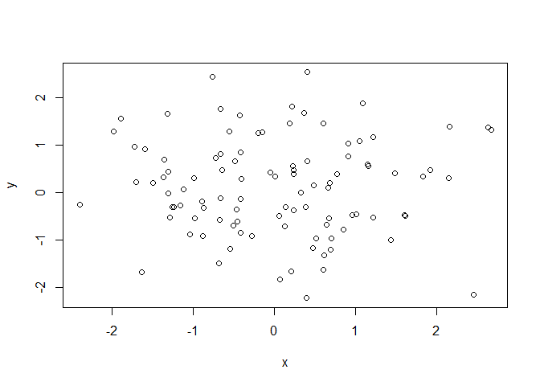
.. |image1| image:: ch2_files/figure-html/unnamed-chunk-3-2.png
.. |image2| image:: ch2_files/figure-html/unnamed-chunk-3-3.png
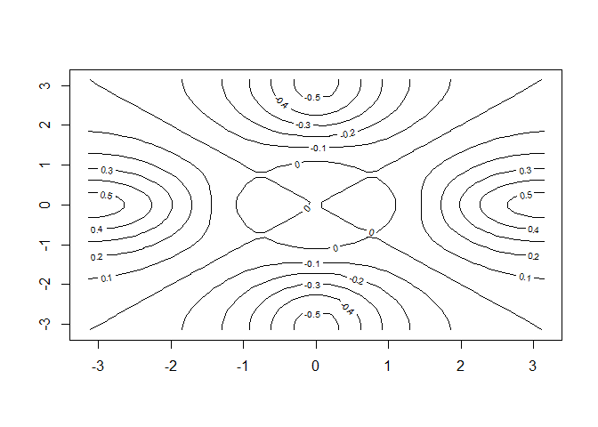
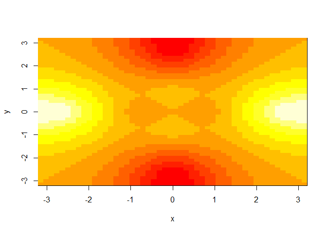
.. |image5| image:: ch2_files/figure-html/unnamed-chunk-3-6.png
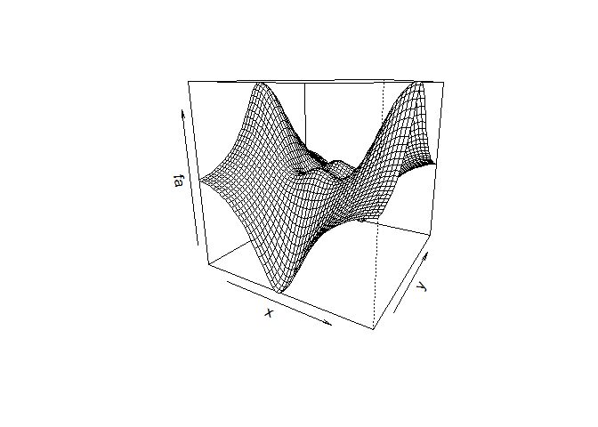
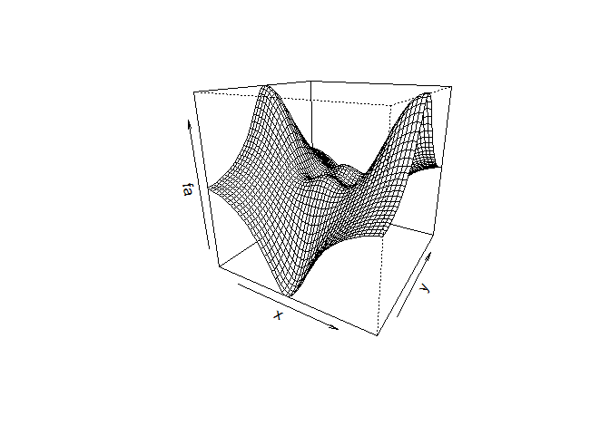
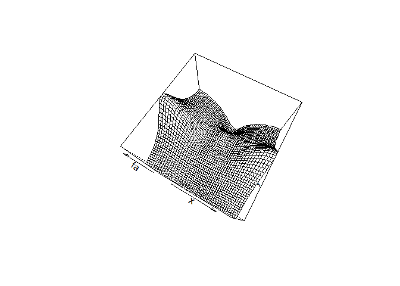
.. |image9| image:: ch2_files/figure-html/unnamed-chunk-3-10.png
.. |image10| image:: ch2_files/figure-html/unnamed-chunk-8-1.png
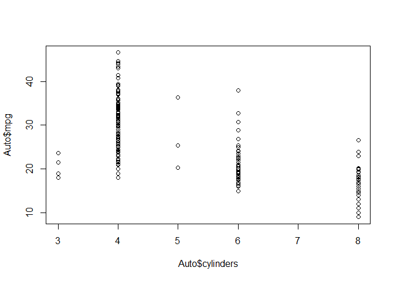
.. |image12| image:: ch2_files/figure-html/unnamed-chunk-8-3.png
.. |image13| image:: ch2_files/figure-html/unnamed-chunk-8-4.png
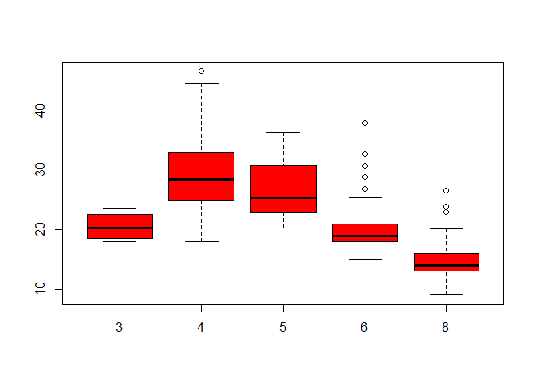
.. |image15| image:: ch2_files/figure-html/unnamed-chunk-8-6.png
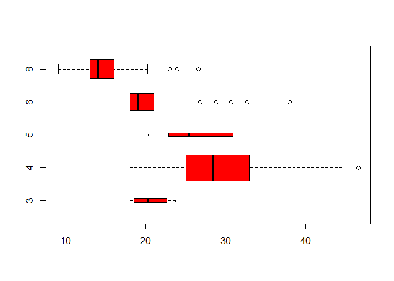
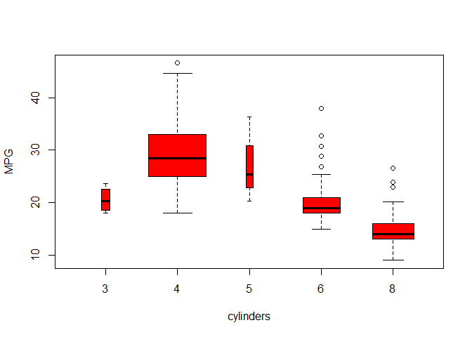
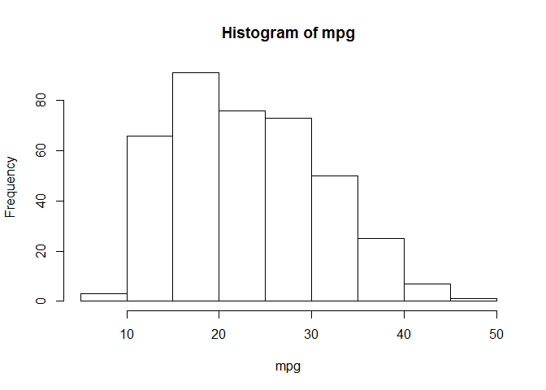
.. |image19| image:: ch2_files/figure-html/unnamed-chunk-8-10.png
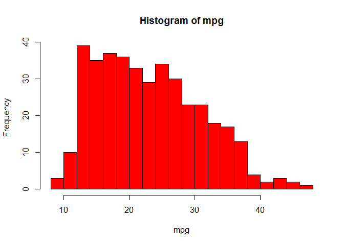
.. |image21| image:: ch2_files/figure-html/unnamed-chunk-8-12.png
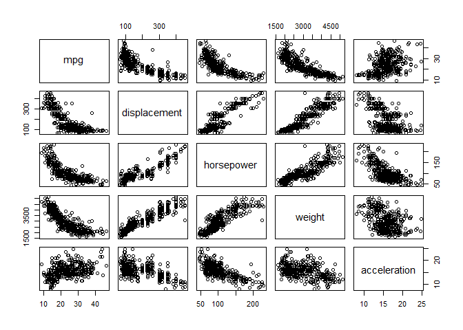
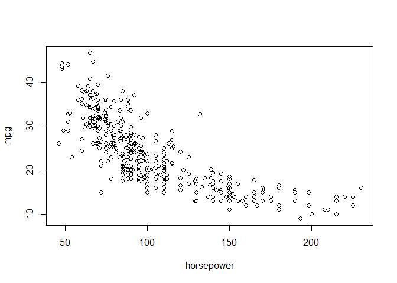

