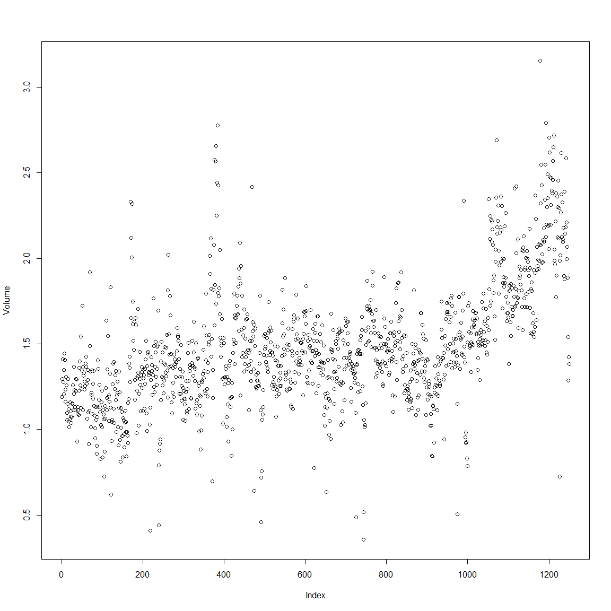

# Ch4 Logistic Regression, LDA, QDA, and KNN

Codes from http://www-bcf.usc.edu/~gareth/ISL/All%20Labs.txt


```r
options(show.error.locations = TRUE)
```

# The Stock Market Data


```r
library(ISLR)
```

```
## Warning: package 'ISLR' was built under R version 3.3.2
```

```r
names(Smarket)
```

```
## [1] "Year"      "Lag1"      "Lag2"      "Lag3"      "Lag4"      "Lag5"     
## [7] "Volume"    "Today"     "Direction"
```

```r
str(Smarket)
```

```
## 'data.frame':	1250 obs. of  9 variables:
##  $ Year     : num  2001 2001 2001 2001 2001 ...
##  $ Lag1     : num  0.381 0.959 1.032 -0.623 0.614 ...
##  $ Lag2     : num  -0.192 0.381 0.959 1.032 -0.623 ...
##  $ Lag3     : num  -2.624 -0.192 0.381 0.959 1.032 ...
##  $ Lag4     : num  -1.055 -2.624 -0.192 0.381 0.959 ...
##  $ Lag5     : num  5.01 -1.055 -2.624 -0.192 0.381 ...
##  $ Volume   : num  1.19 1.3 1.41 1.28 1.21 ...
##  $ Today    : num  0.959 1.032 -0.623 0.614 0.213 ...
##  $ Direction: Factor w/ 2 levels "Down","Up": 2 2 1 2 2 2 1 2 2 2 ...
```

```r
dim(Smarket)
```

```
## [1] 1250    9
```

```r
print(xtable::xtable(head(Smarket,n=10)), type='html')
```

<!-- html table generated in R 3.3.1 by xtable 1.8-2 package -->
<!-- Sat Nov 05 17:25:59 2016 -->
<table border=1>
<tr> <th>  </th> <th> Year </th> <th> Lag1 </th> <th> Lag2 </th> <th> Lag3 </th> <th> Lag4 </th> <th> Lag5 </th> <th> Volume </th> <th> Today </th> <th> Direction </th>  </tr>
  <tr> <td align="right"> 1 </td> <td align="right"> 2001.00 </td> <td align="right"> 0.38 </td> <td align="right"> -0.19 </td> <td align="right"> -2.62 </td> <td align="right"> -1.05 </td> <td align="right"> 5.01 </td> <td align="right"> 1.19 </td> <td align="right"> 0.96 </td> <td> Up </td> </tr>
  <tr> <td align="right"> 2 </td> <td align="right"> 2001.00 </td> <td align="right"> 0.96 </td> <td align="right"> 0.38 </td> <td align="right"> -0.19 </td> <td align="right"> -2.62 </td> <td align="right"> -1.05 </td> <td align="right"> 1.30 </td> <td align="right"> 1.03 </td> <td> Up </td> </tr>
  <tr> <td align="right"> 3 </td> <td align="right"> 2001.00 </td> <td align="right"> 1.03 </td> <td align="right"> 0.96 </td> <td align="right"> 0.38 </td> <td align="right"> -0.19 </td> <td align="right"> -2.62 </td> <td align="right"> 1.41 </td> <td align="right"> -0.62 </td> <td> Down </td> </tr>
  <tr> <td align="right"> 4 </td> <td align="right"> 2001.00 </td> <td align="right"> -0.62 </td> <td align="right"> 1.03 </td> <td align="right"> 0.96 </td> <td align="right"> 0.38 </td> <td align="right"> -0.19 </td> <td align="right"> 1.28 </td> <td align="right"> 0.61 </td> <td> Up </td> </tr>
  <tr> <td align="right"> 5 </td> <td align="right"> 2001.00 </td> <td align="right"> 0.61 </td> <td align="right"> -0.62 </td> <td align="right"> 1.03 </td> <td align="right"> 0.96 </td> <td align="right"> 0.38 </td> <td align="right"> 1.21 </td> <td align="right"> 0.21 </td> <td> Up </td> </tr>
  <tr> <td align="right"> 6 </td> <td align="right"> 2001.00 </td> <td align="right"> 0.21 </td> <td align="right"> 0.61 </td> <td align="right"> -0.62 </td> <td align="right"> 1.03 </td> <td align="right"> 0.96 </td> <td align="right"> 1.35 </td> <td align="right"> 1.39 </td> <td> Up </td> </tr>
  <tr> <td align="right"> 7 </td> <td align="right"> 2001.00 </td> <td align="right"> 1.39 </td> <td align="right"> 0.21 </td> <td align="right"> 0.61 </td> <td align="right"> -0.62 </td> <td align="right"> 1.03 </td> <td align="right"> 1.45 </td> <td align="right"> -0.40 </td> <td> Down </td> </tr>
  <tr> <td align="right"> 8 </td> <td align="right"> 2001.00 </td> <td align="right"> -0.40 </td> <td align="right"> 1.39 </td> <td align="right"> 0.21 </td> <td align="right"> 0.61 </td> <td align="right"> -0.62 </td> <td align="right"> 1.41 </td> <td align="right"> 0.03 </td> <td> Up </td> </tr>
  <tr> <td align="right"> 9 </td> <td align="right"> 2001.00 </td> <td align="right"> 0.03 </td> <td align="right"> -0.40 </td> <td align="right"> 1.39 </td> <td align="right"> 0.21 </td> <td align="right"> 0.61 </td> <td align="right"> 1.16 </td> <td align="right"> 1.30 </td> <td> Up </td> </tr>
  <tr> <td align="right"> 10 </td> <td align="right"> 2001.00 </td> <td align="right"> 1.30 </td> <td align="right"> 0.03 </td> <td align="right"> -0.40 </td> <td align="right"> 1.39 </td> <td align="right"> 0.21 </td> <td align="right"> 1.23 </td> <td align="right"> 0.29 </td> <td> Up </td> </tr>
   </table>

```r
summary(Smarket)
```

      Year           Lag1                Lag2          
 Min.   :2001   Min.   :-4.922000   Min.   :-4.922000  
 1st Qu.:2002   1st Qu.:-0.639500   1st Qu.:-0.639500  
 Median :2003   Median : 0.039000   Median : 0.039000  
 Mean   :2003   Mean   : 0.003834   Mean   : 0.003919  
 3rd Qu.:2004   3rd Qu.: 0.596750   3rd Qu.: 0.596750  
 Max.   :2005   Max.   : 5.733000   Max.   : 5.733000  
      Lag3                Lag4                Lag5         
 Min.   :-4.922000   Min.   :-4.922000   Min.   :-4.92200  
 1st Qu.:-0.640000   1st Qu.:-0.640000   1st Qu.:-0.64000  
 Median : 0.038500   Median : 0.038500   Median : 0.03850  
 Mean   : 0.001716   Mean   : 0.001636   Mean   : 0.00561  
 3rd Qu.: 0.596750   3rd Qu.: 0.596750   3rd Qu.: 0.59700  
 Max.   : 5.733000   Max.   : 5.733000   Max.   : 5.73300  
     Volume           Today           Direction 
 Min.   :0.3561   Min.   :-4.922000   Down:602  
 1st Qu.:1.2574   1st Qu.:-0.639500   Up  :648  
 Median :1.4229   Median : 0.038500             
 Mean   :1.4783   Mean   : 0.003138             
 3rd Qu.:1.6417   3rd Qu.: 0.596750             
 Max.   :3.1525   Max.   : 5.733000             

```r
pairs(Smarket)
```

<!-- -->

```r
lattice::splom(Smarket,group=Smarket$Year,alpha=0.05)
```

<!-- -->

```r
#cor(Smarket) #<- won't work, cuz it has a `Factor` column "Direction")
cor(Smarket[,-9]) # <- so drop that column
```

```
##              Year         Lag1         Lag2         Lag3         Lag4
## Year   1.00000000  0.029699649  0.030596422  0.033194581  0.035688718
## Lag1   0.02969965  1.000000000 -0.026294328 -0.010803402 -0.002985911
## Lag2   0.03059642 -0.026294328  1.000000000 -0.025896670 -0.010853533
## Lag3   0.03319458 -0.010803402 -0.025896670  1.000000000 -0.024051036
## Lag4   0.03568872 -0.002985911 -0.010853533 -0.024051036  1.000000000
## Lag5   0.02978799 -0.005674606 -0.003557949 -0.018808338 -0.027083641
## Volume 0.53900647  0.040909908 -0.043383215 -0.041823686 -0.048414246
## Today  0.03009523 -0.026155045 -0.010250033 -0.002447647 -0.006899527
##                Lag5      Volume        Today
## Year    0.029787995  0.53900647  0.030095229
## Lag1   -0.005674606  0.04090991 -0.026155045
## Lag2   -0.003557949 -0.04338321 -0.010250033
## Lag3   -0.018808338 -0.04182369 -0.002447647
## Lag4   -0.027083641 -0.04841425 -0.006899527
## Lag5    1.000000000 -0.02200231 -0.034860083
## Volume -0.022002315  1.00000000  0.014591823
## Today  -0.034860083  0.01459182  1.000000000
```

```r
attach(Smarket)
plot(Volume)
```

<!-- -->

# Logistic Regression


```r
glm.fit=glm(Direction~Lag1+Lag2+Lag3+Lag4+Lag5+Volume,data=Smarket,family=binomial)
summary(glm.fit)
```

```
## 
## Call:
## glm(formula = Direction ~ Lag1 + Lag2 + Lag3 + Lag4 + Lag5 + 
##     Volume, family = binomial, data = Smarket)
## 
## Deviance Residuals: 
##    Min      1Q  Median      3Q     Max  
## -1.446  -1.203   1.065   1.145   1.326  
## 
## Coefficients:
##              Estimate Std. Error z value Pr(>|z|)
## (Intercept) -0.126000   0.240736  -0.523    0.601
## Lag1        -0.073074   0.050167  -1.457    0.145
## Lag2        -0.042301   0.050086  -0.845    0.398
## Lag3         0.011085   0.049939   0.222    0.824
## Lag4         0.009359   0.049974   0.187    0.851
## Lag5         0.010313   0.049511   0.208    0.835
## Volume       0.135441   0.158360   0.855    0.392
## 
## (Dispersion parameter for binomial family taken to be 1)
## 
##     Null deviance: 1731.2  on 1249  degrees of freedom
## Residual deviance: 1727.6  on 1243  degrees of freedom
## AIC: 1741.6
## 
## Number of Fisher Scoring iterations: 3
```

```r
coef(glm.fit)
```

```
##  (Intercept)         Lag1         Lag2         Lag3         Lag4 
## -0.126000257 -0.073073746 -0.042301344  0.011085108  0.009358938 
##         Lag5       Volume 
##  0.010313068  0.135440659
```

```r
summary(glm.fit)$coef
```

```
##                 Estimate Std. Error    z value  Pr(>|z|)
## (Intercept) -0.126000257 0.24073574 -0.5233966 0.6006983
## Lag1        -0.073073746 0.05016739 -1.4565986 0.1452272
## Lag2        -0.042301344 0.05008605 -0.8445733 0.3983491
## Lag3         0.011085108 0.04993854  0.2219750 0.8243333
## Lag4         0.009358938 0.04997413  0.1872757 0.8514445
## Lag5         0.010313068 0.04951146  0.2082966 0.8349974
## Volume       0.135440659 0.15835970  0.8552723 0.3924004
```

```r
summary(glm.fit)$coef[,4]
```

```
## (Intercept)        Lag1        Lag2        Lag3        Lag4        Lag5 
##   0.6006983   0.1452272   0.3983491   0.8243333   0.8514445   0.8349974 
##      Volume 
##   0.3924004
```

```r
glm.probs=predict(glm.fit,type="response")
glm.probs[1:10]
```

```
##         1         2         3         4         5         6         7 
## 0.5070841 0.4814679 0.4811388 0.5152224 0.5107812 0.5069565 0.4926509 
##         8         9        10 
## 0.5092292 0.5176135 0.4888378
```

```r
contrasts(Direction)
```

```
##      Up
## Down  0
## Up    1
```

```r
glm.pred=rep("Down",1250)
glm.pred[glm.probs>.5]="Up"
table(glm.pred,Direction)
```

```
##         Direction
## glm.pred Down  Up
##     Down  145 141
##     Up    457 507
```

```r
(507+145)/1250
```

```
## [1] 0.5216
```

```r
mean(glm.pred==Direction)
```

```
## [1] 0.5216
```

```r
train=(Year<2005)
Smarket.2005=Smarket[!train,]
dim(Smarket.2005)
```

```
## [1] 252   9
```

```r
Direction.2005=Direction[!train]
glm.fit=glm(Direction~Lag1+Lag2+Lag3+Lag4+Lag5+Volume,data=Smarket,family=binomial,subset=train)
glm.probs=predict(glm.fit,Smarket.2005,type="response")
glm.pred=rep("Down",252)
glm.pred[glm.probs>.5]="Up"
table(glm.pred,Direction.2005)
```

```
##         Direction.2005
## glm.pred Down Up
##     Down   77 97
##     Up     34 44
```

```r
mean(glm.pred==Direction.2005)
```

```
## [1] 0.4801587
```

```r
mean(glm.pred!=Direction.2005)
```

```
## [1] 0.5198413
```

```r
glm.fit=glm(Direction~Lag1+Lag2,data=Smarket,family=binomial,subset=train)
glm.probs=predict(glm.fit,Smarket.2005,type="response")
glm.pred=rep("Down",252)
glm.pred[glm.probs>.5]="Up"
table(glm.pred,Direction.2005)
```

```
##         Direction.2005
## glm.pred Down  Up
##     Down   35  35
##     Up     76 106
```

```r
mean(glm.pred==Direction.2005)
```

```
## [1] 0.5595238
```

```r
106/(106+76)
```

```
## [1] 0.5824176
```

```r
predict(glm.fit,newdata=data.frame(Lag1=c(1.2,1.5),Lag2=c(1.1,-0.8)),type="response")
```

```
##         1         2 
## 0.4791462 0.4960939
```

# Linear Discriminant Analysis


```r
library(MASS)
lda.fit=lda(Direction~Lag1+Lag2,data=Smarket,subset=train)
lda.fit
```

```
## Call:
## lda(Direction ~ Lag1 + Lag2, data = Smarket, subset = train)
## 
## Prior probabilities of groups:
##     Down       Up 
## 0.491984 0.508016 
## 
## Group means:
##             Lag1        Lag2
## Down  0.04279022  0.03389409
## Up   -0.03954635 -0.03132544
## 
## Coefficients of linear discriminants:
##             LD1
## Lag1 -0.6420190
## Lag2 -0.5135293
```

```r
plot(lda.fit)
```

<!-- -->

```r
lda.pred=predict(lda.fit, Smarket.2005)
names(lda.pred)
```

```
## [1] "class"     "posterior" "x"
```

```r
lda.class=lda.pred$class
table(lda.class,Direction.2005)
```

```
##          Direction.2005
## lda.class Down  Up
##      Down   35  35
##      Up     76 106
```

```r
mean(lda.class==Direction.2005)
```

```
## [1] 0.5595238
```

```r
sum(lda.pred$posterior[,1]>=.5)
```

```
## [1] 70
```

```r
sum(lda.pred$posterior[,1]<.5)
```

```
## [1] 182
```

```r
lda.pred$posterior[1:20,1]
```

```
##       999      1000      1001      1002      1003      1004      1005 
## 0.4901792 0.4792185 0.4668185 0.4740011 0.4927877 0.4938562 0.4951016 
##      1006      1007      1008      1009      1010      1011      1012 
## 0.4872861 0.4907013 0.4844026 0.4906963 0.5119988 0.4895152 0.4706761 
##      1013      1014      1015      1016      1017      1018 
## 0.4744593 0.4799583 0.4935775 0.5030894 0.4978806 0.4886331
```

```r
lda.class[1:20]
```

```
##  [1] Up   Up   Up   Up   Up   Up   Up   Up   Up   Up   Up   Down Up   Up  
## [15] Up   Up   Up   Down Up   Up  
## Levels: Down Up
```

```r
sum(lda.pred$posterior[,1]>.9)
```

```
## [1] 0
```

# Quadratic Discriminant Analysis


```r
qda.fit=qda(Direction~Lag1+Lag2,data=Smarket,subset=train)
qda.fit
```

```
## Call:
## qda(Direction ~ Lag1 + Lag2, data = Smarket, subset = train)
## 
## Prior probabilities of groups:
##     Down       Up 
## 0.491984 0.508016 
## 
## Group means:
##             Lag1        Lag2
## Down  0.04279022  0.03389409
## Up   -0.03954635 -0.03132544
```

```r
qda.class=predict(qda.fit,Smarket.2005)$class
table(qda.class,Direction.2005)
```

```
##          Direction.2005
## qda.class Down  Up
##      Down   30  20
##      Up     81 121
```

```r
mean(qda.class==Direction.2005)
```

```
## [1] 0.5992063
```

# K-Nearest Neighbors


```r
library(class)
train.X=cbind(Lag1,Lag2)[train,]
test.X=cbind(Lag1,Lag2)[!train,]
train.Direction=Direction[train]
set.seed(1)
knn.pred=knn(train.X,test.X,train.Direction,k=1)
table(knn.pred,Direction.2005)
```

```
##         Direction.2005
## knn.pred Down Up
##     Down   43 58
##     Up     68 83
```

```r
(83+43)/252
```

```
## [1] 0.5
```

```r
knn.pred=knn(train.X,test.X,train.Direction,k=3)
table(knn.pred,Direction.2005)
```

```
##         Direction.2005
## knn.pred Down Up
##     Down   48 54
##     Up     63 87
```

```r
mean(knn.pred==Direction.2005)
```

```
## [1] 0.5357143
```

# An Application to Caravan Insurance Data


```r
dim(Caravan)
```

```
## [1] 5822   86
```

```r
print(xtable::xtable(head(Caravan,n=10)), type='html')
```

<!-- html table generated in R 3.3.1 by xtable 1.8-2 package -->
<!-- Sat Nov 05 17:26:06 2016 -->
<table border=1>
<tr> <th>  </th> <th> MOSTYPE </th> <th> MAANTHUI </th> <th> MGEMOMV </th> <th> MGEMLEEF </th> <th> MOSHOOFD </th> <th> MGODRK </th> <th> MGODPR </th> <th> MGODOV </th> <th> MGODGE </th> <th> MRELGE </th> <th> MRELSA </th> <th> MRELOV </th> <th> MFALLEEN </th> <th> MFGEKIND </th> <th> MFWEKIND </th> <th> MOPLHOOG </th> <th> MOPLMIDD </th> <th> MOPLLAAG </th> <th> MBERHOOG </th> <th> MBERZELF </th> <th> MBERBOER </th> <th> MBERMIDD </th> <th> MBERARBG </th> <th> MBERARBO </th> <th> MSKA </th> <th> MSKB1 </th> <th> MSKB2 </th> <th> MSKC </th> <th> MSKD </th> <th> MHHUUR </th> <th> MHKOOP </th> <th> MAUT1 </th> <th> MAUT2 </th> <th> MAUT0 </th> <th> MZFONDS </th> <th> MZPART </th> <th> MINKM30 </th> <th> MINK3045 </th> <th> MINK4575 </th> <th> MINK7512 </th> <th> MINK123M </th> <th> MINKGEM </th> <th> MKOOPKLA </th> <th> PWAPART </th> <th> PWABEDR </th> <th> PWALAND </th> <th> PPERSAUT </th> <th> PBESAUT </th> <th> PMOTSCO </th> <th> PVRAAUT </th> <th> PAANHANG </th> <th> PTRACTOR </th> <th> PWERKT </th> <th> PBROM </th> <th> PLEVEN </th> <th> PPERSONG </th> <th> PGEZONG </th> <th> PWAOREG </th> <th> PBRAND </th> <th> PZEILPL </th> <th> PPLEZIER </th> <th> PFIETS </th> <th> PINBOED </th> <th> PBYSTAND </th> <th> AWAPART </th> <th> AWABEDR </th> <th> AWALAND </th> <th> APERSAUT </th> <th> ABESAUT </th> <th> AMOTSCO </th> <th> AVRAAUT </th> <th> AAANHANG </th> <th> ATRACTOR </th> <th> AWERKT </th> <th> ABROM </th> <th> ALEVEN </th> <th> APERSONG </th> <th> AGEZONG </th> <th> AWAOREG </th> <th> ABRAND </th> <th> AZEILPL </th> <th> APLEZIER </th> <th> AFIETS </th> <th> AINBOED </th> <th> ABYSTAND </th> <th> Purchase </th>  </tr>
  <tr> <td align="right"> 1 </td> <td align="right"> 33.00 </td> <td align="right"> 1.00 </td> <td align="right"> 3.00 </td> <td align="right"> 2.00 </td> <td align="right"> 8.00 </td> <td align="right"> 0.00 </td> <td align="right"> 5.00 </td> <td align="right"> 1.00 </td> <td align="right"> 3.00 </td> <td align="right"> 7.00 </td> <td align="right"> 0.00 </td> <td align="right"> 2.00 </td> <td align="right"> 1.00 </td> <td align="right"> 2.00 </td> <td align="right"> 6.00 </td> <td align="right"> 1.00 </td> <td align="right"> 2.00 </td> <td align="right"> 7.00 </td> <td align="right"> 1.00 </td> <td align="right"> 0.00 </td> <td align="right"> 1.00 </td> <td align="right"> 2.00 </td> <td align="right"> 5.00 </td> <td align="right"> 2.00 </td> <td align="right"> 1.00 </td> <td align="right"> 1.00 </td> <td align="right"> 2.00 </td> <td align="right"> 6.00 </td> <td align="right"> 1.00 </td> <td align="right"> 1.00 </td> <td align="right"> 8.00 </td> <td align="right"> 8.00 </td> <td align="right"> 0.00 </td> <td align="right"> 1.00 </td> <td align="right"> 8.00 </td> <td align="right"> 1.00 </td> <td align="right"> 0.00 </td> <td align="right"> 4.00 </td> <td align="right"> 5.00 </td> <td align="right"> 0.00 </td> <td align="right"> 0.00 </td> <td align="right"> 4.00 </td> <td align="right"> 3.00 </td> <td align="right"> 0.00 </td> <td align="right"> 0.00 </td> <td align="right"> 0.00 </td> <td align="right"> 6.00 </td> <td align="right"> 0.00 </td> <td align="right"> 0.00 </td> <td align="right"> 0.00 </td> <td align="right"> 0.00 </td> <td align="right"> 0.00 </td> <td align="right"> 0.00 </td> <td align="right"> 0.00 </td> <td align="right"> 0.00 </td> <td align="right"> 0.00 </td> <td align="right"> 0.00 </td> <td align="right"> 0.00 </td> <td align="right"> 5.00 </td> <td align="right"> 0.00 </td> <td align="right"> 0.00 </td> <td align="right"> 0.00 </td> <td align="right"> 0.00 </td> <td align="right"> 0.00 </td> <td align="right"> 0.00 </td> <td align="right"> 0.00 </td> <td align="right"> 0.00 </td> <td align="right"> 1.00 </td> <td align="right"> 0.00 </td> <td align="right"> 0.00 </td> <td align="right"> 0.00 </td> <td align="right"> 0.00 </td> <td align="right"> 0.00 </td> <td align="right"> 0.00 </td> <td align="right"> 0.00 </td> <td align="right"> 0.00 </td> <td align="right"> 0.00 </td> <td align="right"> 0.00 </td> <td align="right"> 0.00 </td> <td align="right"> 1.00 </td> <td align="right"> 0.00 </td> <td align="right"> 0.00 </td> <td align="right"> 0.00 </td> <td align="right"> 0.00 </td> <td align="right"> 0.00 </td> <td> No </td> </tr>
  <tr> <td align="right"> 2 </td> <td align="right"> 37.00 </td> <td align="right"> 1.00 </td> <td align="right"> 2.00 </td> <td align="right"> 2.00 </td> <td align="right"> 8.00 </td> <td align="right"> 1.00 </td> <td align="right"> 4.00 </td> <td align="right"> 1.00 </td> <td align="right"> 4.00 </td> <td align="right"> 6.00 </td> <td align="right"> 2.00 </td> <td align="right"> 2.00 </td> <td align="right"> 0.00 </td> <td align="right"> 4.00 </td> <td align="right"> 5.00 </td> <td align="right"> 0.00 </td> <td align="right"> 5.00 </td> <td align="right"> 4.00 </td> <td align="right"> 0.00 </td> <td align="right"> 0.00 </td> <td align="right"> 0.00 </td> <td align="right"> 5.00 </td> <td align="right"> 0.00 </td> <td align="right"> 4.00 </td> <td align="right"> 0.00 </td> <td align="right"> 2.00 </td> <td align="right"> 3.00 </td> <td align="right"> 5.00 </td> <td align="right"> 0.00 </td> <td align="right"> 2.00 </td> <td align="right"> 7.00 </td> <td align="right"> 7.00 </td> <td align="right"> 1.00 </td> <td align="right"> 2.00 </td> <td align="right"> 6.00 </td> <td align="right"> 3.00 </td> <td align="right"> 2.00 </td> <td align="right"> 0.00 </td> <td align="right"> 5.00 </td> <td align="right"> 2.00 </td> <td align="right"> 0.00 </td> <td align="right"> 5.00 </td> <td align="right"> 4.00 </td> <td align="right"> 2.00 </td> <td align="right"> 0.00 </td> <td align="right"> 0.00 </td> <td align="right"> 0.00 </td> <td align="right"> 0.00 </td> <td align="right"> 0.00 </td> <td align="right"> 0.00 </td> <td align="right"> 0.00 </td> <td align="right"> 0.00 </td> <td align="right"> 0.00 </td> <td align="right"> 0.00 </td> <td align="right"> 0.00 </td> <td align="right"> 0.00 </td> <td align="right"> 0.00 </td> <td align="right"> 0.00 </td> <td align="right"> 2.00 </td> <td align="right"> 0.00 </td> <td align="right"> 0.00 </td> <td align="right"> 0.00 </td> <td align="right"> 0.00 </td> <td align="right"> 0.00 </td> <td align="right"> 2.00 </td> <td align="right"> 0.00 </td> <td align="right"> 0.00 </td> <td align="right"> 0.00 </td> <td align="right"> 0.00 </td> <td align="right"> 0.00 </td> <td align="right"> 0.00 </td> <td align="right"> 0.00 </td> <td align="right"> 0.00 </td> <td align="right"> 0.00 </td> <td align="right"> 0.00 </td> <td align="right"> 0.00 </td> <td align="right"> 0.00 </td> <td align="right"> 0.00 </td> <td align="right"> 0.00 </td> <td align="right"> 1.00 </td> <td align="right"> 0.00 </td> <td align="right"> 0.00 </td> <td align="right"> 0.00 </td> <td align="right"> 0.00 </td> <td align="right"> 0.00 </td> <td> No </td> </tr>
  <tr> <td align="right"> 3 </td> <td align="right"> 37.00 </td> <td align="right"> 1.00 </td> <td align="right"> 2.00 </td> <td align="right"> 2.00 </td> <td align="right"> 8.00 </td> <td align="right"> 0.00 </td> <td align="right"> 4.00 </td> <td align="right"> 2.00 </td> <td align="right"> 4.00 </td> <td align="right"> 3.00 </td> <td align="right"> 2.00 </td> <td align="right"> 4.00 </td> <td align="right"> 4.00 </td> <td align="right"> 4.00 </td> <td align="right"> 2.00 </td> <td align="right"> 0.00 </td> <td align="right"> 5.00 </td> <td align="right"> 4.00 </td> <td align="right"> 0.00 </td> <td align="right"> 0.00 </td> <td align="right"> 0.00 </td> <td align="right"> 7.00 </td> <td align="right"> 0.00 </td> <td align="right"> 2.00 </td> <td align="right"> 0.00 </td> <td align="right"> 5.00 </td> <td align="right"> 0.00 </td> <td align="right"> 4.00 </td> <td align="right"> 0.00 </td> <td align="right"> 7.00 </td> <td align="right"> 2.00 </td> <td align="right"> 7.00 </td> <td align="right"> 0.00 </td> <td align="right"> 2.00 </td> <td align="right"> 9.00 </td> <td align="right"> 0.00 </td> <td align="right"> 4.00 </td> <td align="right"> 5.00 </td> <td align="right"> 0.00 </td> <td align="right"> 0.00 </td> <td align="right"> 0.00 </td> <td align="right"> 3.00 </td> <td align="right"> 4.00 </td> <td align="right"> 2.00 </td> <td align="right"> 0.00 </td> <td align="right"> 0.00 </td> <td align="right"> 6.00 </td> <td align="right"> 0.00 </td> <td align="right"> 0.00 </td> <td align="right"> 0.00 </td> <td align="right"> 0.00 </td> <td align="right"> 0.00 </td> <td align="right"> 0.00 </td> <td align="right"> 0.00 </td> <td align="right"> 0.00 </td> <td align="right"> 0.00 </td> <td align="right"> 0.00 </td> <td align="right"> 0.00 </td> <td align="right"> 2.00 </td> <td align="right"> 0.00 </td> <td align="right"> 0.00 </td> <td align="right"> 0.00 </td> <td align="right"> 0.00 </td> <td align="right"> 0.00 </td> <td align="right"> 1.00 </td> <td align="right"> 0.00 </td> <td align="right"> 0.00 </td> <td align="right"> 1.00 </td> <td align="right"> 0.00 </td> <td align="right"> 0.00 </td> <td align="right"> 0.00 </td> <td align="right"> 0.00 </td> <td align="right"> 0.00 </td> <td align="right"> 0.00 </td> <td align="right"> 0.00 </td> <td align="right"> 0.00 </td> <td align="right"> 0.00 </td> <td align="right"> 0.00 </td> <td align="right"> 0.00 </td> <td align="right"> 1.00 </td> <td align="right"> 0.00 </td> <td align="right"> 0.00 </td> <td align="right"> 0.00 </td> <td align="right"> 0.00 </td> <td align="right"> 0.00 </td> <td> No </td> </tr>
  <tr> <td align="right"> 4 </td> <td align="right"> 9.00 </td> <td align="right"> 1.00 </td> <td align="right"> 3.00 </td> <td align="right"> 3.00 </td> <td align="right"> 3.00 </td> <td align="right"> 2.00 </td> <td align="right"> 3.00 </td> <td align="right"> 2.00 </td> <td align="right"> 4.00 </td> <td align="right"> 5.00 </td> <td align="right"> 2.00 </td> <td align="right"> 2.00 </td> <td align="right"> 2.00 </td> <td align="right"> 3.00 </td> <td align="right"> 4.00 </td> <td align="right"> 3.00 </td> <td align="right"> 4.00 </td> <td align="right"> 2.00 </td> <td align="right"> 4.00 </td> <td align="right"> 0.00 </td> <td align="right"> 0.00 </td> <td align="right"> 3.00 </td> <td align="right"> 1.00 </td> <td align="right"> 2.00 </td> <td align="right"> 3.00 </td> <td align="right"> 2.00 </td> <td align="right"> 1.00 </td> <td align="right"> 4.00 </td> <td align="right"> 0.00 </td> <td align="right"> 5.00 </td> <td align="right"> 4.00 </td> <td align="right"> 9.00 </td> <td align="right"> 0.00 </td> <td align="right"> 0.00 </td> <td align="right"> 7.00 </td> <td align="right"> 2.00 </td> <td align="right"> 1.00 </td> <td align="right"> 5.00 </td> <td align="right"> 3.00 </td> <td align="right"> 0.00 </td> <td align="right"> 0.00 </td> <td align="right"> 4.00 </td> <td align="right"> 4.00 </td> <td align="right"> 0.00 </td> <td align="right"> 0.00 </td> <td align="right"> 0.00 </td> <td align="right"> 6.00 </td> <td align="right"> 0.00 </td> <td align="right"> 0.00 </td> <td align="right"> 0.00 </td> <td align="right"> 0.00 </td> <td align="right"> 0.00 </td> <td align="right"> 0.00 </td> <td align="right"> 0.00 </td> <td align="right"> 0.00 </td> <td align="right"> 0.00 </td> <td align="right"> 0.00 </td> <td align="right"> 0.00 </td> <td align="right"> 2.00 </td> <td align="right"> 0.00 </td> <td align="right"> 0.00 </td> <td align="right"> 0.00 </td> <td align="right"> 0.00 </td> <td align="right"> 0.00 </td> <td align="right"> 0.00 </td> <td align="right"> 0.00 </td> <td align="right"> 0.00 </td> <td align="right"> 1.00 </td> <td align="right"> 0.00 </td> <td align="right"> 0.00 </td> <td align="right"> 0.00 </td> <td align="right"> 0.00 </td> <td align="right"> 0.00 </td> <td align="right"> 0.00 </td> <td align="right"> 0.00 </td> <td align="right"> 0.00 </td> <td align="right"> 0.00 </td> <td align="right"> 0.00 </td> <td align="right"> 0.00 </td> <td align="right"> 1.00 </td> <td align="right"> 0.00 </td> <td align="right"> 0.00 </td> <td align="right"> 0.00 </td> <td align="right"> 0.00 </td> <td align="right"> 0.00 </td> <td> No </td> </tr>
  <tr> <td align="right"> 5 </td> <td align="right"> 40.00 </td> <td align="right"> 1.00 </td> <td align="right"> 4.00 </td> <td align="right"> 2.00 </td> <td align="right"> 10.00 </td> <td align="right"> 1.00 </td> <td align="right"> 4.00 </td> <td align="right"> 1.00 </td> <td align="right"> 4.00 </td> <td align="right"> 7.00 </td> <td align="right"> 1.00 </td> <td align="right"> 2.00 </td> <td align="right"> 2.00 </td> <td align="right"> 4.00 </td> <td align="right"> 4.00 </td> <td align="right"> 5.00 </td> <td align="right"> 4.00 </td> <td align="right"> 0.00 </td> <td align="right"> 0.00 </td> <td align="right"> 5.00 </td> <td align="right"> 4.00 </td> <td align="right"> 0.00 </td> <td align="right"> 0.00 </td> <td align="right"> 0.00 </td> <td align="right"> 9.00 </td> <td align="right"> 0.00 </td> <td align="right"> 0.00 </td> <td align="right"> 0.00 </td> <td align="right"> 0.00 </td> <td align="right"> 4.00 </td> <td align="right"> 5.00 </td> <td align="right"> 6.00 </td> <td align="right"> 2.00 </td> <td align="right"> 1.00 </td> <td align="right"> 5.00 </td> <td align="right"> 4.00 </td> <td align="right"> 0.00 </td> <td align="right"> 0.00 </td> <td align="right"> 9.00 </td> <td align="right"> 0.00 </td> <td align="right"> 0.00 </td> <td align="right"> 6.00 </td> <td align="right"> 3.00 </td> <td align="right"> 0.00 </td> <td align="right"> 0.00 </td> <td align="right"> 0.00 </td> <td align="right"> 0.00 </td> <td align="right"> 0.00 </td> <td align="right"> 0.00 </td> <td align="right"> 0.00 </td> <td align="right"> 0.00 </td> <td align="right"> 0.00 </td> <td align="right"> 0.00 </td> <td align="right"> 0.00 </td> <td align="right"> 0.00 </td> <td align="right"> 0.00 </td> <td align="right"> 0.00 </td> <td align="right"> 0.00 </td> <td align="right"> 6.00 </td> <td align="right"> 0.00 </td> <td align="right"> 0.00 </td> <td align="right"> 0.00 </td> <td align="right"> 0.00 </td> <td align="right"> 0.00 </td> <td align="right"> 0.00 </td> <td align="right"> 0.00 </td> <td align="right"> 0.00 </td> <td align="right"> 0.00 </td> <td align="right"> 0.00 </td> <td align="right"> 0.00 </td> <td align="right"> 0.00 </td> <td align="right"> 0.00 </td> <td align="right"> 0.00 </td> <td align="right"> 0.00 </td> <td align="right"> 0.00 </td> <td align="right"> 0.00 </td> <td align="right"> 0.00 </td> <td align="right"> 0.00 </td> <td align="right"> 0.00 </td> <td align="right"> 1.00 </td> <td align="right"> 0.00 </td> <td align="right"> 0.00 </td> <td align="right"> 0.00 </td> <td align="right"> 0.00 </td> <td align="right"> 0.00 </td> <td> No </td> </tr>
  <tr> <td align="right"> 6 </td> <td align="right"> 23.00 </td> <td align="right"> 1.00 </td> <td align="right"> 2.00 </td> <td align="right"> 1.00 </td> <td align="right"> 5.00 </td> <td align="right"> 0.00 </td> <td align="right"> 5.00 </td> <td align="right"> 0.00 </td> <td align="right"> 5.00 </td> <td align="right"> 0.00 </td> <td align="right"> 6.00 </td> <td align="right"> 3.00 </td> <td align="right"> 3.00 </td> <td align="right"> 5.00 </td> <td align="right"> 2.00 </td> <td align="right"> 0.00 </td> <td align="right"> 5.00 </td> <td align="right"> 4.00 </td> <td align="right"> 2.00 </td> <td align="right"> 0.00 </td> <td align="right"> 0.00 </td> <td align="right"> 4.00 </td> <td align="right"> 2.00 </td> <td align="right"> 2.00 </td> <td align="right"> 2.00 </td> <td align="right"> 2.00 </td> <td align="right"> 2.00 </td> <td align="right"> 4.00 </td> <td align="right"> 2.00 </td> <td align="right"> 9.00 </td> <td align="right"> 0.00 </td> <td align="right"> 5.00 </td> <td align="right"> 3.00 </td> <td align="right"> 3.00 </td> <td align="right"> 9.00 </td> <td align="right"> 0.00 </td> <td align="right"> 5.00 </td> <td align="right"> 2.00 </td> <td align="right"> 3.00 </td> <td align="right"> 0.00 </td> <td align="right"> 0.00 </td> <td align="right"> 3.00 </td> <td align="right"> 3.00 </td> <td align="right"> 0.00 </td> <td align="right"> 0.00 </td> <td align="right"> 0.00 </td> <td align="right"> 6.00 </td> <td align="right"> 0.00 </td> <td align="right"> 0.00 </td> <td align="right"> 0.00 </td> <td align="right"> 0.00 </td> <td align="right"> 0.00 </td> <td align="right"> 0.00 </td> <td align="right"> 0.00 </td> <td align="right"> 0.00 </td> <td align="right"> 0.00 </td> <td align="right"> 0.00 </td> <td align="right"> 0.00 </td> <td align="right"> 0.00 </td> <td align="right"> 0.00 </td> <td align="right"> 0.00 </td> <td align="right"> 0.00 </td> <td align="right"> 0.00 </td> <td align="right"> 0.00 </td> <td align="right"> 0.00 </td> <td align="right"> 0.00 </td> <td align="right"> 0.00 </td> <td align="right"> 1.00 </td> <td align="right"> 0.00 </td> <td align="right"> 0.00 </td> <td align="right"> 0.00 </td> <td align="right"> 0.00 </td> <td align="right"> 0.00 </td> <td align="right"> 0.00 </td> <td align="right"> 0.00 </td> <td align="right"> 0.00 </td> <td align="right"> 0.00 </td> <td align="right"> 0.00 </td> <td align="right"> 0.00 </td> <td align="right"> 0.00 </td> <td align="right"> 0.00 </td> <td align="right"> 0.00 </td> <td align="right"> 0.00 </td> <td align="right"> 0.00 </td> <td align="right"> 0.00 </td> <td> No </td> </tr>
  <tr> <td align="right"> 7 </td> <td align="right"> 39.00 </td> <td align="right"> 2.00 </td> <td align="right"> 3.00 </td> <td align="right"> 2.00 </td> <td align="right"> 9.00 </td> <td align="right"> 2.00 </td> <td align="right"> 2.00 </td> <td align="right"> 0.00 </td> <td align="right"> 5.00 </td> <td align="right"> 7.00 </td> <td align="right"> 2.00 </td> <td align="right"> 0.00 </td> <td align="right"> 0.00 </td> <td align="right"> 3.00 </td> <td align="right"> 6.00 </td> <td align="right"> 0.00 </td> <td align="right"> 4.00 </td> <td align="right"> 5.00 </td> <td align="right"> 0.00 </td> <td align="right"> 0.00 </td> <td align="right"> 0.00 </td> <td align="right"> 4.00 </td> <td align="right"> 1.00 </td> <td align="right"> 5.00 </td> <td align="right"> 0.00 </td> <td align="right"> 1.00 </td> <td align="right"> 4.00 </td> <td align="right"> 5.00 </td> <td align="right"> 0.00 </td> <td align="right"> 6.00 </td> <td align="right"> 3.00 </td> <td align="right"> 8.00 </td> <td align="right"> 0.00 </td> <td align="right"> 1.00 </td> <td align="right"> 9.00 </td> <td align="right"> 0.00 </td> <td align="right"> 4.00 </td> <td align="right"> 3.00 </td> <td align="right"> 3.00 </td> <td align="right"> 0.00 </td> <td align="right"> 0.00 </td> <td align="right"> 3.00 </td> <td align="right"> 5.00 </td> <td align="right"> 0.00 </td> <td align="right"> 0.00 </td> <td align="right"> 0.00 </td> <td align="right"> 6.00 </td> <td align="right"> 0.00 </td> <td align="right"> 0.00 </td> <td align="right"> 0.00 </td> <td align="right"> 0.00 </td> <td align="right"> 0.00 </td> <td align="right"> 0.00 </td> <td align="right"> 0.00 </td> <td align="right"> 0.00 </td> <td align="right"> 0.00 </td> <td align="right"> 0.00 </td> <td align="right"> 0.00 </td> <td align="right"> 0.00 </td> <td align="right"> 0.00 </td> <td align="right"> 0.00 </td> <td align="right"> 0.00 </td> <td align="right"> 0.00 </td> <td align="right"> 0.00 </td> <td align="right"> 0.00 </td> <td align="right"> 0.00 </td> <td align="right"> 0.00 </td> <td align="right"> 1.00 </td> <td align="right"> 0.00 </td> <td align="right"> 0.00 </td> <td align="right"> 0.00 </td> <td align="right"> 0.00 </td> <td align="right"> 0.00 </td> <td align="right"> 0.00 </td> <td align="right"> 0.00 </td> <td align="right"> 0.00 </td> <td align="right"> 0.00 </td> <td align="right"> 0.00 </td> <td align="right"> 0.00 </td> <td align="right"> 0.00 </td> <td align="right"> 0.00 </td> <td align="right"> 0.00 </td> <td align="right"> 0.00 </td> <td align="right"> 0.00 </td> <td align="right"> 0.00 </td> <td> No </td> </tr>
  <tr> <td align="right"> 8 </td> <td align="right"> 33.00 </td> <td align="right"> 1.00 </td> <td align="right"> 2.00 </td> <td align="right"> 3.00 </td> <td align="right"> 8.00 </td> <td align="right"> 0.00 </td> <td align="right"> 7.00 </td> <td align="right"> 0.00 </td> <td align="right"> 2.00 </td> <td align="right"> 7.00 </td> <td align="right"> 2.00 </td> <td align="right"> 0.00 </td> <td align="right"> 0.00 </td> <td align="right"> 5.00 </td> <td align="right"> 4.00 </td> <td align="right"> 0.00 </td> <td align="right"> 3.00 </td> <td align="right"> 6.00 </td> <td align="right"> 2.00 </td> <td align="right"> 0.00 </td> <td align="right"> 0.00 </td> <td align="right"> 2.00 </td> <td align="right"> 5.00 </td> <td align="right"> 2.00 </td> <td align="right"> 2.00 </td> <td align="right"> 1.00 </td> <td align="right"> 2.00 </td> <td align="right"> 5.00 </td> <td align="right"> 2.00 </td> <td align="right"> 0.00 </td> <td align="right"> 9.00 </td> <td align="right"> 4.00 </td> <td align="right"> 4.00 </td> <td align="right"> 2.00 </td> <td align="right"> 6.00 </td> <td align="right"> 3.00 </td> <td align="right"> 2.00 </td> <td align="right"> 5.00 </td> <td align="right"> 3.00 </td> <td align="right"> 0.00 </td> <td align="right"> 0.00 </td> <td align="right"> 3.00 </td> <td align="right"> 3.00 </td> <td align="right"> 0.00 </td> <td align="right"> 0.00 </td> <td align="right"> 0.00 </td> <td align="right"> 0.00 </td> <td align="right"> 0.00 </td> <td align="right"> 0.00 </td> <td align="right"> 0.00 </td> <td align="right"> 0.00 </td> <td align="right"> 0.00 </td> <td align="right"> 0.00 </td> <td align="right"> 3.00 </td> <td align="right"> 0.00 </td> <td align="right"> 0.00 </td> <td align="right"> 0.00 </td> <td align="right"> 0.00 </td> <td align="right"> 0.00 </td> <td align="right"> 0.00 </td> <td align="right"> 0.00 </td> <td align="right"> 0.00 </td> <td align="right"> 0.00 </td> <td align="right"> 0.00 </td> <td align="right"> 0.00 </td> <td align="right"> 0.00 </td> <td align="right"> 0.00 </td> <td align="right"> 0.00 </td> <td align="right"> 0.00 </td> <td align="right"> 0.00 </td> <td align="right"> 0.00 </td> <td align="right"> 0.00 </td> <td align="right"> 0.00 </td> <td align="right"> 0.00 </td> <td align="right"> 1.00 </td> <td align="right"> 0.00 </td> <td align="right"> 0.00 </td> <td align="right"> 0.00 </td> <td align="right"> 0.00 </td> <td align="right"> 0.00 </td> <td align="right"> 0.00 </td> <td align="right"> 0.00 </td> <td align="right"> 0.00 </td> <td align="right"> 0.00 </td> <td align="right"> 0.00 </td> <td> No </td> </tr>
  <tr> <td align="right"> 9 </td> <td align="right"> 33.00 </td> <td align="right"> 1.00 </td> <td align="right"> 2.00 </td> <td align="right"> 4.00 </td> <td align="right"> 8.00 </td> <td align="right"> 0.00 </td> <td align="right"> 1.00 </td> <td align="right"> 3.00 </td> <td align="right"> 6.00 </td> <td align="right"> 6.00 </td> <td align="right"> 0.00 </td> <td align="right"> 3.00 </td> <td align="right"> 3.00 </td> <td align="right"> 3.00 </td> <td align="right"> 3.00 </td> <td align="right"> 0.00 </td> <td align="right"> 1.00 </td> <td align="right"> 8.00 </td> <td align="right"> 1.00 </td> <td align="right"> 1.00 </td> <td align="right"> 0.00 </td> <td align="right"> 1.00 </td> <td align="right"> 8.00 </td> <td align="right"> 1.00 </td> <td align="right"> 1.00 </td> <td align="right"> 1.00 </td> <td align="right"> 0.00 </td> <td align="right"> 8.00 </td> <td align="right"> 1.00 </td> <td align="right"> 9.00 </td> <td align="right"> 0.00 </td> <td align="right"> 5.00 </td> <td align="right"> 2.00 </td> <td align="right"> 3.00 </td> <td align="right"> 7.00 </td> <td align="right"> 2.00 </td> <td align="right"> 7.00 </td> <td align="right"> 2.00 </td> <td align="right"> 1.00 </td> <td align="right"> 0.00 </td> <td align="right"> 0.00 </td> <td align="right"> 2.00 </td> <td align="right"> 3.00 </td> <td align="right"> 0.00 </td> <td align="right"> 0.00 </td> <td align="right"> 0.00 </td> <td align="right"> 5.00 </td> <td align="right"> 0.00 </td> <td align="right"> 0.00 </td> <td align="right"> 0.00 </td> <td align="right"> 0.00 </td> <td align="right"> 0.00 </td> <td align="right"> 0.00 </td> <td align="right"> 0.00 </td> <td align="right"> 0.00 </td> <td align="right"> 0.00 </td> <td align="right"> 0.00 </td> <td align="right"> 0.00 </td> <td align="right"> 0.00 </td> <td align="right"> 0.00 </td> <td align="right"> 0.00 </td> <td align="right"> 0.00 </td> <td align="right"> 0.00 </td> <td align="right"> 0.00 </td> <td align="right"> 0.00 </td> <td align="right"> 0.00 </td> <td align="right"> 0.00 </td> <td align="right"> 1.00 </td> <td align="right"> 0.00 </td> <td align="right"> 0.00 </td> <td align="right"> 0.00 </td> <td align="right"> 0.00 </td> <td align="right"> 0.00 </td> <td align="right"> 0.00 </td> <td align="right"> 0.00 </td> <td align="right"> 0.00 </td> <td align="right"> 0.00 </td> <td align="right"> 0.00 </td> <td align="right"> 0.00 </td> <td align="right"> 0.00 </td> <td align="right"> 0.00 </td> <td align="right"> 0.00 </td> <td align="right"> 0.00 </td> <td align="right"> 0.00 </td> <td align="right"> 0.00 </td> <td> No </td> </tr>
  <tr> <td align="right"> 10 </td> <td align="right"> 11.00 </td> <td align="right"> 2.00 </td> <td align="right"> 3.00 </td> <td align="right"> 3.00 </td> <td align="right"> 3.00 </td> <td align="right"> 3.00 </td> <td align="right"> 5.00 </td> <td align="right"> 0.00 </td> <td align="right"> 2.00 </td> <td align="right"> 7.00 </td> <td align="right"> 0.00 </td> <td align="right"> 2.00 </td> <td align="right"> 2.00 </td> <td align="right"> 2.00 </td> <td align="right"> 6.00 </td> <td align="right"> 0.00 </td> <td align="right"> 4.00 </td> <td align="right"> 5.00 </td> <td align="right"> 2.00 </td> <td align="right"> 0.00 </td> <td align="right"> 0.00 </td> <td align="right"> 3.00 </td> <td align="right"> 3.00 </td> <td align="right"> 3.00 </td> <td align="right"> 1.00 </td> <td align="right"> 2.00 </td> <td align="right"> 1.00 </td> <td align="right"> 4.00 </td> <td align="right"> 2.00 </td> <td align="right"> 0.00 </td> <td align="right"> 9.00 </td> <td align="right"> 6.00 </td> <td align="right"> 1.00 </td> <td align="right"> 2.00 </td> <td align="right"> 6.00 </td> <td align="right"> 3.00 </td> <td align="right"> 2.00 </td> <td align="right"> 3.00 </td> <td align="right"> 3.00 </td> <td align="right"> 1.00 </td> <td align="right"> 0.00 </td> <td align="right"> 4.00 </td> <td align="right"> 7.00 </td> <td align="right"> 2.00 </td> <td align="right"> 0.00 </td> <td align="right"> 0.00 </td> <td align="right"> 0.00 </td> <td align="right"> 0.00 </td> <td align="right"> 0.00 </td> <td align="right"> 0.00 </td> <td align="right"> 0.00 </td> <td align="right"> 0.00 </td> <td align="right"> 0.00 </td> <td align="right"> 0.00 </td> <td align="right"> 0.00 </td> <td align="right"> 0.00 </td> <td align="right"> 0.00 </td> <td align="right"> 0.00 </td> <td align="right"> 3.00 </td> <td align="right"> 0.00 </td> <td align="right"> 0.00 </td> <td align="right"> 0.00 </td> <td align="right"> 0.00 </td> <td align="right"> 0.00 </td> <td align="right"> 1.00 </td> <td align="right"> 0.00 </td> <td align="right"> 0.00 </td> <td align="right"> 0.00 </td> <td align="right"> 0.00 </td> <td align="right"> 0.00 </td> <td align="right"> 0.00 </td> <td align="right"> 0.00 </td> <td align="right"> 0.00 </td> <td align="right"> 0.00 </td> <td align="right"> 0.00 </td> <td align="right"> 0.00 </td> <td align="right"> 0.00 </td> <td align="right"> 0.00 </td> <td align="right"> 0.00 </td> <td align="right"> 1.00 </td> <td align="right"> 0.00 </td> <td align="right"> 0.00 </td> <td align="right"> 0.00 </td> <td align="right"> 0.00 </td> <td align="right"> 0.00 </td> <td> No </td> </tr>
   </table>

```r
attach(Caravan)
summary(Purchase)
```

  No  Yes 
5474  348 

```r
348/5822
```

[1] 0.05977327

```r
standardized.X=scale(Caravan[,-86])
var(Caravan[,1])
```

[1] 165.0378

```r
var(Caravan[,2])
```

[1] 0.1647078

```r
var(standardized.X[,1])
```

[1] 1

```r
var(standardized.X[,2])
```

[1] 1

```r
test=1:1000
train.X=standardized.X[-test,]
test.X=standardized.X[test,]
train.Y=Purchase[-test]
test.Y=Purchase[test]
set.seed(1)
knn.pred=knn(train.X,test.X,train.Y,k=1)
mean(test.Y!=knn.pred)
```

[1] 0.118

```r
mean(test.Y!="No")
```

[1] 0.059

```r
table(knn.pred,test.Y)
```

        test.Y
knn.pred  No Yes
     No  873  50
     Yes  68   9

```r
9/(68+9)
```

[1] 0.1168831

```r
knn.pred=knn(train.X,test.X,train.Y,k=3)
table(knn.pred,test.Y)
```

        test.Y
knn.pred  No Yes
     No  920  54
     Yes  21   5

```r
5/26
```

[1] 0.1923077

```r
knn.pred=knn(train.X,test.X,train.Y,k=5)
table(knn.pred,test.Y)
```

        test.Y
knn.pred  No Yes
     No  930  55
     Yes  11   4

```r
4/15
```

[1] 0.2666667

```r
glm.fit=glm(Purchase~.,data=Caravan,family=binomial,subset=-test)
```

```
## Warning: glm.fit: fitted probabilities numerically 0 or 1 occurred
```

```r
glm.probs=predict(glm.fit,Caravan[test,],type="response")
glm.pred=rep("No",1000)
glm.pred[glm.probs>.5]="Yes"
table(glm.pred,test.Y)
```

        test.Y
glm.pred  No Yes
     No  934  59
     Yes   7   0

```r
glm.pred=rep("No",1000)
glm.pred[glm.probs>.25]="Yes"
table(glm.pred,test.Y)
```

        test.Y
glm.pred  No Yes
     No  919  48
     Yes  22  11

```r
11/(22+11)
```

[1] 0.3333333


---
title: "ch4.R"
author: "takanori"
date: "Sat Nov 05 17:25:59 2016"
---
