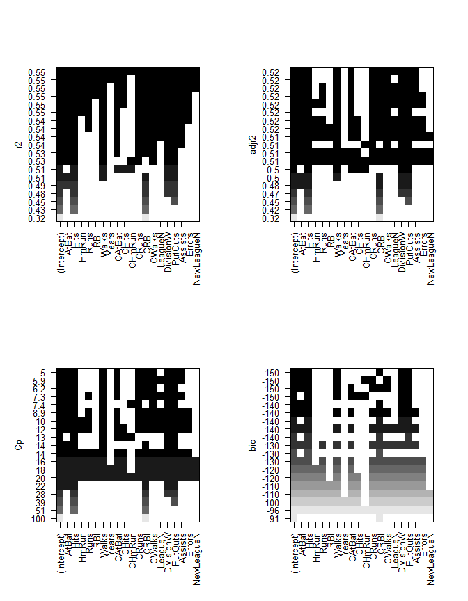

Ch6 Linear Model Selection and Regularization
"""""""""""""""""""""""""""""""""""""""""""""
The source R script available :download:`here <ch6.R>`

.. include:: /table-template-knitr.rst

.. contents:: `Contents`
    :depth: 2
    :local:

Codes from http://www-bcf.usc.edu/~gareth/ISL/All%20Labs.txt

.. code-block:: R

    options(show.error.locations = TRUE)

Lab 1: Subset Selection Methods
===============================

Best Subset Selection
---------------------

.. code-block:: R

    library(ISLR)

::

    ## Warning: package 'ISLR' was built under R version 3.3.2

.. code-block:: R

    # fix(Hitters)
    Hitters <- Hitters
    names(Hitters)

::

    ##  [1] "AtBat"     "Hits"      "HmRun"     "Runs"      "RBI"      
    ##  [6] "Walks"     "Years"     "CAtBat"    "CHits"     "CHmRun"   
    ## [11] "CRuns"     "CRBI"      "CWalks"    "League"    "Division" 
    ## [16] "PutOuts"   "Assists"   "Errors"    "Salary"    "NewLeague"

.. code-block:: R

    dim(Hitters)

::

    ## [1] 322  20

.. code-block:: R

    sum(is.na(Hitters$Salary))

::

    ## [1] 59

.. code-block:: R

    Hitters=na.omit(Hitters)
    dim(Hitters)

::

    ## [1] 263  20

.. code-block:: R

    sum(is.na(Hitters))

::

    ## [1] 0

.. code-block:: R

    library(leaps)

::

    ## Warning: package 'leaps' was built under R version 3.3.2

.. code-block:: R

    regfit.full=regsubsets(Salary~.,Hitters)
    summary(regfit.full)

::

    ## Subset selection object
    ## Call: regsubsets.formula(Salary ~ ., Hitters)
    ## 19 Variables  (and intercept)
    ##            Forced in Forced out
    ## AtBat          FALSE      FALSE
    ## Hits           FALSE      FALSE
    ## HmRun          FALSE      FALSE
    ## Runs           FALSE      FALSE
    ## RBI            FALSE      FALSE
    ## Walks          FALSE      FALSE
    ## Years          FALSE      FALSE
    ## CAtBat         FALSE      FALSE
    ## CHits          FALSE      FALSE
    ## CHmRun         FALSE      FALSE
    ## CRuns          FALSE      FALSE
    ## CRBI           FALSE      FALSE
    ## CWalks         FALSE      FALSE
    ## LeagueN        FALSE      FALSE
    ## DivisionW      FALSE      FALSE
    ## PutOuts        FALSE      FALSE
    ## Assists        FALSE      FALSE
    ## Errors         FALSE      FALSE
    ## NewLeagueN     FALSE      FALSE
    ## 1 subsets of each size up to 8
    ## Selection Algorithm: exhaustive
    ##          AtBat Hits HmRun Runs RBI Walks Years CAtBat CHits CHmRun CRuns
    ## 1  ( 1 ) " "   " "  " "   " "  " " " "   " "   " "    " "   " "    " "  
    ## 2  ( 1 ) " "   "*"  " "   " "  " " " "   " "   " "    " "   " "    " "  
    ## 3  ( 1 ) " "   "*"  " "   " "  " " " "   " "   " "    " "   " "    " "  
    ## 4  ( 1 ) " "   "*"  " "   " "  " " " "   " "   " "    " "   " "    " "  
    ## 5  ( 1 ) "*"   "*"  " "   " "  " " " "   " "   " "    " "   " "    " "  
    ## 6  ( 1 ) "*"   "*"  " "   " "  " " "*"   " "   " "    " "   " "    " "  
    ## 7  ( 1 ) " "   "*"  " "   " "  " " "*"   " "   "*"    "*"   "*"    " "  
    ## 8  ( 1 ) "*"   "*"  " "   " "  " " "*"   " "   " "    " "   "*"    "*"  
    ##          CRBI CWalks LeagueN DivisionW PutOuts Assists Errors NewLeagueN
    ## 1  ( 1 ) "*"  " "    " "     " "       " "     " "     " "    " "       
    ## 2  ( 1 ) "*"  " "    " "     " "       " "     " "     " "    " "       
    ## 3  ( 1 ) "*"  " "    " "     " "       "*"     " "     " "    " "       
    ## 4  ( 1 ) "*"  " "    " "     "*"       "*"     " "     " "    " "       
    ## 5  ( 1 ) "*"  " "    " "     "*"       "*"     " "     " "    " "       
    ## 6  ( 1 ) "*"  " "    " "     "*"       "*"     " "     " "    " "       
    ## 7  ( 1 ) " "  " "    " "     "*"       "*"     " "     " "    " "       
    ## 8  ( 1 ) " "  "*"    " "     "*"       "*"     " "     " "    " "

.. code-block:: R

    regfit.full=regsubsets(Salary~.,data=Hitters,nvmax=19)
    reg.summary=summary(regfit.full)
    names(reg.summary)

::

    ## [1] "which"  "rsq"    "rss"    "adjr2"  "cp"     "bic"    "outmat" "obj"

.. code-block:: R

    reg.summary$rsq

::

    ##  [1] 0.3214501 0.4252237 0.4514294 0.4754067 0.4908036 0.5087146 0.5141227
    ##  [8] 0.5285569 0.5346124 0.5404950 0.5426153 0.5436302 0.5444570 0.5452164
    ## [15] 0.5454692 0.5457656 0.5459518 0.5460945 0.5461159

.. code-block:: R

    par(mfrow=c(2,2))
    plot(reg.summary$rss,xlab="Number of Variables",ylab="RSS",type="l")
    plot(reg.summary$adjr2,xlab="Number of Variables",ylab="Adjusted RSq",type="l")
    which.max(reg.summary$adjr2)

::

    ## [1] 11

.. code-block:: R

    points(11,reg.summary$adjr2[11], col="red",cex=2,pch=20)
    plot(reg.summary$cp,xlab="Number of Variables",ylab="Cp",type='l')
    which.min(reg.summary$cp)

::

    ## [1] 10

.. code-block:: R

    points(10,reg.summary$cp[10],col="red",cex=2,pch=20)
    which.min(reg.summary$bic)

::

    ## [1] 6

.. code-block:: R

    plot(reg.summary$bic,xlab="Number of Variables",ylab="BIC",type='l')
    points(6,reg.summary$bic[6],col="red",cex=2,pch=20)

|image0|\ 

.. code-block:: R

    par(mfrow=c(2,2))
    plot(regfit.full,scale="r2")
    plot(regfit.full,scale="adjr2")
    plot(regfit.full,scale="Cp")
    plot(regfit.full,scale="bic")

|image1|\ 

.. code-block:: R

    coef(regfit.full,6)

::

    ##  (Intercept)        AtBat         Hits        Walks         CRBI 
    ##   91.5117981   -1.8685892    7.6043976    3.6976468    0.6430169 
    ##    DivisionW      PutOuts 
    ## -122.9515338    0.2643076

Forward and Backward Stepwise Selection
---------------------------------------

.. code-block:: R

    regfit.fwd=regsubsets(Salary~.,data=Hitters,nvmax=19,method="forward")
    summary(regfit.fwd)

::

    ## Subset selection object
    ## Call: regsubsets.formula(Salary ~ ., data = Hitters, nvmax = 19, method = "forward")
    ## 19 Variables  (and intercept)
    ##            Forced in Forced out
    ## AtBat          FALSE      FALSE
    ## Hits           FALSE      FALSE
    ## HmRun          FALSE      FALSE
    ## Runs           FALSE      FALSE
    ## RBI            FALSE      FALSE
    ## Walks          FALSE      FALSE
    ## Years          FALSE      FALSE
    ## CAtBat         FALSE      FALSE
    ## CHits          FALSE      FALSE
    ## CHmRun         FALSE      FALSE
    ## CRuns          FALSE      FALSE
    ## CRBI           FALSE      FALSE
    ## CWalks         FALSE      FALSE
    ## LeagueN        FALSE      FALSE
    ## DivisionW      FALSE      FALSE
    ## PutOuts        FALSE      FALSE
    ## Assists        FALSE      FALSE
    ## Errors         FALSE      FALSE
    ## NewLeagueN     FALSE      FALSE
    ## 1 subsets of each size up to 19
    ## Selection Algorithm: forward
    ##           AtBat Hits HmRun Runs RBI Walks Years CAtBat CHits CHmRun CRuns
    ## 1  ( 1 )  " "   " "  " "   " "  " " " "   " "   " "    " "   " "    " "  
    ## 2  ( 1 )  " "   "*"  " "   " "  " " " "   " "   " "    " "   " "    " "  
    ## 3  ( 1 )  " "   "*"  " "   " "  " " " "   " "   " "    " "   " "    " "  
    ## 4  ( 1 )  " "   "*"  " "   " "  " " " "   " "   " "    " "   " "    " "  
    ## 5  ( 1 )  "*"   "*"  " "   " "  " " " "   " "   " "    " "   " "    " "  
    ## 6  ( 1 )  "*"   "*"  " "   " "  " " "*"   " "   " "    " "   " "    " "  
    ## 7  ( 1 )  "*"   "*"  " "   " "  " " "*"   " "   " "    " "   " "    " "  
    ## 8  ( 1 )  "*"   "*"  " "   " "  " " "*"   " "   " "    " "   " "    "*"  
    ## 9  ( 1 )  "*"   "*"  " "   " "  " " "*"   " "   "*"    " "   " "    "*"  
    ## 10  ( 1 ) "*"   "*"  " "   " "  " " "*"   " "   "*"    " "   " "    "*"  
    ## 11  ( 1 ) "*"   "*"  " "   " "  " " "*"   " "   "*"    " "   " "    "*"  
    ## 12  ( 1 ) "*"   "*"  " "   "*"  " " "*"   " "   "*"    " "   " "    "*"  
    ## 13  ( 1 ) "*"   "*"  " "   "*"  " " "*"   " "   "*"    " "   " "    "*"  
    ## 14  ( 1 ) "*"   "*"  "*"   "*"  " " "*"   " "   "*"    " "   " "    "*"  
    ## 15  ( 1 ) "*"   "*"  "*"   "*"  " " "*"   " "   "*"    "*"   " "    "*"  
    ## 16  ( 1 ) "*"   "*"  "*"   "*"  "*" "*"   " "   "*"    "*"   " "    "*"  
    ## 17  ( 1 ) "*"   "*"  "*"   "*"  "*" "*"   " "   "*"    "*"   " "    "*"  
    ## 18  ( 1 ) "*"   "*"  "*"   "*"  "*" "*"   "*"   "*"    "*"   " "    "*"  
    ## 19  ( 1 ) "*"   "*"  "*"   "*"  "*" "*"   "*"   "*"    "*"   "*"    "*"  
    ##           CRBI CWalks LeagueN DivisionW PutOuts Assists Errors NewLeagueN
    ## 1  ( 1 )  "*"  " "    " "     " "       " "     " "     " "    " "       
    ## 2  ( 1 )  "*"  " "    " "     " "       " "     " "     " "    " "       
    ## 3  ( 1 )  "*"  " "    " "     " "       "*"     " "     " "    " "       
    ## 4  ( 1 )  "*"  " "    " "     "*"       "*"     " "     " "    " "       
    ## 5  ( 1 )  "*"  " "    " "     "*"       "*"     " "     " "    " "       
    ## 6  ( 1 )  "*"  " "    " "     "*"       "*"     " "     " "    " "       
    ## 7  ( 1 )  "*"  "*"    " "     "*"       "*"     " "     " "    " "       
    ## 8  ( 1 )  "*"  "*"    " "     "*"       "*"     " "     " "    " "       
    ## 9  ( 1 )  "*"  "*"    " "     "*"       "*"     " "     " "    " "       
    ## 10  ( 1 ) "*"  "*"    " "     "*"       "*"     "*"     " "    " "       
    ## 11  ( 1 ) "*"  "*"    "*"     "*"       "*"     "*"     " "    " "       
    ## 12  ( 1 ) "*"  "*"    "*"     "*"       "*"     "*"     " "    " "       
    ## 13  ( 1 ) "*"  "*"    "*"     "*"       "*"     "*"     "*"    " "       
    ## 14  ( 1 ) "*"  "*"    "*"     "*"       "*"     "*"     "*"    " "       
    ## 15  ( 1 ) "*"  "*"    "*"     "*"       "*"     "*"     "*"    " "       
    ## 16  ( 1 ) "*"  "*"    "*"     "*"       "*"     "*"     "*"    " "       
    ## 17  ( 1 ) "*"  "*"    "*"     "*"       "*"     "*"     "*"    "*"       
    ## 18  ( 1 ) "*"  "*"    "*"     "*"       "*"     "*"     "*"    "*"       
    ## 19  ( 1 ) "*"  "*"    "*"     "*"       "*"     "*"     "*"    "*"

.. code-block:: R

    regfit.bwd=regsubsets(Salary~.,data=Hitters,nvmax=19,method="backward")
    summary(regfit.bwd)

::

    ## Subset selection object
    ## Call: regsubsets.formula(Salary ~ ., data = Hitters, nvmax = 19, method = "backward")
    ## 19 Variables  (and intercept)
    ##            Forced in Forced out
    ## AtBat          FALSE      FALSE
    ## Hits           FALSE      FALSE
    ## HmRun          FALSE      FALSE
    ## Runs           FALSE      FALSE
    ## RBI            FALSE      FALSE
    ## Walks          FALSE      FALSE
    ## Years          FALSE      FALSE
    ## CAtBat         FALSE      FALSE
    ## CHits          FALSE      FALSE
    ## CHmRun         FALSE      FALSE
    ## CRuns          FALSE      FALSE
    ## CRBI           FALSE      FALSE
    ## CWalks         FALSE      FALSE
    ## LeagueN        FALSE      FALSE
    ## DivisionW      FALSE      FALSE
    ## PutOuts        FALSE      FALSE
    ## Assists        FALSE      FALSE
    ## Errors         FALSE      FALSE
    ## NewLeagueN     FALSE      FALSE
    ## 1 subsets of each size up to 19
    ## Selection Algorithm: backward
    ##           AtBat Hits HmRun Runs RBI Walks Years CAtBat CHits CHmRun CRuns
    ## 1  ( 1 )  " "   " "  " "   " "  " " " "   " "   " "    " "   " "    "*"  
    ## 2  ( 1 )  " "   "*"  " "   " "  " " " "   " "   " "    " "   " "    "*"  
    ## 3  ( 1 )  " "   "*"  " "   " "  " " " "   " "   " "    " "   " "    "*"  
    ## 4  ( 1 )  "*"   "*"  " "   " "  " " " "   " "   " "    " "   " "    "*"  
    ## 5  ( 1 )  "*"   "*"  " "   " "  " " "*"   " "   " "    " "   " "    "*"  
    ## 6  ( 1 )  "*"   "*"  " "   " "  " " "*"   " "   " "    " "   " "    "*"  
    ## 7  ( 1 )  "*"   "*"  " "   " "  " " "*"   " "   " "    " "   " "    "*"  
    ## 8  ( 1 )  "*"   "*"  " "   " "  " " "*"   " "   " "    " "   " "    "*"  
    ## 9  ( 1 )  "*"   "*"  " "   " "  " " "*"   " "   "*"    " "   " "    "*"  
    ## 10  ( 1 ) "*"   "*"  " "   " "  " " "*"   " "   "*"    " "   " "    "*"  
    ## 11  ( 1 ) "*"   "*"  " "   " "  " " "*"   " "   "*"    " "   " "    "*"  
    ## 12  ( 1 ) "*"   "*"  " "   "*"  " " "*"   " "   "*"    " "   " "    "*"  
    ## 13  ( 1 ) "*"   "*"  " "   "*"  " " "*"   " "   "*"    " "   " "    "*"  
    ## 14  ( 1 ) "*"   "*"  "*"   "*"  " " "*"   " "   "*"    " "   " "    "*"  
    ## 15  ( 1 ) "*"   "*"  "*"   "*"  " " "*"   " "   "*"    "*"   " "    "*"  
    ## 16  ( 1 ) "*"   "*"  "*"   "*"  "*" "*"   " "   "*"    "*"   " "    "*"  
    ## 17  ( 1 ) "*"   "*"  "*"   "*"  "*" "*"   " "   "*"    "*"   " "    "*"  
    ## 18  ( 1 ) "*"   "*"  "*"   "*"  "*" "*"   "*"   "*"    "*"   " "    "*"  
    ## 19  ( 1 ) "*"   "*"  "*"   "*"  "*" "*"   "*"   "*"    "*"   "*"    "*"  
    ##           CRBI CWalks LeagueN DivisionW PutOuts Assists Errors NewLeagueN
    ## 1  ( 1 )  " "  " "    " "     " "       " "     " "     " "    " "       
    ## 2  ( 1 )  " "  " "    " "     " "       " "     " "     " "    " "       
    ## 3  ( 1 )  " "  " "    " "     " "       "*"     " "     " "    " "       
    ## 4  ( 1 )  " "  " "    " "     " "       "*"     " "     " "    " "       
    ## 5  ( 1 )  " "  " "    " "     " "       "*"     " "     " "    " "       
    ## 6  ( 1 )  " "  " "    " "     "*"       "*"     " "     " "    " "       
    ## 7  ( 1 )  " "  "*"    " "     "*"       "*"     " "     " "    " "       
    ## 8  ( 1 )  "*"  "*"    " "     "*"       "*"     " "     " "    " "       
    ## 9  ( 1 )  "*"  "*"    " "     "*"       "*"     " "     " "    " "       
    ## 10  ( 1 ) "*"  "*"    " "     "*"       "*"     "*"     " "    " "       
    ## 11  ( 1 ) "*"  "*"    "*"     "*"       "*"     "*"     " "    " "       
    ## 12  ( 1 ) "*"  "*"    "*"     "*"       "*"     "*"     " "    " "       
    ## 13  ( 1 ) "*"  "*"    "*"     "*"       "*"     "*"     "*"    " "       
    ## 14  ( 1 ) "*"  "*"    "*"     "*"       "*"     "*"     "*"    " "       
    ## 15  ( 1 ) "*"  "*"    "*"     "*"       "*"     "*"     "*"    " "       
    ## 16  ( 1 ) "*"  "*"    "*"     "*"       "*"     "*"     "*"    " "       
    ## 17  ( 1 ) "*"  "*"    "*"     "*"       "*"     "*"     "*"    "*"       
    ## 18  ( 1 ) "*"  "*"    "*"     "*"       "*"     "*"     "*"    "*"       
    ## 19  ( 1 ) "*"  "*"    "*"     "*"       "*"     "*"     "*"    "*"

.. code-block:: R

    coef(regfit.full,7)

::

    ##  (Intercept)         Hits        Walks       CAtBat        CHits 
    ##   79.4509472    1.2833513    3.2274264   -0.3752350    1.4957073 
    ##       CHmRun    DivisionW      PutOuts 
    ##    1.4420538 -129.9866432    0.2366813

.. code-block:: R

    coef(regfit.fwd,7)

::

    ##  (Intercept)        AtBat         Hits        Walks         CRBI 
    ##  109.7873062   -1.9588851    7.4498772    4.9131401    0.8537622 
    ##       CWalks    DivisionW      PutOuts 
    ##   -0.3053070 -127.1223928    0.2533404

.. code-block:: R

    coef(regfit.bwd,7)

::

    ##  (Intercept)        AtBat         Hits        Walks        CRuns 
    ##  105.6487488   -1.9762838    6.7574914    6.0558691    1.1293095 
    ##       CWalks    DivisionW      PutOuts 
    ##   -0.7163346 -116.1692169    0.3028847

Choosing Among Models
---------------------

.. code-block:: R

    set.seed(1)
    train=sample(c(TRUE,FALSE), nrow(Hitters),rep=TRUE)
    test=(!train)
    regfit.best=regsubsets(Salary~.,data=Hitters[train,],nvmax=19)
    test.mat=model.matrix(Salary~.,data=Hitters[test,])
    val.errors=rep(NA,19)
    for(i in 1:19){
      coefi=coef(regfit.best,id=i)
      pred=test.mat[,names(coefi)]%*%coefi
      val.errors[i]=mean((Hitters$Salary[test]-pred)^2)
    }
    val.errors

::

    ##  [1] 220968.0 169157.1 178518.2 163426.1 168418.1 171270.6 162377.1
    ##  [8] 157909.3 154055.7 148162.1 151156.4 151742.5 152214.5 157358.7
    ## [15] 158541.4 158743.3 159972.7 159859.8 160105.6

.. code-block:: R

    which.min(val.errors)

::

    ## [1] 10

.. code-block:: R

    coef(regfit.best,10)

::

    ## (Intercept)       AtBat        Hits       Walks      CAtBat       CHits 
    ## -80.2751499  -1.4683816   7.1625314   3.6430345  -0.1855698   1.1053238 
    ##      CHmRun      CWalks     LeagueN   DivisionW     PutOuts 
    ##   1.3844863  -0.7483170  84.5576103 -53.0289658   0.2381662

.. code-block:: R

    predict.regsubsets=function(object,newdata,id,...){
      form=as.formula(object$call[[2]])
      mat=model.matrix(form,newdata)
      coefi=coef(object,id=id)
      xvars=names(coefi)
      mat[,xvars]%*%coefi
    }
    regfit.best=regsubsets(Salary~.,data=Hitters,nvmax=19)
    coef(regfit.best,10)

::

    ##  (Intercept)        AtBat         Hits        Walks       CAtBat 
    ##  162.5354420   -2.1686501    6.9180175    5.7732246   -0.1300798 
    ##        CRuns         CRBI       CWalks    DivisionW      PutOuts 
    ##    1.4082490    0.7743122   -0.8308264 -112.3800575    0.2973726 
    ##      Assists 
    ##    0.2831680

.. code-block:: R

    k=10
    set.seed(1)
    folds=sample(1:k,nrow(Hitters),replace=TRUE)
    cv.errors=matrix(NA,k,19, dimnames=list(NULL, paste(1:19)))
    for(j in 1:k){
      best.fit=regsubsets(Salary~.,data=Hitters[folds!=j,],nvmax=19)
      for(i in 1:19){
        pred=predict(best.fit,Hitters[folds==j,],id=i)
        cv.errors[j,i]=mean( (Hitters$Salary[folds==j]-pred)^2)
      }
    }
    mean.cv.errors=apply(cv.errors,2,mean)
    mean.cv.errors

::

    ##        1        2        3        4        5        6        7        8 
    ## 160093.5 140196.8 153117.0 151159.3 146841.3 138302.6 144346.2 130207.7 
    ##        9       10       11       12       13       14       15       16 
    ## 129459.6 125334.7 125153.8 128273.5 133461.0 133974.6 131825.7 131882.8 
    ##       17       18       19 
    ## 132750.9 133096.2 132804.7

.. code-block:: R

    par(mfrow=c(1,1))
    plot(mean.cv.errors,type='b')

|image2|\ 

.. code-block:: R

    reg.best=regsubsets(Salary~.,data=Hitters, nvmax=19)
    coef(reg.best,11)

::

    ##  (Intercept)        AtBat         Hits        Walks       CAtBat 
    ##  135.7512195   -2.1277482    6.9236994    5.6202755   -0.1389914 
    ##        CRuns         CRBI       CWalks      LeagueN    DivisionW 
    ##    1.4553310    0.7852528   -0.8228559   43.1116152 -111.1460252 
    ##      PutOuts      Assists 
    ##    0.2894087    0.2688277

Lab 2: Ridge Regression and the Lasso
=====================================

.. code-block:: R

    x=model.matrix(Salary~.,Hitters)[,-1]
    y=Hitters$Salary

Ridge Regression
----------------

.. code-block:: R

    library(glmnet)

::

    ## Warning: package 'glmnet' was built under R version 3.3.2

::

    ## Loading required package: Matrix

::

    ## Loading required package: foreach

::

    ## Loaded glmnet 2.0-5

.. code-block:: R

    grid=10^seq(10,-2,length=100)
    ridge.mod=glmnet(x,y,alpha=0,lambda=grid)
    dim(coef(ridge.mod))

::

    ## [1]  20 100

.. code-block:: R

    ridge.mod$lambda[50]

::

    ## [1] 11497.57

.. code-block:: R

    coef(ridge.mod)[,50]

::

    ##   (Intercept)         AtBat          Hits         HmRun          Runs 
    ## 407.356050200   0.036957182   0.138180344   0.524629976   0.230701523 
    ##           RBI         Walks         Years        CAtBat         CHits 
    ##   0.239841459   0.289618741   1.107702929   0.003131815   0.011653637 
    ##        CHmRun         CRuns          CRBI        CWalks       LeagueN 
    ##   0.087545670   0.023379882   0.024138320   0.025015421   0.085028114 
    ##     DivisionW       PutOuts       Assists        Errors    NewLeagueN 
    ##  -6.215440973   0.016482577   0.002612988  -0.020502690   0.301433531

.. code-block:: R

    sqrt(sum(coef(ridge.mod)[-1,50]^2))

::

    ## [1] 6.360612

.. code-block:: R

    ridge.mod$lambda[60]

::

    ## [1] 705.4802

.. code-block:: R

    coef(ridge.mod)[,60]

::

    ##  (Intercept)        AtBat         Hits        HmRun         Runs 
    ##  54.32519950   0.11211115   0.65622409   1.17980910   0.93769713 
    ##          RBI        Walks        Years       CAtBat        CHits 
    ##   0.84718546   1.31987948   2.59640425   0.01083413   0.04674557 
    ##       CHmRun        CRuns         CRBI       CWalks      LeagueN 
    ##   0.33777318   0.09355528   0.09780402   0.07189612  13.68370191 
    ##    DivisionW      PutOuts      Assists       Errors   NewLeagueN 
    ## -54.65877750   0.11852289   0.01606037  -0.70358655   8.61181213

.. code-block:: R

    sqrt(sum(coef(ridge.mod)[-1,60]^2))

::

    ## [1] 57.11001

.. code-block:: R

    predict(ridge.mod,s=50,type="coefficients")[1:20,]

::

    ##   (Intercept)         AtBat          Hits         HmRun          Runs 
    ##  4.876610e+01 -3.580999e-01  1.969359e+00 -1.278248e+00  1.145892e+00 
    ##           RBI         Walks         Years        CAtBat         CHits 
    ##  8.038292e-01  2.716186e+00 -6.218319e+00  5.447837e-03  1.064895e-01 
    ##        CHmRun         CRuns          CRBI        CWalks       LeagueN 
    ##  6.244860e-01  2.214985e-01  2.186914e-01 -1.500245e-01  4.592589e+01 
    ##     DivisionW       PutOuts       Assists        Errors    NewLeagueN 
    ## -1.182011e+02  2.502322e-01  1.215665e-01 -3.278600e+00 -9.496680e+00

.. code-block:: R

    set.seed(1)
    train=sample(1:nrow(x), nrow(x)/2)
    test=(-train)
    y.test=y[test]
    ridge.mod=glmnet(x[train,],y[train],alpha=0,lambda=grid, thresh=1e-12)
    ridge.pred=predict(ridge.mod,s=4,newx=x[test,])
    mean((ridge.pred-y.test)^2)

::

    ## [1] 101036.8

.. code-block:: R

    mean((mean(y[train])-y.test)^2)

::

    ## [1] 193253.1

.. code-block:: R

    ridge.pred=predict(ridge.mod,s=1e10,newx=x[test,])
    mean((ridge.pred-y.test)^2)

::

    ## [1] 193253.1

.. code-block:: R

    ridge.pred=predict(ridge.mod,s=0,newx=x[test,],exact=T)
    mean((ridge.pred-y.test)^2)

::

    ## [1] 114783.1

.. code-block:: R

    lm(y~x, subset=train)

::

    ## 
    ## Call:
    ## lm(formula = y ~ x, subset = train)
    ## 
    ## Coefficients:
    ## (Intercept)       xAtBat        xHits       xHmRun        xRuns  
    ##   299.42849     -2.54027      8.36682     11.64512     -9.09923  
    ##        xRBI       xWalks       xYears      xCAtBat       xCHits  
    ##     2.44105      9.23440    -22.93673     -0.18154     -0.11598  
    ##     xCHmRun       xCRuns        xCRBI      xCWalks     xLeagueN  
    ##    -1.33888      3.32838      0.07536     -1.07841     59.76065  
    ##  xDivisionW     xPutOuts     xAssists      xErrors  xNewLeagueN  
    ##   -98.86233      0.34087      0.34165     -0.64207     -0.67442

.. code-block:: R

    predict(ridge.mod,s=0,exact=T,type="coefficients")[1:20,]

::

    ##  (Intercept)        AtBat         Hits        HmRun         Runs 
    ## 299.42883596  -2.54014665   8.36611719  11.64400720  -9.09877719 
    ##          RBI        Walks        Years       CAtBat        CHits 
    ##   2.44152119   9.23403909 -22.93584442  -0.18160843  -0.11561496 
    ##       CHmRun        CRuns         CRBI       CWalks      LeagueN 
    ##  -1.33836534   3.32817777   0.07511771  -1.07828647  59.76529059 
    ##    DivisionW      PutOuts      Assists       Errors   NewLeagueN 
    ## -98.85996590   0.34086400   0.34165605  -0.64205839  -0.67606314

.. code-block:: R

    set.seed(1)
    cv.out=cv.glmnet(x[train,],y[train],alpha=0)
    plot(cv.out)

|image3|\ 

.. code-block:: R

    bestlam=cv.out$lambda.min
    bestlam

::

    ## [1] 211.7416

.. code-block:: R

    ridge.pred=predict(ridge.mod,s=bestlam,newx=x[test,])
    mean((ridge.pred-y.test)^2)

::

    ## [1] 96015.51

.. code-block:: R

    out=glmnet(x,y,alpha=0)
    predict(out,type="coefficients",s=bestlam)[1:20,]

::

    ##  (Intercept)        AtBat         Hits        HmRun         Runs 
    ##   9.88487157   0.03143991   1.00882875   0.13927624   1.11320781 
    ##          RBI        Walks        Years       CAtBat        CHits 
    ##   0.87318990   1.80410229   0.13074381   0.01113978   0.06489843 
    ##       CHmRun        CRuns         CRBI       CWalks      LeagueN 
    ##   0.45158546   0.12900049   0.13737712   0.02908572  27.18227535 
    ##    DivisionW      PutOuts      Assists       Errors   NewLeagueN 
    ## -91.63411299   0.19149252   0.04254536  -1.81244470   7.21208390

The Lasso
---------

.. code-block:: R

    lasso.mod=glmnet(x[train,],y[train],alpha=1,lambda=grid)
    plot(lasso.mod)

|image4|\ 

.. code-block:: R

    set.seed(1)
    cv.out=cv.glmnet(x[train,],y[train],alpha=1)
    plot(cv.out)

|image5|\ 

.. code-block:: R

    bestlam=cv.out$lambda.min
    lasso.pred=predict(lasso.mod,s=bestlam,newx=x[test,])
    mean((lasso.pred-y.test)^2)

::

    ## [1] 100743.4

.. code-block:: R

    out=glmnet(x,y,alpha=1,lambda=grid)
    lasso.coef=predict(out,type="coefficients",s=bestlam)[1:20,]
    lasso.coef

::

    ##  (Intercept)        AtBat         Hits        HmRun         Runs 
    ##   18.5394844    0.0000000    1.8735390    0.0000000    0.0000000 
    ##          RBI        Walks        Years       CAtBat        CHits 
    ##    0.0000000    2.2178444    0.0000000    0.0000000    0.0000000 
    ##       CHmRun        CRuns         CRBI       CWalks      LeagueN 
    ##    0.0000000    0.2071252    0.4130132    0.0000000    3.2666677 
    ##    DivisionW      PutOuts      Assists       Errors   NewLeagueN 
    ## -103.4845458    0.2204284    0.0000000    0.0000000    0.0000000

.. code-block:: R

    lasso.coef[lasso.coef!=0]

::

    ##  (Intercept)         Hits        Walks        CRuns         CRBI 
    ##   18.5394844    1.8735390    2.2178444    0.2071252    0.4130132 
    ##      LeagueN    DivisionW      PutOuts 
    ##    3.2666677 -103.4845458    0.2204284

Lab 3: PCR and PLS Regression
=============================

Principal Components Regression
-------------------------------

.. code-block:: R

    library(pls)

::

    ## Warning: package 'pls' was built under R version 3.3.2

::

    ## 
    ## Attaching package: 'pls'

::

    ## The following object is masked from 'package:stats':
    ## 
    ##     loadings

.. code-block:: R

    set.seed(2)
    pcr.fit=pcr(Salary~., data=Hitters,scale=TRUE,validation="CV")
    summary(pcr.fit)

::

    ## Data:    X dimension: 263 19 
    ##  Y dimension: 263 1
    ## Fit method: svdpc
    ## Number of components considered: 19
    ## 
    ## VALIDATION: RMSEP
    ## Cross-validated using 10 random segments.
    ##        (Intercept)  1 comps  2 comps  3 comps  4 comps  5 comps  6 comps
    ## CV             452    348.9    352.2    353.5    352.8    350.1    349.1
    ## adjCV          452    348.7    351.8    352.9    352.1    349.3    348.0
    ##        7 comps  8 comps  9 comps  10 comps  11 comps  12 comps  13 comps
    ## CV       349.6    350.9    352.9     353.8     355.0     356.2     363.5
    ## adjCV    348.5    349.8    351.6     352.3     353.4     354.5     361.6
    ##        14 comps  15 comps  16 comps  17 comps  18 comps  19 comps
    ## CV        355.2     357.4     347.6     350.1     349.2     352.6
    ## adjCV     352.8     355.2     345.5     347.6     346.7     349.8
    ## 
    ## TRAINING: % variance explained
    ##         1 comps  2 comps  3 comps  4 comps  5 comps  6 comps  7 comps
    ## X         38.31    60.16    70.84    79.03    84.29    88.63    92.26
    ## Salary    40.63    41.58    42.17    43.22    44.90    46.48    46.69
    ##         8 comps  9 comps  10 comps  11 comps  12 comps  13 comps  14 comps
    ## X         94.96    96.28     97.26     97.98     98.65     99.15     99.47
    ## Salary    46.75    46.86     47.76     47.82     47.85     48.10     50.40
    ##         15 comps  16 comps  17 comps  18 comps  19 comps
    ## X          99.75     99.89     99.97     99.99    100.00
    ## Salary     50.55     53.01     53.85     54.61     54.61

.. code-block:: R

    validationplot(pcr.fit,val.type="MSEP")

|image6|\ 

.. code-block:: R

    set.seed(1)
    pcr.fit=pcr(Salary~., data=Hitters,subset=train,scale=TRUE, validation="CV")
    validationplot(pcr.fit,val.type="MSEP")

|image7|\ 

.. code-block:: R

    pcr.pred=predict(pcr.fit,x[test,],ncomp=7)
    mean((pcr.pred-y.test)^2)

::

    ## [1] 96556.22

.. code-block:: R

    pcr.fit=pcr(y~x,scale=TRUE,ncomp=7)
    summary(pcr.fit)

::

    ## Data:    X dimension: 263 19 
    ##  Y dimension: 263 1
    ## Fit method: svdpc
    ## Number of components considered: 7
    ## TRAINING: % variance explained
    ##    1 comps  2 comps  3 comps  4 comps  5 comps  6 comps  7 comps
    ## X    38.31    60.16    70.84    79.03    84.29    88.63    92.26
    ## y    40.63    41.58    42.17    43.22    44.90    46.48    46.69

Partial Least Squares
---------------------

.. code-block:: R

    set.seed(1)
    pls.fit=plsr(Salary~., data=Hitters,subset=train,scale=TRUE, validation="CV")
    summary(pls.fit)

::

    ## Data:    X dimension: 131 19 
    ##  Y dimension: 131 1
    ## Fit method: kernelpls
    ## Number of components considered: 19
    ## 
    ## VALIDATION: RMSEP
    ## Cross-validated using 10 random segments.
    ##        (Intercept)  1 comps  2 comps  3 comps  4 comps  5 comps  6 comps
    ## CV           464.6    394.2    391.5    393.1    395.0    415.0    424.0
    ## adjCV        464.6    393.4    390.2    391.1    392.9    411.5    418.8
    ##        7 comps  8 comps  9 comps  10 comps  11 comps  12 comps  13 comps
    ## CV       424.5    415.8    404.6     407.1     412.0     414.4     410.3
    ## adjCV    418.9    411.4    400.7     402.2     407.2     409.3     405.6
    ##        14 comps  15 comps  16 comps  17 comps  18 comps  19 comps
    ## CV        406.2     408.6     410.5     408.8     407.8     410.2
    ## adjCV     401.8     403.9     405.6     404.1     403.2     405.5
    ## 
    ## TRAINING: % variance explained
    ##         1 comps  2 comps  3 comps  4 comps  5 comps  6 comps  7 comps
    ## X         38.12    53.46    66.05    74.49    79.33    84.56    87.09
    ## Salary    33.58    38.96    41.57    42.43    44.04    45.59    47.05
    ##         8 comps  9 comps  10 comps  11 comps  12 comps  13 comps  14 comps
    ## X         90.74    92.55     93.94     97.23     97.88     98.35     98.85
    ## Salary    47.53    48.42     49.68     50.04     50.54     50.78     50.92
    ##         15 comps  16 comps  17 comps  18 comps  19 comps
    ## X          99.11     99.43     99.78     99.99    100.00
    ## Salary     51.04     51.11     51.15     51.16     51.18

.. code-block:: R

    validationplot(pls.fit,val.type="MSEP")

|image8|\ 

.. code-block:: R

    pls.pred=predict(pls.fit,x[test,],ncomp=2)
    mean((pls.pred-y.test)^2)

::

    ## [1] 101417.5

.. code-block:: R

    pls.fit=plsr(Salary~., data=Hitters,scale=TRUE,ncomp=2)
    summary(pls.fit)

::

    ## Data:    X dimension: 263 19 
    ##  Y dimension: 263 1
    ## Fit method: kernelpls
    ## Number of components considered: 2
    ## TRAINING: % variance explained
    ##         1 comps  2 comps
    ## X         38.08    51.03
    ## Salary    43.05    46.40

.. |image0| image:: ch6_files/figure-html/unnamed-chunk-2-1.png

.. |image2| image:: ch6_files/figure-html/unnamed-chunk-5-1.png
.. |image3| image:: ch6_files/figure-html/unnamed-chunk-7-1.png
.. |image4| image:: ch6_files/figure-html/unnamed-chunk-8-1.png
.. |image5| image:: ch6_files/figure-html/unnamed-chunk-8-2.png
.. |image6| image:: ch6_files/figure-html/unnamed-chunk-9-1.png
.. |image7| image:: ch6_files/figure-html/unnamed-chunk-9-2.png
.. |image8| image:: ch6_files/figure-html/unnamed-chunk-10-1.png

