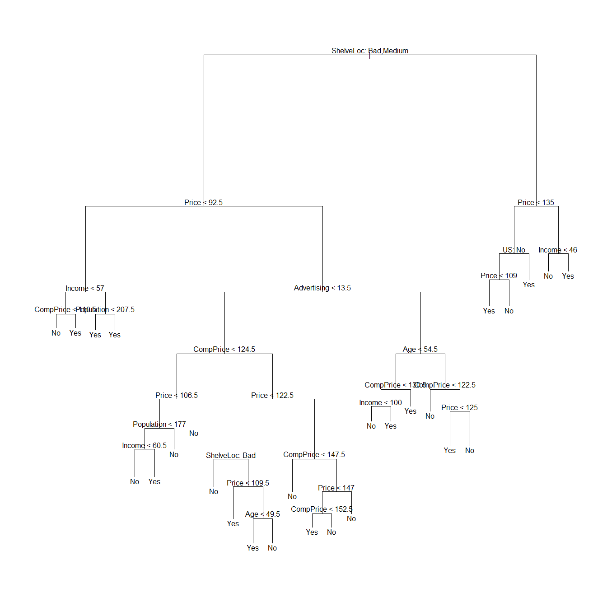
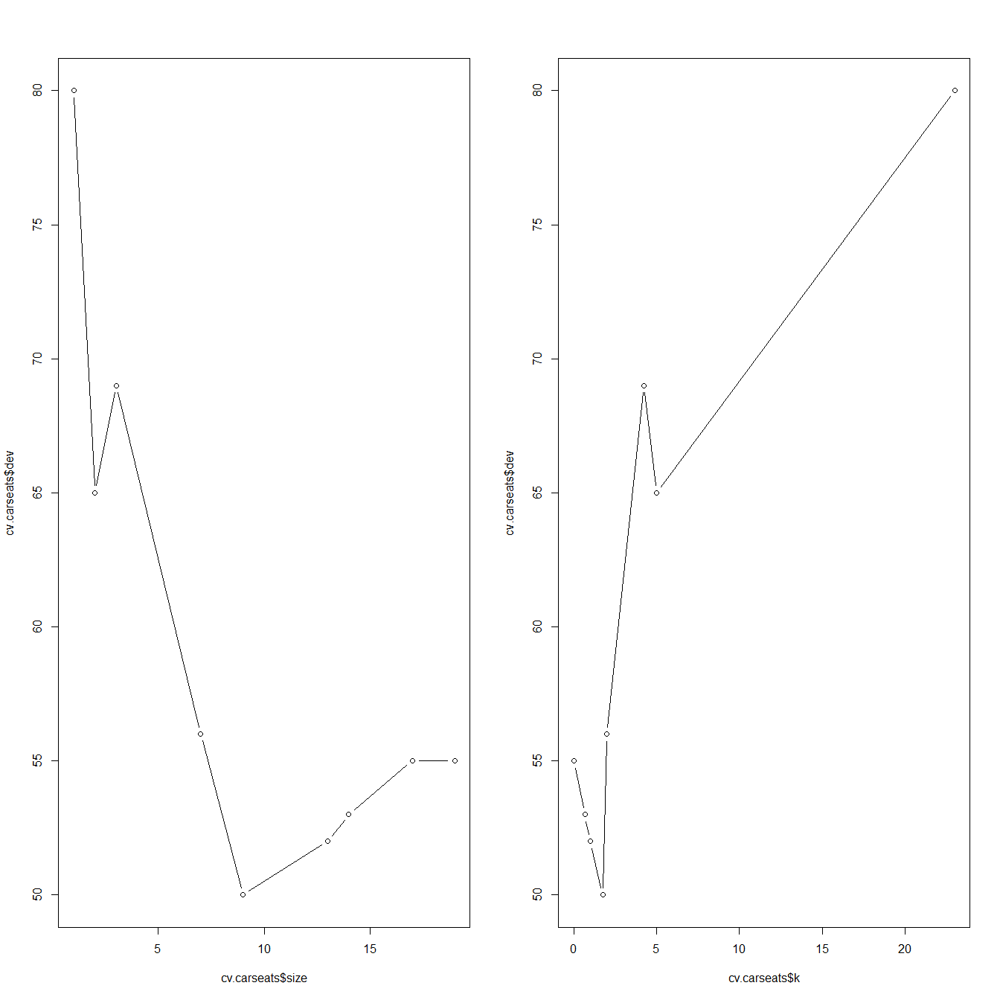
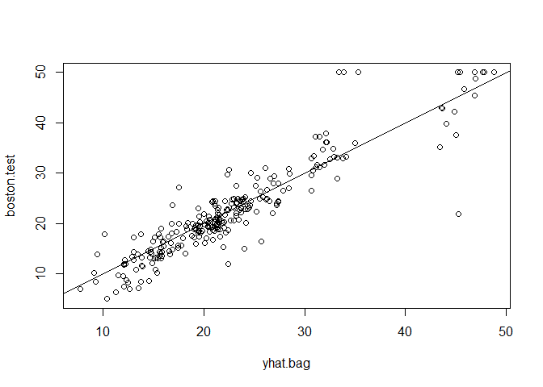
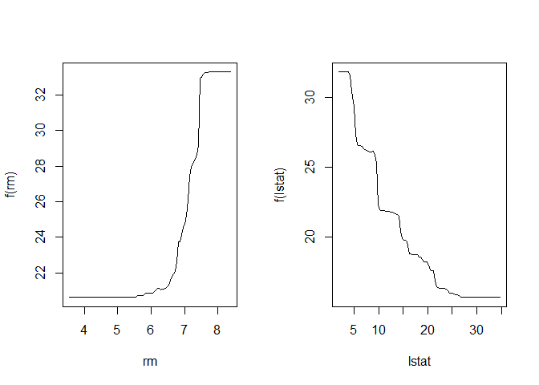

Ch8 Tree-Based Methods
""""""""""""""""""""""
The source R script available :download:`here <ch8.R>`

.. include:: /table-template-knitr.rst

.. contents:: `Contents`
    :depth: 2
    :local:

Codes from http://www-bcf.usc.edu/~gareth/ISL/All%20Labs.txt

.. code-block:: R

    options(show.error.locations = TRUE)

    library(ISLR)

::

    ## Warning: package 'ISLR' was built under R version 3.3.2

.. code-block:: R

    attach(Wage)

Fitting Classification Trees
============================

.. code-block:: R

    library(tree)

::

    ## Warning: package 'tree' was built under R version 3.3.2

.. code-block:: R

    library(ISLR)
    attach(Carseats)
    High=ifelse(Sales<=8,"No","Yes")
    Carseats=data.frame(Carseats,High)
    tree.carseats=tree(High~.-Sales,Carseats)
    summary(tree.carseats)

::

    ## 
    ## Classification tree:
    ## tree(formula = High ~ . - Sales, data = Carseats)
    ## Variables actually used in tree construction:
    ## [1] "ShelveLoc"   "Price"       "Income"      "CompPrice"   "Population" 
    ## [6] "Advertising" "Age"         "US"         
    ## Number of terminal nodes:  27 
    ## Residual mean deviance:  0.4575 = 170.7 / 373 
    ## Misclassification error rate: 0.09 = 36 / 400

.. code-block:: R

    plot(tree.carseats)
    text(tree.carseats,pretty=0)

|image0|\ 

.. code-block:: R

    tree.carseats

::

    ## node), split, n, deviance, yval, (yprob)
    ##       * denotes terminal node
    ## 
    ##   1) root 400 541.500 No ( 0.59000 0.41000 )  
    ##     2) ShelveLoc: Bad,Medium 315 390.600 No ( 0.68889 0.31111 )  
    ##       4) Price < 92.5 46  56.530 Yes ( 0.30435 0.69565 )  
    ##         8) Income < 57 10  12.220 No ( 0.70000 0.30000 )  
    ##          16) CompPrice < 110.5 5   0.000 No ( 1.00000 0.00000 ) *
    ##          17) CompPrice > 110.5 5   6.730 Yes ( 0.40000 0.60000 ) *
    ##         9) Income > 57 36  35.470 Yes ( 0.19444 0.80556 )  
    ##          18) Population < 207.5 16  21.170 Yes ( 0.37500 0.62500 ) *
    ##          19) Population > 207.5 20   7.941 Yes ( 0.05000 0.95000 ) *
    ##       5) Price > 92.5 269 299.800 No ( 0.75465 0.24535 )  
    ##        10) Advertising < 13.5 224 213.200 No ( 0.81696 0.18304 )  
    ##          20) CompPrice < 124.5 96  44.890 No ( 0.93750 0.06250 )  
    ##            40) Price < 106.5 38  33.150 No ( 0.84211 0.15789 )  
    ##              80) Population < 177 12  16.300 No ( 0.58333 0.41667 )  
    ##               160) Income < 60.5 6   0.000 No ( 1.00000 0.00000 ) *
    ##               161) Income > 60.5 6   5.407 Yes ( 0.16667 0.83333 ) *
    ##              81) Population > 177 26   8.477 No ( 0.96154 0.03846 ) *
    ##            41) Price > 106.5 58   0.000 No ( 1.00000 0.00000 ) *
    ##          21) CompPrice > 124.5 128 150.200 No ( 0.72656 0.27344 )  
    ##            42) Price < 122.5 51  70.680 Yes ( 0.49020 0.50980 )  
    ##              84) ShelveLoc: Bad 11   6.702 No ( 0.90909 0.09091 ) *
    ##              85) ShelveLoc: Medium 40  52.930 Yes ( 0.37500 0.62500 )  
    ##               170) Price < 109.5 16   7.481 Yes ( 0.06250 0.93750 ) *
    ##               171) Price > 109.5 24  32.600 No ( 0.58333 0.41667 )  
    ##                 342) Age < 49.5 13  16.050 Yes ( 0.30769 0.69231 ) *
    ##                 343) Age > 49.5 11   6.702 No ( 0.90909 0.09091 ) *
    ##            43) Price > 122.5 77  55.540 No ( 0.88312 0.11688 )  
    ##              86) CompPrice < 147.5 58  17.400 No ( 0.96552 0.03448 ) *
    ##              87) CompPrice > 147.5 19  25.010 No ( 0.63158 0.36842 )  
    ##               174) Price < 147 12  16.300 Yes ( 0.41667 0.58333 )  
    ##                 348) CompPrice < 152.5 7   5.742 Yes ( 0.14286 0.85714 ) *
    ##                 349) CompPrice > 152.5 5   5.004 No ( 0.80000 0.20000 ) *
    ##               175) Price > 147 7   0.000 No ( 1.00000 0.00000 ) *
    ##        11) Advertising > 13.5 45  61.830 Yes ( 0.44444 0.55556 )  
    ##          22) Age < 54.5 25  25.020 Yes ( 0.20000 0.80000 )  
    ##            44) CompPrice < 130.5 14  18.250 Yes ( 0.35714 0.64286 )  
    ##              88) Income < 100 9  12.370 No ( 0.55556 0.44444 ) *
    ##              89) Income > 100 5   0.000 Yes ( 0.00000 1.00000 ) *
    ##            45) CompPrice > 130.5 11   0.000 Yes ( 0.00000 1.00000 ) *
    ##          23) Age > 54.5 20  22.490 No ( 0.75000 0.25000 )  
    ##            46) CompPrice < 122.5 10   0.000 No ( 1.00000 0.00000 ) *
    ##            47) CompPrice > 122.5 10  13.860 No ( 0.50000 0.50000 )  
    ##              94) Price < 125 5   0.000 Yes ( 0.00000 1.00000 ) *
    ##              95) Price > 125 5   0.000 No ( 1.00000 0.00000 ) *
    ##     3) ShelveLoc: Good 85  90.330 Yes ( 0.22353 0.77647 )  
    ##       6) Price < 135 68  49.260 Yes ( 0.11765 0.88235 )  
    ##        12) US: No 17  22.070 Yes ( 0.35294 0.64706 )  
    ##          24) Price < 109 8   0.000 Yes ( 0.00000 1.00000 ) *
    ##          25) Price > 109 9  11.460 No ( 0.66667 0.33333 ) *
    ##        13) US: Yes 51  16.880 Yes ( 0.03922 0.96078 ) *
    ##       7) Price > 135 17  22.070 No ( 0.64706 0.35294 )  
    ##        14) Income < 46 6   0.000 No ( 1.00000 0.00000 ) *
    ##        15) Income > 46 11  15.160 Yes ( 0.45455 0.54545 ) *

.. code-block:: R

    set.seed(2)
    train=sample(1:nrow(Carseats), 200)
    Carseats.test=Carseats[-train,]
    High.test=High[-train]
    tree.carseats=tree(High~.-Sales,Carseats,subset=train)
    tree.pred=predict(tree.carseats,Carseats.test,type="class")
    table(tree.pred,High.test)

::

    ##          High.test
    ## tree.pred No Yes
    ##       No  86  27
    ##       Yes 30  57

.. code-block:: R

    (86+57)/200

::

    ## [1] 0.715

.. code-block:: R

    set.seed(3)
    cv.carseats=cv.tree(tree.carseats,FUN=prune.misclass)
    names(cv.carseats)

::

    ## [1] "size"   "dev"    "k"      "method"

.. code-block:: R

    cv.carseats

::

    ## $size
    ## [1] 19 17 14 13  9  7  3  2  1
    ## 
    ## $dev
    ## [1] 55 55 53 52 50 56 69 65 80
    ## 
    ## $k
    ## [1]       -Inf  0.0000000  0.6666667  1.0000000  1.7500000  2.0000000
    ## [7]  4.2500000  5.0000000 23.0000000
    ## 
    ## $method
    ## [1] "misclass"
    ## 
    ## attr(,"class")
    ## [1] "prune"         "tree.sequence"

.. code-block:: R

    par(mfrow=c(1,2))
    plot(cv.carseats$size,cv.carseats$dev,type="b")
    plot(cv.carseats$k,cv.carseats$dev,type="b")

|image1|\ 

.. code-block:: R

    prune.carseats=prune.misclass(tree.carseats,best=9)
    plot(prune.carseats)
    text(prune.carseats,pretty=0)
    tree.pred=predict(prune.carseats,Carseats.test,type="class")
    table(tree.pred,High.test)

::

    ##          High.test
    ## tree.pred No Yes
    ##       No  94  24
    ##       Yes 22  60

.. code-block:: R

    (94+60)/200

::

    ## [1] 0.77

.. code-block:: R

    prune.carseats=prune.misclass(tree.carseats,best=15)
    plot(prune.carseats)
    text(prune.carseats,pretty=0)

|image2|\ 

.. code-block:: R

    tree.pred=predict(prune.carseats,Carseats.test,type="class")
    table(tree.pred,High.test)

::

    ##          High.test
    ## tree.pred No Yes
    ##       No  86  22
    ##       Yes 30  62

.. code-block:: R

    (86+62)/200

::

    ## [1] 0.74

.. code-block:: R

    # #' Fitting Regression Trees

    library(MASS)
    set.seed(1)
    train = sample(1:nrow(Boston), nrow(Boston)/2)
    tree.boston=tree(medv~.,Boston,subset=train)
    summary(tree.boston)

::

    ## 
    ## Regression tree:
    ## tree(formula = medv ~ ., data = Boston, subset = train)
    ## Variables actually used in tree construction:
    ## [1] "lstat" "rm"    "dis"  
    ## Number of terminal nodes:  8 
    ## Residual mean deviance:  12.65 = 3099 / 245 
    ## Distribution of residuals:
    ##      Min.   1st Qu.    Median      Mean   3rd Qu.      Max. 
    ## -14.10000  -2.04200  -0.05357   0.00000   1.96000  12.60000

.. code-block:: R

    plot(tree.boston)
    text(tree.boston,pretty=0)
    cv.boston=cv.tree(tree.boston)
    plot(cv.boston$size,cv.boston$dev,type='b')

|image3|\ 

.. code-block:: R

    prune.boston=prune.tree(tree.boston,best=5)
    plot(prune.boston)
    text(prune.boston,pretty=0)
    yhat=predict(tree.boston,newdata=Boston[-train,])
    boston.test=Boston[-train,"medv"]
    plot(yhat,boston.test)
    abline(0,1)

|image4|\ 

.. code-block:: R

    mean((yhat-boston.test)^2)

::

    ## [1] 25.04559

Bagging and Random Forests
==========================

.. code-block:: R

    library(randomForest)

::

    ## Warning: package 'randomForest' was built under R version 3.3.2

::

    ## randomForest 4.6-12

::

    ## Type rfNews() to see new features/changes/bug fixes.

.. code-block:: R

    set.seed(1)
    bag.boston=randomForest(medv~.,data=Boston,subset=train,mtry=13,importance=TRUE)
    bag.boston

::

    ## 
    ## Call:
    ##  randomForest(formula = medv ~ ., data = Boston, mtry = 13, importance = TRUE,      subset = train) 
    ##                Type of random forest: regression
    ##                      Number of trees: 500
    ## No. of variables tried at each split: 13
    ## 
    ##           Mean of squared residuals: 11.02509
    ##                     % Var explained: 86.65

.. code-block:: R

    yhat.bag = predict(bag.boston,newdata=Boston[-train,])
    plot(yhat.bag, boston.test)
    abline(0,1)

|image5|\ 

.. code-block:: R

    mean((yhat.bag-boston.test)^2)

::

    ## [1] 13.47349

.. code-block:: R

    bag.boston=randomForest(medv~.,data=Boston,subset=train,mtry=13,ntree=25)
    yhat.bag = predict(bag.boston,newdata=Boston[-train,])
    mean((yhat.bag-boston.test)^2)

::

    ## [1] 13.43068

.. code-block:: R

    set.seed(1)
    rf.boston=randomForest(medv~.,data=Boston,subset=train,mtry=6,importance=TRUE)
    yhat.rf = predict(rf.boston,newdata=Boston[-train,])
    mean((yhat.rf-boston.test)^2)

::

    ## [1] 11.48022

.. code-block:: R

    importance(rf.boston)

::

    ##           %IncMSE IncNodePurity
    ## crim    12.547772    1094.65382
    ## zn       1.375489      64.40060
    ## indus    9.304258    1086.09103
    ## chas     2.518766      76.36804
    ## nox     12.835614    1008.73703
    ## rm      31.646147    6705.02638
    ## age      9.970243     575.13702
    ## dis     12.774430    1351.01978
    ## rad      3.911852      93.78200
    ## tax      7.624043     453.19472
    ## ptratio 12.008194     919.06760
    ## black    7.376024     358.96935
    ## lstat   27.666896    6927.98475

.. code-block:: R

    varImpPlot(rf.boston)

|image6|\ 

Boosting
========

.. code-block:: R

    library(gbm)

::

    ## Warning: package 'gbm' was built under R version 3.3.2

::

    ## Loading required package: survival

::

    ## Loading required package: lattice

::

    ## Loading required package: splines

::

    ## Loading required package: parallel

::

    ## Loaded gbm 2.1.1

.. code-block:: R

    set.seed(1)
    boost.boston=gbm(medv~.,data=Boston[train,],distribution="gaussian",n.trees=5000,interaction.depth=4)
    summary(boost.boston)

|image7|\ 

::

    ##             var    rel.inf
    ## lstat     lstat 45.9627334
    ## rm           rm 31.2238187
    ## dis         dis  6.8087398
    ## crim       crim  4.0743784
    ## nox         nox  2.5605001
    ## ptratio ptratio  2.2748652
    ## black     black  1.7971159
    ## age         age  1.6488532
    ## tax         tax  1.3595005
    ## indus     indus  1.2705924
    ## chas       chas  0.8014323
    ## rad         rad  0.2026619
    ## zn           zn  0.0148083

.. code-block:: R

    par(mfrow=c(1,2))
    plot(boost.boston,i="rm")
    plot(boost.boston,i="lstat")

|image8|\ 

.. code-block:: R

    yhat.boost=predict(boost.boston,newdata=Boston[-train,],n.trees=5000)
    mean((yhat.boost-boston.test)^2)

::

    ## [1] 11.84434

.. code-block:: R

    boost.boston=gbm(medv~.,data=Boston[train,],distribution="gaussian",n.trees=5000,interaction.depth=4,shrinkage=0.2,verbose=F)
    yhat.boost=predict(boost.boston,newdata=Boston[-train,],n.trees=5000)
    mean((yhat.boost-boston.test)^2)

::

    ## [1] 11.51109

.. |image2| image:: ch8_files/figure-html/unnamed-chunk-3-3.png
.. |image3| image:: ch8_files/figure-html/unnamed-chunk-3-4.png
.. |image4| image:: ch8_files/figure-html/unnamed-chunk-3-5.png

.. |image6| image:: ch8_files/figure-html/unnamed-chunk-4-2.png
.. |image7| image:: ch8_files/figure-html/unnamed-chunk-5-1.png

