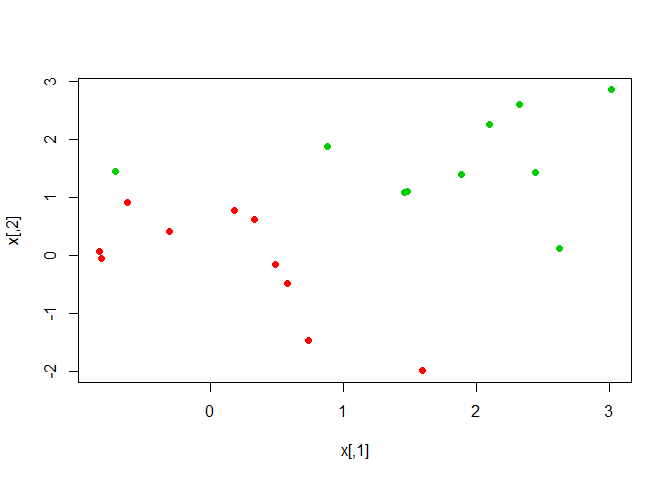
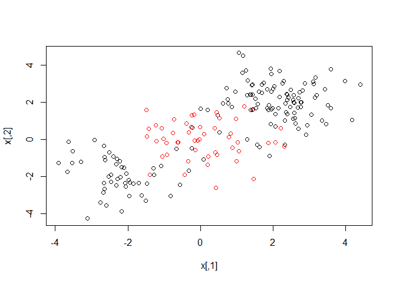
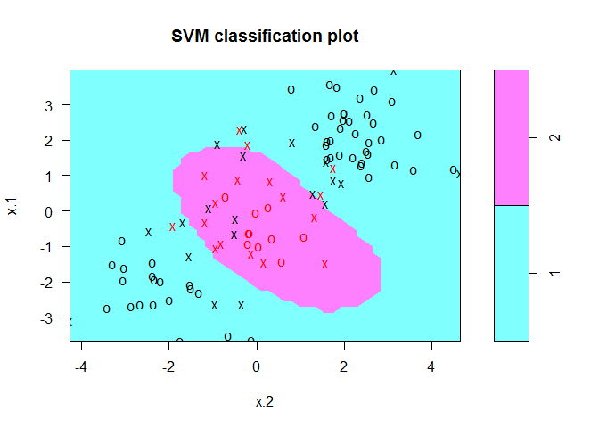
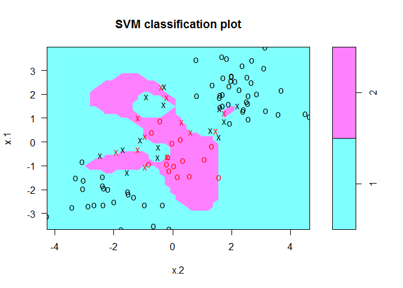
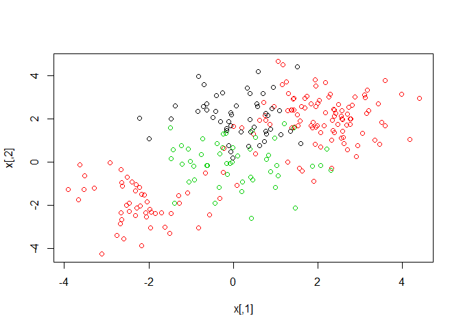
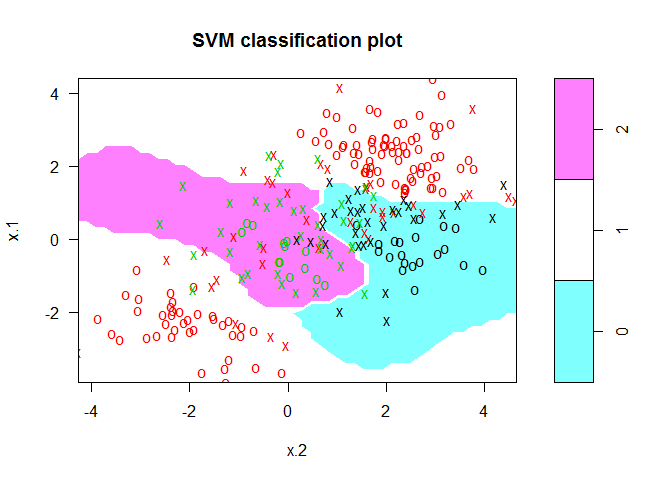

# Ch9 Support Vector Machines

Codes from http://www-bcf.usc.edu/~gareth/ISL/All%20Labs.txt


```r
options(show.error.locations = TRUE)

library(ISLR)
```

```
## Warning: package 'ISLR' was built under R version 3.3.2
```

```r
attach(Wage)
```

# Support Vector Classifier


```r
set.seed(1)
x=matrix(rnorm(20*2), ncol=2)
y=c(rep(-1,10), rep(1,10))
x[y==1,]=x[y==1,] + 1
plot(x, col=(3-y))
```

<!-- -->

```r
dat=data.frame(x=x, y=as.factor(y))
library(e1071)
```

```
## Warning: package 'e1071' was built under R version 3.3.2
```

```r
svmfit=svm(y~., data=dat, kernel="linear", cost=10,scale=FALSE)
plot(svmfit, dat)
```

<!-- -->

```r
svmfit$index
```

```
## [1]  1  2  5  7 14 16 17
```

```r
summary(svmfit)
```

```
## 
## Call:
## svm(formula = y ~ ., data = dat, kernel = "linear", cost = 10, 
##     scale = FALSE)
## 
## 
## Parameters:
##    SVM-Type:  C-classification 
##  SVM-Kernel:  linear 
##        cost:  10 
##       gamma:  0.5 
## 
## Number of Support Vectors:  7
## 
##  ( 4 3 )
## 
## 
## Number of Classes:  2 
## 
## Levels: 
##  -1 1
```

```r
svmfit=svm(y~., data=dat, kernel="linear", cost=0.1,scale=FALSE)
plot(svmfit, dat)
```

<!-- -->

```r
svmfit$index
```

```
##  [1]  1  2  3  4  5  7  9 10 12 13 14 15 16 17 18 20
```

```r
set.seed(1)
tune.out=tune(svm,y~.,data=dat,kernel="linear",ranges=list(cost=c(0.001, 0.01, 0.1, 1,5,10,100)))
summary(tune.out)
```

```
## 
## Parameter tuning of 'svm':
## 
## - sampling method: 10-fold cross validation 
## 
## - best parameters:
##  cost
##   0.1
## 
## - best performance: 0.1 
## 
## - Detailed performance results:
##    cost error dispersion
## 1 1e-03  0.70  0.4216370
## 2 1e-02  0.70  0.4216370
## 3 1e-01  0.10  0.2108185
## 4 1e+00  0.15  0.2415229
## 5 5e+00  0.15  0.2415229
## 6 1e+01  0.15  0.2415229
## 7 1e+02  0.15  0.2415229
```

```r
bestmod=tune.out$best.model
summary(bestmod)
```

```
## 
## Call:
## best.tune(method = svm, train.x = y ~ ., data = dat, ranges = list(cost = c(0.001, 
##     0.01, 0.1, 1, 5, 10, 100)), kernel = "linear")
## 
## 
## Parameters:
##    SVM-Type:  C-classification 
##  SVM-Kernel:  linear 
##        cost:  0.1 
##       gamma:  0.5 
## 
## Number of Support Vectors:  16
## 
##  ( 8 8 )
## 
## 
## Number of Classes:  2 
## 
## Levels: 
##  -1 1
```

```r
xtest=matrix(rnorm(20*2), ncol=2)
ytest=sample(c(-1,1), 20, rep=TRUE)
xtest[ytest==1,]=xtest[ytest==1,] + 1
testdat=data.frame(x=xtest, y=as.factor(ytest))
ypred=predict(bestmod,testdat)
table(predict=ypred, truth=testdat$y)
```

```
##        truth
## predict -1  1
##      -1 11  1
##      1   0  8
```

```r
svmfit=svm(y~., data=dat, kernel="linear", cost=.01,scale=FALSE)
ypred=predict(svmfit,testdat)
table(predict=ypred, truth=testdat$y)
```

```
##        truth
## predict -1  1
##      -1 11  2
##      1   0  7
```

```r
x[y==1,]=x[y==1,]+0.5
plot(x, col=(y+5)/2, pch=19)
```

<!-- -->

```r
dat=data.frame(x=x,y=as.factor(y))
svmfit=svm(y~., data=dat, kernel="linear", cost=1e5)
summary(svmfit)
```

```
## 
## Call:
## svm(formula = y ~ ., data = dat, kernel = "linear", cost = 1e+05)
## 
## 
## Parameters:
##    SVM-Type:  C-classification 
##  SVM-Kernel:  linear 
##        cost:  1e+05 
##       gamma:  0.5 
## 
## Number of Support Vectors:  3
## 
##  ( 1 2 )
## 
## 
## Number of Classes:  2 
## 
## Levels: 
##  -1 1
```

```r
plot(svmfit, dat)
```

<!-- -->

```r
svmfit=svm(y~., data=dat, kernel="linear", cost=1)
summary(svmfit)
```

```
## 
## Call:
## svm(formula = y ~ ., data = dat, kernel = "linear", cost = 1)
## 
## 
## Parameters:
##    SVM-Type:  C-classification 
##  SVM-Kernel:  linear 
##        cost:  1 
##       gamma:  0.5 
## 
## Number of Support Vectors:  7
## 
##  ( 4 3 )
## 
## 
## Number of Classes:  2 
## 
## Levels: 
##  -1 1
```

```r
plot(svmfit,dat)
```

<!-- -->

# Support Vector Machine


```r
set.seed(1)
x=matrix(rnorm(200*2), ncol=2)
x[1:100,]=x[1:100,]+2
x[101:150,]=x[101:150,]-2
y=c(rep(1,150),rep(2,50))
dat=data.frame(x=x,y=as.factor(y))
plot(x, col=y)
```

<!-- -->

```r
train=sample(200,100)
svmfit=svm(y~., data=dat[train,], kernel="radial",  gamma=1, cost=1)
plot(svmfit, dat[train,])
```

<!-- -->

```r
summary(svmfit)
```

```
## 
## Call:
## svm(formula = y ~ ., data = dat[train, ], kernel = "radial", 
##     gamma = 1, cost = 1)
## 
## 
## Parameters:
##    SVM-Type:  C-classification 
##  SVM-Kernel:  radial 
##        cost:  1 
##       gamma:  1 
## 
## Number of Support Vectors:  37
## 
##  ( 17 20 )
## 
## 
## Number of Classes:  2 
## 
## Levels: 
##  1 2
```

```r
svmfit=svm(y~., data=dat[train,], kernel="radial",gamma=1,cost=1e5)
plot(svmfit,dat[train,])
```

<!-- -->

```r
set.seed(1)
tune.out=tune(svm, y~., data=dat[train,], kernel="radial", ranges=list(cost=c(0.1,1,10,100,1000),gamma=c(0.5,1,2,3,4)))
summary(tune.out)
```

```
## 
## Parameter tuning of 'svm':
## 
## - sampling method: 10-fold cross validation 
## 
## - best parameters:
##  cost gamma
##     1     2
## 
## - best performance: 0.12 
## 
## - Detailed performance results:
##     cost gamma error dispersion
## 1  1e-01   0.5  0.27 0.11595018
## 2  1e+00   0.5  0.13 0.08232726
## 3  1e+01   0.5  0.15 0.07071068
## 4  1e+02   0.5  0.17 0.08232726
## 5  1e+03   0.5  0.21 0.09944289
## 6  1e-01   1.0  0.25 0.13540064
## 7  1e+00   1.0  0.13 0.08232726
## 8  1e+01   1.0  0.16 0.06992059
## 9  1e+02   1.0  0.20 0.09428090
## 10 1e+03   1.0  0.20 0.08164966
## 11 1e-01   2.0  0.25 0.12692955
## 12 1e+00   2.0  0.12 0.09189366
## 13 1e+01   2.0  0.17 0.09486833
## 14 1e+02   2.0  0.19 0.09944289
## 15 1e+03   2.0  0.20 0.09428090
## 16 1e-01   3.0  0.27 0.11595018
## 17 1e+00   3.0  0.13 0.09486833
## 18 1e+01   3.0  0.18 0.10327956
## 19 1e+02   3.0  0.21 0.08755950
## 20 1e+03   3.0  0.22 0.10327956
## 21 1e-01   4.0  0.27 0.11595018
## 22 1e+00   4.0  0.15 0.10801234
## 23 1e+01   4.0  0.18 0.11352924
## 24 1e+02   4.0  0.21 0.08755950
## 25 1e+03   4.0  0.24 0.10749677
```

```r
table(true=dat[-train,"y"], pred=predict(tune.out$best.model,newdata=dat[-train,]))
```

```
##     pred
## true  1  2
##    1 74  3
##    2  7 16
```

# ROC Curves


```r
library(ROCR)
```

```
## Warning: package 'ROCR' was built under R version 3.3.2
```

```
## Loading required package: gplots
```

```
## Warning: package 'gplots' was built under R version 3.3.2
```

```
## 
## Attaching package: 'gplots'
```

```
## The following object is masked from 'package:stats':
## 
##     lowess
```

```r
rocplot=function(pred, truth, ...){
  predob = prediction(pred, truth)
  perf = performance(predob, "tpr", "fpr")
  plot(perf,...)}
svmfit.opt=svm(y~., data=dat[train,], kernel="radial",gamma=2, cost=1,decision.values=T)
fitted=attributes(predict(svmfit.opt,dat[train,],decision.values=TRUE))$decision.values
par(mfrow=c(1,2))
rocplot(fitted,dat[train,"y"],main="Training Data")
svmfit.flex=svm(y~., data=dat[train,], kernel="radial",gamma=50, cost=1, decision.values=T)
fitted=attributes(predict(svmfit.flex,dat[train,],decision.values=T))$decision.values
rocplot(fitted,dat[train,"y"],add=T,col="red")
fitted=attributes(predict(svmfit.opt,dat[-train,],decision.values=T))$decision.values
rocplot(fitted,dat[-train,"y"],main="Test Data")
fitted=attributes(predict(svmfit.flex,dat[-train,],decision.values=T))$decision.values
rocplot(fitted,dat[-train,"y"],add=T,col="red")
```

<!-- -->

# SVM with Multiple Classes


```r
set.seed(1)
x=rbind(x, matrix(rnorm(50*2), ncol=2))
y=c(y, rep(0,50))
x[y==0,2]=x[y==0,2]+2
dat=data.frame(x=x, y=as.factor(y))
par(mfrow=c(1,1))
plot(x,col=(y+1))
```

<!-- -->

```r
svmfit=svm(y~., data=dat, kernel="radial", cost=10, gamma=1)
plot(svmfit, dat)
```

<!-- -->

# Application to Gene Expression Data


```r
library(ISLR)
names(Khan)
```

```
## [1] "xtrain" "xtest"  "ytrain" "ytest"
```

```r
dim(Khan$xtrain)
```

```
## [1]   63 2308
```

```r
dim(Khan$xtest)
```

```
## [1]   20 2308
```

```r
length(Khan$ytrain)
```

```
## [1] 63
```

```r
length(Khan$ytest)
```

```
## [1] 20
```

```r
table(Khan$ytrain)
```

```
## 
##  1  2  3  4 
##  8 23 12 20
```

```r
table(Khan$ytest)
```

```
## 
## 1 2 3 4 
## 3 6 6 5
```

```r
dat=data.frame(x=Khan$xtrain, y=as.factor(Khan$ytrain))
out=svm(y~., data=dat, kernel="linear",cost=10)
summary(out)
```

```
## 
## Call:
## svm(formula = y ~ ., data = dat, kernel = "linear", cost = 10)
## 
## 
## Parameters:
##    SVM-Type:  C-classification 
##  SVM-Kernel:  linear 
##        cost:  10 
##       gamma:  0.0004332756 
## 
## Number of Support Vectors:  58
## 
##  ( 20 20 11 7 )
## 
## 
## Number of Classes:  4 
## 
## Levels: 
##  1 2 3 4
```

```r
table(out$fitted, dat$y)
```

```
##    
##      1  2  3  4
##   1  8  0  0  0
##   2  0 23  0  0
##   3  0  0 12  0
##   4  0  0  0 20
```

```r
dat.te=data.frame(x=Khan$xtest, y=as.factor(Khan$ytest))
pred.te=predict(out, newdata=dat.te)
table(pred.te, dat.te$y)
```

```
##        
## pred.te 1 2 3 4
##       1 3 0 0 0
##       2 0 6 2 0
##       3 0 0 4 0
##       4 0 0 0 5
```


---
title: "ch9.R"
author: "takanori"
date: "Sat Nov 05 17:08:38 2016"
---
