Introduction to Data Science with R
"""""""""""""""""""""""""""""""""""
The source R script available :download:`here <TitanicDataAnalysis_Video7.R>`

.. include:: /table-template-knitr.rst

.. contents:: `Contents`
    :depth: 2
    :local:

R codes from the Youtube tutorial from Dave Langer.
https://github.com/EasyD/IntroToDataScience

.. code-block:: R

    options(show.error.locations = TRUE)

    #
    # This R source code file corresponds to video 7 of the YouTube series
    # "Introduction to Data Science with R" located at the following URL:
    #     https://youtu.be/fuB7s19g3nQ     
    #

Video1 - Data Analysis Part 1
=============================

https://www.youtube.com/watch?v=32o0DnuRjfg

.. code-block:: R

    # Video1 - Data Analysis Part 1 ----

    # Load raw data
    train <- read.csv("train.csv", header = TRUE)
    test <- read.csv("test.csv", header = TRUE)

.. code-block:: R

    print(xtable::xtable(head(train,n=10)), type='html')

.. raw:: html

   <!-- html table generated in R 3.3.1 by xtable 1.8-2 package -->

.. raw:: html

   <!-- Sat Nov 05 18:23:56 2016 -->

.. raw:: html

   <table border="1">

.. raw:: html

   <tr>

.. raw:: html

   <th>

.. raw:: html

   </th>

.. raw:: html

   <th>

survived

.. raw:: html

   </th>

.. raw:: html

   <th>

pclass

.. raw:: html

   </th>

.. raw:: html

   <th>

name

.. raw:: html

   </th>

.. raw:: html

   <th>

sex

.. raw:: html

   </th>

.. raw:: html

   <th>

age

.. raw:: html

   </th>

.. raw:: html

   <th>

sibsp

.. raw:: html

   </th>

.. raw:: html

   <th>

parch

.. raw:: html

   </th>

.. raw:: html

   <th>

ticket

.. raw:: html

   </th>

.. raw:: html

   <th>

fare

.. raw:: html

   </th>

.. raw:: html

   <th>

cabin

.. raw:: html

   </th>

.. raw:: html

   <th>

embarked

.. raw:: html

   </th>

.. raw:: html

   </tr>

.. raw:: html

   <tr>

.. raw:: html

   <td align="right">

1

.. raw:: html

   </td>

.. raw:: html

   <td align="right">

0

.. raw:: html

   </td>

.. raw:: html

   <td align="right">

3

.. raw:: html

   </td>

.. raw:: html

   <td>

Braund, Mr. Owen Harris

.. raw:: html

   </td>

.. raw:: html

   <td>

male

.. raw:: html

   </td>

.. raw:: html

   <td align="right">

22.00

.. raw:: html

   </td>

.. raw:: html

   <td align="right">

1

.. raw:: html

   </td>

.. raw:: html

   <td align="right">

0

.. raw:: html

   </td>

.. raw:: html

   <td>

A/5 21171

.. raw:: html

   </td>

.. raw:: html

   <td align="right">

7.25

.. raw:: html

   </td>

.. raw:: html

   <td>

.. raw:: html

   </td>

.. raw:: html

   <td>

S

.. raw:: html

   </td>

.. raw:: html

   </tr>

.. raw:: html

   <tr>

.. raw:: html

   <td align="right">

2

.. raw:: html

   </td>

.. raw:: html

   <td align="right">

1

.. raw:: html

   </td>

.. raw:: html

   <td align="right">

1

.. raw:: html

   </td>

.. raw:: html

   <td>

Cumings, Mrs. John Bradley (Florence Briggs Thayer)

.. raw:: html

   </td>

.. raw:: html

   <td>

female

.. raw:: html

   </td>

.. raw:: html

   <td align="right">

38.00

.. raw:: html

   </td>

.. raw:: html

   <td align="right">

1

.. raw:: html

   </td>

.. raw:: html

   <td align="right">

0

.. raw:: html

   </td>

.. raw:: html

   <td>

PC 17599

.. raw:: html

   </td>

.. raw:: html

   <td align="right">

71.28

.. raw:: html

   </td>

.. raw:: html

   <td>

C85

.. raw:: html

   </td>

.. raw:: html

   <td>

C

.. raw:: html

   </td>

.. raw:: html

   </tr>

.. raw:: html

   <tr>

.. raw:: html

   <td align="right">

3

.. raw:: html

   </td>

.. raw:: html

   <td align="right">

1

.. raw:: html

   </td>

.. raw:: html

   <td align="right">

3

.. raw:: html

   </td>

.. raw:: html

   <td>

Heikkinen, Miss. Laina

.. raw:: html

   </td>

.. raw:: html

   <td>

female

.. raw:: html

   </td>

.. raw:: html

   <td align="right">

26.00

.. raw:: html

   </td>

.. raw:: html

   <td align="right">

0

.. raw:: html

   </td>

.. raw:: html

   <td align="right">

0

.. raw:: html

   </td>

.. raw:: html

   <td>

STON/O2. 3101282

.. raw:: html

   </td>

.. raw:: html

   <td align="right">

7.92

.. raw:: html

   </td>

.. raw:: html

   <td>

.. raw:: html

   </td>

.. raw:: html

   <td>

S

.. raw:: html

   </td>

.. raw:: html

   </tr>

.. raw:: html

   <tr>

.. raw:: html

   <td align="right">

4

.. raw:: html

   </td>

.. raw:: html

   <td align="right">

1

.. raw:: html

   </td>

.. raw:: html

   <td align="right">

1

.. raw:: html

   </td>

.. raw:: html

   <td>

Futrelle, Mrs. Jacques Heath (Lily May Peel)

.. raw:: html

   </td>

.. raw:: html

   <td>

female

.. raw:: html

   </td>

.. raw:: html

   <td align="right">

35.00

.. raw:: html

   </td>

.. raw:: html

   <td align="right">

1

.. raw:: html

   </td>

.. raw:: html

   <td align="right">

0

.. raw:: html

   </td>

.. raw:: html

   <td>

113803

.. raw:: html

   </td>

.. raw:: html

   <td align="right">

53.10

.. raw:: html

   </td>

.. raw:: html

   <td>

C123

.. raw:: html

   </td>

.. raw:: html

   <td>

S

.. raw:: html

   </td>

.. raw:: html

   </tr>

.. raw:: html

   <tr>

.. raw:: html

   <td align="right">

5

.. raw:: html

   </td>

.. raw:: html

   <td align="right">

0

.. raw:: html

   </td>

.. raw:: html

   <td align="right">

3

.. raw:: html

   </td>

.. raw:: html

   <td>

Allen, Mr. William Henry

.. raw:: html

   </td>

.. raw:: html

   <td>

male

.. raw:: html

   </td>

.. raw:: html

   <td align="right">

35.00

.. raw:: html

   </td>

.. raw:: html

   <td align="right">

0

.. raw:: html

   </td>

.. raw:: html

   <td align="right">

0

.. raw:: html

   </td>

.. raw:: html

   <td>

373450

.. raw:: html

   </td>

.. raw:: html

   <td align="right">

8.05

.. raw:: html

   </td>

.. raw:: html

   <td>

.. raw:: html

   </td>

.. raw:: html

   <td>

S

.. raw:: html

   </td>

.. raw:: html

   </tr>

.. raw:: html

   <tr>

.. raw:: html

   <td align="right">

6

.. raw:: html

   </td>

.. raw:: html

   <td align="right">

0

.. raw:: html

   </td>

.. raw:: html

   <td align="right">

3

.. raw:: html

   </td>

.. raw:: html

   <td>

Moran, Mr. James

.. raw:: html

   </td>

.. raw:: html

   <td>

male

.. raw:: html

   </td>

.. raw:: html

   <td align="right">

.. raw:: html

   </td>

.. raw:: html

   <td align="right">

0

.. raw:: html

   </td>

.. raw:: html

   <td align="right">

0

.. raw:: html

   </td>

.. raw:: html

   <td>

330877

.. raw:: html

   </td>

.. raw:: html

   <td align="right">

8.46

.. raw:: html

   </td>

.. raw:: html

   <td>

.. raw:: html

   </td>

.. raw:: html

   <td>

Q

.. raw:: html

   </td>

.. raw:: html

   </tr>

.. raw:: html

   <tr>

.. raw:: html

   <td align="right">

7

.. raw:: html

   </td>

.. raw:: html

   <td align="right">

0

.. raw:: html

   </td>

.. raw:: html

   <td align="right">

1

.. raw:: html

   </td>

.. raw:: html

   <td>

McCarthy, Mr. Timothy J

.. raw:: html

   </td>

.. raw:: html

   <td>

male

.. raw:: html

   </td>

.. raw:: html

   <td align="right">

54.00

.. raw:: html

   </td>

.. raw:: html

   <td align="right">

0

.. raw:: html

   </td>

.. raw:: html

   <td align="right">

0

.. raw:: html

   </td>

.. raw:: html

   <td>

17463

.. raw:: html

   </td>

.. raw:: html

   <td align="right">

51.86

.. raw:: html

   </td>

.. raw:: html

   <td>

E46

.. raw:: html

   </td>

.. raw:: html

   <td>

S

.. raw:: html

   </td>

.. raw:: html

   </tr>

.. raw:: html

   <tr>

.. raw:: html

   <td align="right">

8

.. raw:: html

   </td>

.. raw:: html

   <td align="right">

0

.. raw:: html

   </td>

.. raw:: html

   <td align="right">

3

.. raw:: html

   </td>

.. raw:: html

   <td>

Palsson, Master. Gosta Leonard

.. raw:: html

   </td>

.. raw:: html

   <td>

male

.. raw:: html

   </td>

.. raw:: html

   <td align="right">

2.00

.. raw:: html

   </td>

.. raw:: html

   <td align="right">

3

.. raw:: html

   </td>

.. raw:: html

   <td align="right">

1

.. raw:: html

   </td>

.. raw:: html

   <td>

349909

.. raw:: html

   </td>

.. raw:: html

   <td align="right">

21.07

.. raw:: html

   </td>

.. raw:: html

   <td>

.. raw:: html

   </td>

.. raw:: html

   <td>

S

.. raw:: html

   </td>

.. raw:: html

   </tr>

.. raw:: html

   <tr>

.. raw:: html

   <td align="right">

9

.. raw:: html

   </td>

.. raw:: html

   <td align="right">

1

.. raw:: html

   </td>

.. raw:: html

   <td align="right">

3

.. raw:: html

   </td>

.. raw:: html

   <td>

Johnson, Mrs. Oscar W (Elisabeth Vilhelmina Berg)

.. raw:: html

   </td>

.. raw:: html

   <td>

female

.. raw:: html

   </td>

.. raw:: html

   <td align="right">

27.00

.. raw:: html

   </td>

.. raw:: html

   <td align="right">

0

.. raw:: html

   </td>

.. raw:: html

   <td align="right">

2

.. raw:: html

   </td>

.. raw:: html

   <td>

347742

.. raw:: html

   </td>

.. raw:: html

   <td align="right">

11.13

.. raw:: html

   </td>

.. raw:: html

   <td>

.. raw:: html

   </td>

.. raw:: html

   <td>

S

.. raw:: html

   </td>

.. raw:: html

   </tr>

.. raw:: html

   <tr>

.. raw:: html

   <td align="right">

10

.. raw:: html

   </td>

.. raw:: html

   <td align="right">

1

.. raw:: html

   </td>

.. raw:: html

   <td align="right">

2

.. raw:: html

   </td>

.. raw:: html

   <td>

Nasser, Mrs. Nicholas (Adele Achem)

.. raw:: html

   </td>

.. raw:: html

   <td>

female

.. raw:: html

   </td>

.. raw:: html

   <td align="right">

14.00

.. raw:: html

   </td>

.. raw:: html

   <td align="right">

1

.. raw:: html

   </td>

.. raw:: html

   <td align="right">

0

.. raw:: html

   </td>

.. raw:: html

   <td>

237736

.. raw:: html

   </td>

.. raw:: html

   <td align="right">

30.07

.. raw:: html

   </td>

.. raw:: html

   <td>

.. raw:: html

   </td>

.. raw:: html

   <td>

C

.. raw:: html

   </td>

.. raw:: html

   </tr>

.. raw:: html

   </table>

.. code-block:: R

    print(xtable::xtable(head(test,n=10)), type='html')

.. raw:: html

   <!-- html table generated in R 3.3.1 by xtable 1.8-2 package -->

.. raw:: html

   <!-- Sat Nov 05 18:23:56 2016 -->

.. raw:: html

   <table border="1">

.. raw:: html

   <tr>

.. raw:: html

   <th>

.. raw:: html

   </th>

.. raw:: html

   <th>

pclass

.. raw:: html

   </th>

.. raw:: html

   <th>

name

.. raw:: html

   </th>

.. raw:: html

   <th>

sex

.. raw:: html

   </th>

.. raw:: html

   <th>

age

.. raw:: html

   </th>

.. raw:: html

   <th>

sibsp

.. raw:: html

   </th>

.. raw:: html

   <th>

parch

.. raw:: html

   </th>

.. raw:: html

   <th>

ticket

.. raw:: html

   </th>

.. raw:: html

   <th>

fare

.. raw:: html

   </th>

.. raw:: html

   <th>

cabin

.. raw:: html

   </th>

.. raw:: html

   <th>

embarked

.. raw:: html

   </th>

.. raw:: html

   </tr>

.. raw:: html

   <tr>

.. raw:: html

   <td align="right">

1

.. raw:: html

   </td>

.. raw:: html

   <td align="right">

3

.. raw:: html

   </td>

.. raw:: html

   <td>

Kelly, Mr. James

.. raw:: html

   </td>

.. raw:: html

   <td>

male

.. raw:: html

   </td>

.. raw:: html

   <td align="right">

34.50

.. raw:: html

   </td>

.. raw:: html

   <td align="right">

0

.. raw:: html

   </td>

.. raw:: html

   <td align="right">

0

.. raw:: html

   </td>

.. raw:: html

   <td>

330911

.. raw:: html

   </td>

.. raw:: html

   <td align="right">

7.83

.. raw:: html

   </td>

.. raw:: html

   <td>

.. raw:: html

   </td>

.. raw:: html

   <td>

Q

.. raw:: html

   </td>

.. raw:: html

   </tr>

.. raw:: html

   <tr>

.. raw:: html

   <td align="right">

2

.. raw:: html

   </td>

.. raw:: html

   <td align="right">

3

.. raw:: html

   </td>

.. raw:: html

   <td>

Wilkes, Mrs. James (Ellen Needs)

.. raw:: html

   </td>

.. raw:: html

   <td>

female

.. raw:: html

   </td>

.. raw:: html

   <td align="right">

47.00

.. raw:: html

   </td>

.. raw:: html

   <td align="right">

1

.. raw:: html

   </td>

.. raw:: html

   <td align="right">

0

.. raw:: html

   </td>

.. raw:: html

   <td>

363272

.. raw:: html

   </td>

.. raw:: html

   <td align="right">

7.00

.. raw:: html

   </td>

.. raw:: html

   <td>

.. raw:: html

   </td>

.. raw:: html

   <td>

S

.. raw:: html

   </td>

.. raw:: html

   </tr>

.. raw:: html

   <tr>

.. raw:: html

   <td align="right">

3

.. raw:: html

   </td>

.. raw:: html

   <td align="right">

2

.. raw:: html

   </td>

.. raw:: html

   <td>

Myles, Mr. Thomas Francis

.. raw:: html

   </td>

.. raw:: html

   <td>

male

.. raw:: html

   </td>

.. raw:: html

   <td align="right">

62.00

.. raw:: html

   </td>

.. raw:: html

   <td align="right">

0

.. raw:: html

   </td>

.. raw:: html

   <td align="right">

0

.. raw:: html

   </td>

.. raw:: html

   <td>

240276

.. raw:: html

   </td>

.. raw:: html

   <td align="right">

9.69

.. raw:: html

   </td>

.. raw:: html

   <td>

.. raw:: html

   </td>

.. raw:: html

   <td>

Q

.. raw:: html

   </td>

.. raw:: html

   </tr>

.. raw:: html

   <tr>

.. raw:: html

   <td align="right">

4

.. raw:: html

   </td>

.. raw:: html

   <td align="right">

3

.. raw:: html

   </td>

.. raw:: html

   <td>

Wirz, Mr. Albert

.. raw:: html

   </td>

.. raw:: html

   <td>

male

.. raw:: html

   </td>

.. raw:: html

   <td align="right">

27.00

.. raw:: html

   </td>

.. raw:: html

   <td align="right">

0

.. raw:: html

   </td>

.. raw:: html

   <td align="right">

0

.. raw:: html

   </td>

.. raw:: html

   <td>

315154

.. raw:: html

   </td>

.. raw:: html

   <td align="right">

8.66

.. raw:: html

   </td>

.. raw:: html

   <td>

.. raw:: html

   </td>

.. raw:: html

   <td>

S

.. raw:: html

   </td>

.. raw:: html

   </tr>

.. raw:: html

   <tr>

.. raw:: html

   <td align="right">

5

.. raw:: html

   </td>

.. raw:: html

   <td align="right">

3

.. raw:: html

   </td>

.. raw:: html

   <td>

Hirvonen, Mrs. Alexander (Helga E Lindqvist)

.. raw:: html

   </td>

.. raw:: html

   <td>

female

.. raw:: html

   </td>

.. raw:: html

   <td align="right">

22.00

.. raw:: html

   </td>

.. raw:: html

   <td align="right">

1

.. raw:: html

   </td>

.. raw:: html

   <td align="right">

1

.. raw:: html

   </td>

.. raw:: html

   <td>

3101298

.. raw:: html

   </td>

.. raw:: html

   <td align="right">

12.29

.. raw:: html

   </td>

.. raw:: html

   <td>

.. raw:: html

   </td>

.. raw:: html

   <td>

S

.. raw:: html

   </td>

.. raw:: html

   </tr>

.. raw:: html

   <tr>

.. raw:: html

   <td align="right">

6

.. raw:: html

   </td>

.. raw:: html

   <td align="right">

3

.. raw:: html

   </td>

.. raw:: html

   <td>

Svensson, Mr. Johan Cervin

.. raw:: html

   </td>

.. raw:: html

   <td>

male

.. raw:: html

   </td>

.. raw:: html

   <td align="right">

14.00

.. raw:: html

   </td>

.. raw:: html

   <td align="right">

0

.. raw:: html

   </td>

.. raw:: html

   <td align="right">

0

.. raw:: html

   </td>

.. raw:: html

   <td>

7538

.. raw:: html

   </td>

.. raw:: html

   <td align="right">

9.22

.. raw:: html

   </td>

.. raw:: html

   <td>

.. raw:: html

   </td>

.. raw:: html

   <td>

S

.. raw:: html

   </td>

.. raw:: html

   </tr>

.. raw:: html

   <tr>

.. raw:: html

   <td align="right">

7

.. raw:: html

   </td>

.. raw:: html

   <td align="right">

3

.. raw:: html

   </td>

.. raw:: html

   <td>

Connolly, Miss. Kate

.. raw:: html

   </td>

.. raw:: html

   <td>

female

.. raw:: html

   </td>

.. raw:: html

   <td align="right">

30.00

.. raw:: html

   </td>

.. raw:: html

   <td align="right">

0

.. raw:: html

   </td>

.. raw:: html

   <td align="right">

0

.. raw:: html

   </td>

.. raw:: html

   <td>

330972

.. raw:: html

   </td>

.. raw:: html

   <td align="right">

7.63

.. raw:: html

   </td>

.. raw:: html

   <td>

.. raw:: html

   </td>

.. raw:: html

   <td>

Q

.. raw:: html

   </td>

.. raw:: html

   </tr>

.. raw:: html

   <tr>

.. raw:: html

   <td align="right">

8

.. raw:: html

   </td>

.. raw:: html

   <td align="right">

2

.. raw:: html

   </td>

.. raw:: html

   <td>

Caldwell, Mr. Albert Francis

.. raw:: html

   </td>

.. raw:: html

   <td>

male

.. raw:: html

   </td>

.. raw:: html

   <td align="right">

26.00

.. raw:: html

   </td>

.. raw:: html

   <td align="right">

1

.. raw:: html

   </td>

.. raw:: html

   <td align="right">

1

.. raw:: html

   </td>

.. raw:: html

   <td>

248738

.. raw:: html

   </td>

.. raw:: html

   <td align="right">

29.00

.. raw:: html

   </td>

.. raw:: html

   <td>

.. raw:: html

   </td>

.. raw:: html

   <td>

S

.. raw:: html

   </td>

.. raw:: html

   </tr>

.. raw:: html

   <tr>

.. raw:: html

   <td align="right">

9

.. raw:: html

   </td>

.. raw:: html

   <td align="right">

3

.. raw:: html

   </td>

.. raw:: html

   <td>

Abrahim, Mrs. Joseph (Sophie Halaut Easu)

.. raw:: html

   </td>

.. raw:: html

   <td>

female

.. raw:: html

   </td>

.. raw:: html

   <td align="right">

18.00

.. raw:: html

   </td>

.. raw:: html

   <td align="right">

0

.. raw:: html

   </td>

.. raw:: html

   <td align="right">

0

.. raw:: html

   </td>

.. raw:: html

   <td>

2657

.. raw:: html

   </td>

.. raw:: html

   <td align="right">

7.23

.. raw:: html

   </td>

.. raw:: html

   <td>

.. raw:: html

   </td>

.. raw:: html

   <td>

C

.. raw:: html

   </td>

.. raw:: html

   </tr>

.. raw:: html

   <tr>

.. raw:: html

   <td align="right">

10

.. raw:: html

   </td>

.. raw:: html

   <td align="right">

3

.. raw:: html

   </td>

.. raw:: html

   <td>

Davies, Mr. John Samuel

.. raw:: html

   </td>

.. raw:: html

   <td>

male

.. raw:: html

   </td>

.. raw:: html

   <td align="right">

21.00

.. raw:: html

   </td>

.. raw:: html

   <td align="right">

2

.. raw:: html

   </td>

.. raw:: html

   <td align="right">

0

.. raw:: html

   </td>

.. raw:: html

   <td>

A/4 48871

.. raw:: html

   </td>

.. raw:: html

   <td align="right">

24.15

.. raw:: html

   </td>

.. raw:: html

   <td>

.. raw:: html

   </td>

.. raw:: html

   <td>

S

.. raw:: html

   </td>

.. raw:: html

   </tr>

.. raw:: html

   </table>

.. code-block:: R

    # Add a "Survived" variable to the test set to allow for combining data sets
    test.survived <- data.frame(survived = rep("None", nrow(test)), test[,])

    # Combine data sets
    data.combined <- rbind(train, test.survived)

    # A bit about R data types (e.g., factors)
    str(data.combined)

'data.frame': 1309 obs. of 11 variables: $ survived: chr "0" "1" "1" "1"
... $ pclass : int 3 1 3 1 3 3 1 3 3 2 ... $ name : Factor w/ 1307
levels "Abbing, Mr. Anthony",..: 109 191 358 277 16 559 520 629 417 581
... $ sex : Factor w/ 2 levels "female","male": 2 1 1 1 2 2 2 2 1 1 ...
$ age : num 22 38 26 35 35 NA 54 2 27 14 ... $ sibsp : int 1 1 0 1 0 0 0
3 0 1 ... $ parch : int 0 0 0 0 0 0 0 1 2 0 ... $ ticket : Factor w/ 929
levels "110152","110413",..: 524 597 670 50 473 276 86 396 345 133 ... $
fare : num 7.25 71.28 7.92 53.1 8.05 ... $ cabin : Factor w/ 187 levels
"","A10","A14",..: 1 83 1 57 1 1 131 1 1 1 ... $ embarked: Factor w/ 4
levels "","C","Q","S": 4 2 4 4 4 3 4 4 4 2 ...

.. code-block:: R

    data.combined$survived <- as.factor(data.combined$survived)
    data.combined$pclass <- as.factor(data.combined$pclass)

    # Take a look at gross survival rates
    table(data.combined$survived)

0 1 None 549 342 418

.. code-block:: R

    # Distribution across classes
    table(data.combined$pclass)

1 2 3 323 277 709

.. code-block:: R

    # Load up ggplot2 package to use for visualizations
    library(ggplot2)

    # Hypothesis - Rich folks survived at a higer rate
    train$pclass <- as.factor(train$pclass)
    ggplot(train, aes(x = pclass, fill = factor(survived))) +
      geom_bar() +
      xlab("Pclass") +
      ylab("Total Count") +
      labs(fill = "Survived") 

|image0|\ 

.. code-block:: R

    # Examine the first few names in the training data set
    head(as.character(train$name))

| [1] "Braund, Mr. Owen Harris"
| [2] "Cumings, Mrs. John Bradley (Florence Briggs Thayer)" [3]
  "Heikkinen, Miss. Laina"
| [4] "Futrelle, Mrs. Jacques Heath (Lily May Peel)"
| [5] "Allen, Mr. William Henry"
| [6] "Moran, Mr. James"

.. code-block:: R

    # How many unique names are there across both train & test?
    length(unique(as.character(data.combined$name)))

[1] 1307

.. code-block:: R

    # Two duplicate names, take a closer look
    # First, get the duplicate names and store them as a vector
    dup.names <- as.character(data.combined[which(duplicated(as.character(data.combined$name))), "name"])

    # Next, take a look at the records in the combined data set
    data.combined[which(data.combined$name %in% dup.names),]

::

    survived pclass                 name    sex  age sibsp parch ticket

290 1 3 Connolly, Miss. Kate female 22.0 0 0 370373 697 0 3 Kelly, Mr.
James male 44.0 0 0 363592 892 None 3 Kelly, Mr. James male 34.5 0 0
330911 898 None 3 Connolly, Miss. Kate female 30.0 0 0 330972 fare cabin
embarked 290 7.7500 Q 697 8.0500 S 892 7.8292 Q 898 7.6292 Q

.. code-block:: R

    # What is up with the 'Miss.' and 'Mr.' thing?
    library(stringr)

    # Any correlation with other variables (e.g., sibsp)?
    misses <- data.combined[which(str_detect(data.combined$name, "Miss.")),]
    misses[1:5,]

survived pclass name sex age sibsp 3 1 3 Heikkinen, Miss. Laina female
26 0 11 1 3 Sandstrom, Miss. Marguerite Rut female 4 1 12 1 1 Bonnell,
Miss. Elizabeth female 58 0 15 0 3 Vestrom, Miss. Hulda Amanda Adolfina
female 14 0 23 1 3 McGowan, Miss. Anna "Annie" female 15 0 parch ticket
fare cabin embarked 3 0 STON/O2. 3101282 7.9250 S 11 1 PP 9549 16.7000
G6 S 12 0 113783 26.5500 C103 S 15 0 350406 7.8542 S 23 0 330923 8.0292
Q

.. code-block:: R

    # Hypothesis - Name titles correlate with age
    mrses <- data.combined[which(str_detect(data.combined$name, "Mrs.")), ]
    mrses[1:5,]

survived pclass name 2 1 1 Cumings, Mrs. John Bradley (Florence Briggs
Thayer) 4 1 1 Futrelle, Mrs. Jacques Heath (Lily May Peel) 9 1 3
Johnson, Mrs. Oscar W (Elisabeth Vilhelmina Berg) 10 1 2 Nasser, Mrs.
Nicholas (Adele Achem) 16 1 2 Hewlett, Mrs. (Mary D Kingcome) sex age
sibsp parch ticket fare cabin embarked 2 female 38 1 0 PC 17599 71.2833
C85 C 4 female 35 1 0 113803 53.1000 C123 S 9 female 27 0 2 347742
11.1333 S 10 female 14 1 0 237736 30.0708 C 16 female 55 0 0 248706
16.0000 S

.. code-block:: R

    # Check out males to see if pattern continues
    males <- data.combined[which(train$sex == "male"), ]
    males[1:5,]

survived pclass name sex age sibsp parch 1 0 3 Braund, Mr. Owen Harris
male 22 1 0 5 0 3 Allen, Mr. William Henry male 35 0 0 6 0 3 Moran, Mr.
James male NA 0 0 7 0 1 McCarthy, Mr. Timothy J male 54 0 0 8 0 3
Palsson, Master. Gosta Leonard male 2 3 1 ticket fare cabin embarked 1
A/5 21171 7.2500 S 5 373450 8.0500 S 6 330877 8.4583 Q 7 17463 51.8625
E46 S 8 349909 21.0750 S

.. code-block:: R

    # Expand upon the realtionship between `Survived` and `Pclass` by adding the new `Title` variable to the
    # data set and then explore a potential 3-dimensional relationship.

    # Create a utility function to help with title extraction
    extractTitle <- function(name) {
      name <- as.character(name)
      
      if (length(grep("Miss.", name)) > 0) {
        return ("Miss.")
      } else if (length(grep("Master.", name)) > 0) {
        return ("Master.")
      } else if (length(grep("Mrs.", name)) > 0) {
        return ("Mrs.")
      } else if (length(grep("Mr.", name)) > 0) {
        return ("Mr.")
      } else {
        return ("Other")
      }
    }

    titles <- NULL
    for (i in 1:nrow(data.combined)) {
      titles <- c(titles, extractTitle(data.combined[i,"name"]))
    }
    data.combined$title <- as.factor(titles)

    # Since we only have survived lables for the train set, only use the
    # first 891 rows
    ggplot(data.combined[1:891,], aes(x = title, fill = survived)) +
      geom_bar() +
      facet_wrap(~pclass) + 
      ggtitle("Pclass") +
      xlab("Title") +
      ylab("Total Count") +
      labs(fill = "Survived")

|image1|\ 

Video2 - Data Analysis Part 2
=============================

https://www.youtube.com/watch?v=u6sahb7Hmog

.. code-block:: R

    # Video2 - Data Analysis Part 2 ----
    # What's the distribution of females to males across train & test?
    table(data.combined$sex)

::

    ## 
    ## female   male 
    ##    466    843

.. code-block:: R

    # Visualize the 3-way relationship of sex, pclass, and survival, compare to analysis of title
    ggplot(data.combined[1:891,], aes(x = sex, fill = survived)) +
      geom_bar() +
      facet_wrap(~pclass) + 
      ggtitle("Pclass") +
      xlab("Sex") +
      ylab("Total Count") +
      labs(fill = "Survived")

|image2|\ 

.. code-block:: R

    # OK, age and sex seem pretty important as derived from analysis of title, let's take a closer 
    # look at the distibutions of age over entire data set
    summary(data.combined$age)

::

    ##    Min. 1st Qu.  Median    Mean 3rd Qu.    Max.    NA's 
    ##    0.17   21.00   28.00   29.88   39.00   80.00     263

.. code-block:: R

    summary(data.combined[1:891,"age"])

::

    ##    Min. 1st Qu.  Median    Mean 3rd Qu.    Max.    NA's 
    ##    0.42   20.12   28.00   29.70   38.00   80.00     177

.. code-block:: R

    # Just to be thorough, take a look at survival rates broken out by sex, pclass, and age
    ggplot(data.combined[1:891,], aes(x = age, fill = survived)) +
      facet_wrap(~sex + pclass) +
      geom_histogram(binwidth = 10) +
      xlab("Age") +
      ylab("Total Count")

::

    ## Warning: Removed 177 rows containing non-finite values (stat_bin).

|image3|\ 

.. code-block:: R

    # Validate that "Master." is a good proxy for male children
    boys <- data.combined[which(data.combined$title == "Master."),]
    summary(boys$age)

::

    ##    Min. 1st Qu.  Median    Mean 3rd Qu.    Max.    NA's 
    ##   0.330   2.000   4.000   5.483   9.000  14.500       8

.. code-block:: R

    # We know that "Miss." is more complicated, let's examine further
    misses <- data.combined[which(data.combined$title == "Miss."),]
    summary(misses$age)

::

    ##    Min. 1st Qu.  Median    Mean 3rd Qu.    Max.    NA's 
    ##    0.17   15.00   22.00   21.77   30.00   63.00      50

.. code-block:: R

    ggplot(misses[misses$survived != "None" & !is.na(misses$age),], aes(x = age, fill = survived)) +
      facet_wrap(~pclass) +
      geom_histogram(binwidth = 5) +
      ggtitle("Age for 'Miss.' by Pclass") + 
      xlab("Age") +
      ylab("Total Count")

|image4|\ 

.. code-block:: R

    # OK, appears female children may have different survival rate, 
    # could be a candidate for feature engineering later
    misses.alone <- misses[which(misses$sibsp == 0 & misses$parch == 0),]
    summary(misses.alone$age)

::

    ##    Min. 1st Qu.  Median    Mean 3rd Qu.    Max.    NA's 
    ##    5.00   21.00   26.00   27.23   32.50   58.00      33

.. code-block:: R

    length(which(misses.alone$age <= 14.5))

::

    ## [1] 4

.. code-block:: R

    # Move on to the sibsp variable, summarize the variable
    summary(data.combined$sibsp)

::

    ##    Min. 1st Qu.  Median    Mean 3rd Qu.    Max. 
    ##  0.0000  0.0000  0.0000  0.4989  1.0000  8.0000

.. code-block:: R

    # Can we treat as a factor?
    length(unique(data.combined$sibsp))

::

    ## [1] 7

.. code-block:: R

    data.combined$sibsp <- as.factor(data.combined$sibsp)

    # We believe title is predictive. Visualize survival reates by sibsp, pclass, and title
    ggplot(data.combined[1:891,], aes(x = sibsp, fill = survived)) +
      geom_bar() +
      facet_wrap(~pclass + title) + 
      ggtitle("Pclass, Title") +
      xlab("SibSp") +
      ylab("Total Count") +
      ylim(0,300) +
      labs(fill = "Survived")

|image5|\ 

.. code-block:: R

    # Treat the parch vaiable as a factor and visualize
    data.combined$parch <- as.factor(data.combined$parch)
    ggplot(data.combined[1:891,], aes(x = parch, fill = survived)) +
      geom_bar() +
      facet_wrap(~pclass + title) + 
      ggtitle("Pclass, Title") +
      xlab("ParCh") +
      ylab("Total Count") +
      ylim(0,300) +
      labs(fill = "Survived")

|image6|\ 

.. code-block:: R

    # Let's try some feature engineering. What about creating a family size feature?
    temp.sibsp <- c(train$sibsp, test$sibsp)
    temp.parch <- c(train$parch, test$parch)
    data.combined$family.size <- as.factor(temp.sibsp + temp.parch + 1)

    # Visualize it to see if it is predictive
    ggplot(data.combined[1:891,], aes(x = family.size, fill = survived)) +
      geom_bar() +
      facet_wrap(~pclass + title) + 
      ggtitle("Pclass, Title") +
      xlab("family.size") +
      ylab("Total Count") +
      ylim(0,300) +
      labs(fill = "Survived")

|image7|\ 

Video3 - Data Analysis Part 3
=============================

https://www.youtube.com/watch?v=aMV\_6LmCs4Q

.. code-block:: R

    # Video3 - Data Analysis Part 3 ----

    # Take a look at the ticket variable
    str(data.combined$ticket)

::

    ##  Factor w/ 929 levels "110152","110413",..: 524 597 670 50 473 276 86 396 345 133 ...

.. code-block:: R

    # Based on the huge number of levels ticket really isn't a factor variable it is a string. 
    # Convert it and display first 20
    data.combined$ticket <- as.character(data.combined$ticket)
    data.combined$ticket[1:20]

::

    ##  [1] "A/5 21171"        "PC 17599"         "STON/O2. 3101282"
    ##  [4] "113803"           "373450"           "330877"          
    ##  [7] "17463"            "349909"           "347742"          
    ## [10] "237736"           "PP 9549"          "113783"          
    ## [13] "A/5. 2151"        "347082"           "350406"          
    ## [16] "248706"           "382652"           "244373"          
    ## [19] "345763"           "2649"

.. code-block:: R

    # There's no immediately apparent structure in the data, let's see if we can find some.
    # We'll start with taking a look at just the first char for each
    ticket.first.char <- ifelse(data.combined$ticket == "", " ", substr(data.combined$ticket, 1, 1))
    unique(ticket.first.char)

::

    ##  [1] "A" "P" "S" "1" "3" "2" "C" "7" "W" "4" "F" "L" "9" "6" "5" "8"

.. code-block:: R

    # OK, we can make a factor for analysis purposes and visualize
    data.combined$ticket.first.char <- as.factor(ticket.first.char)

    # First, a high-level plot of the data
    ggplot(data.combined[1:891,], aes(x = ticket.first.char, fill = survived)) +
      geom_bar() +
      ggtitle("Survivability by ticket.first.char") +
      xlab("ticket.first.char") +
      ylab("Total Count") +
      ylim(0,350) +
      labs(fill = "Survived")

|image8|\ 

.. code-block:: R

    # Ticket seems like it might be predictive, drill down a bit
    ggplot(data.combined[1:891,], aes(x = ticket.first.char, fill = survived)) +
      geom_bar() +
      facet_wrap(~pclass) + 
      ggtitle("Pclass") +
      xlab("ticket.first.char") +
      ylab("Total Count") +
      ylim(0,150) +
      labs(fill = "Survived")

|image9|\ 

.. code-block:: R

    # Lastly, see if we get a pattern when using combination of pclass & title
    ggplot(data.combined[1:891,], aes(x = ticket.first.char, fill = survived)) +
      geom_bar() +
      facet_wrap(~pclass + title) + 
      ggtitle("Pclass, Title") +
      xlab("ticket.first.char") +
      ylab("Total Count") +
      ylim(0,200) +
      labs(fill = "Survived")

|image10|\ 

.. code-block:: R

    # Next up - the fares Titanic passengers paid
    summary(data.combined$fare)

::

    ##    Min. 1st Qu.  Median    Mean 3rd Qu.    Max.    NA's 
    ##   0.000   7.896  14.450  33.300  31.280 512.300       1

.. code-block:: R

    length(unique(data.combined$fare))

::

    ## [1] 282

.. code-block:: R

    # Can't make fare a factor, treat as numeric & visualize with histogram
    ggplot(data.combined, aes(x = fare)) +
      geom_histogram(binwidth = 5) +
      ggtitle("Combined Fare Distribution") +
      xlab("Fare") +
      ylab("Total Count") +
      ylim(0,200)

::

    ## Warning: Removed 1 rows containing non-finite values (stat_bin).

|image11|\ 

.. code-block:: R

    # Let's check to see if fare has predictive power
    ggplot(data.combined[1:891,], aes(x = fare, fill = survived)) +
      geom_histogram(binwidth = 5) +
      facet_wrap(~pclass + title) + 
      ggtitle("Pclass, Title") +
      xlab("fare") +
      ylab("Total Count") +
      ylim(0,50) + 
      labs(fill = "Survived")

|image12|\ 

.. code-block:: R

    # Analysis of the cabin variable
    str(data.combined$cabin)

::

    ##  Factor w/ 187 levels "","A10","A14",..: 1 83 1 57 1 1 131 1 1 1 ...

.. code-block:: R

    # Cabin really isn't a factor, make a string and the display first 100
    data.combined$cabin <- as.character(data.combined$cabin)
    data.combined$cabin[1:100]

::

    ##   [1] ""            "C85"         ""            "C123"        ""           
    ##   [6] ""            "E46"         ""            ""            ""           
    ##  [11] "G6"          "C103"        ""            ""            ""           
    ##  [16] ""            ""            ""            ""            ""           
    ##  [21] ""            "D56"         ""            "A6"          ""           
    ##  [26] ""            ""            "C23 C25 C27" ""            ""           
    ##  [31] ""            "B78"         ""            ""            ""           
    ##  [36] ""            ""            ""            ""            ""           
    ##  [41] ""            ""            ""            ""            ""           
    ##  [46] ""            ""            ""            ""            ""           
    ##  [51] ""            ""            "D33"         ""            "B30"        
    ##  [56] "C52"         ""            ""            ""            ""           
    ##  [61] ""            "B28"         "C83"         ""            ""           
    ##  [66] ""            "F33"         ""            ""            ""           
    ##  [71] ""            ""            ""            ""            ""           
    ##  [76] "F G73"       ""            ""            ""            ""           
    ##  [81] ""            ""            ""            ""            ""           
    ##  [86] ""            ""            ""            "C23 C25 C27" ""           
    ##  [91] ""            ""            "E31"         ""            ""           
    ##  [96] ""            "A5"          "D10 D12"     ""            ""

.. code-block:: R

    # Replace empty cabins with a "U"
    data.combined[which(data.combined$cabin == ""), "cabin"] <- "U"
    data.combined$cabin[1:100]

::

    ##   [1] "U"           "C85"         "U"           "C123"        "U"          
    ##   [6] "U"           "E46"         "U"           "U"           "U"          
    ##  [11] "G6"          "C103"        "U"           "U"           "U"          
    ##  [16] "U"           "U"           "U"           "U"           "U"          
    ##  [21] "U"           "D56"         "U"           "A6"          "U"          
    ##  [26] "U"           "U"           "C23 C25 C27" "U"           "U"          
    ##  [31] "U"           "B78"         "U"           "U"           "U"          
    ##  [36] "U"           "U"           "U"           "U"           "U"          
    ##  [41] "U"           "U"           "U"           "U"           "U"          
    ##  [46] "U"           "U"           "U"           "U"           "U"          
    ##  [51] "U"           "U"           "D33"         "U"           "B30"        
    ##  [56] "C52"         "U"           "U"           "U"           "U"          
    ##  [61] "U"           "B28"         "C83"         "U"           "U"          
    ##  [66] "U"           "F33"         "U"           "U"           "U"          
    ##  [71] "U"           "U"           "U"           "U"           "U"          
    ##  [76] "F G73"       "U"           "U"           "U"           "U"          
    ##  [81] "U"           "U"           "U"           "U"           "U"          
    ##  [86] "U"           "U"           "U"           "C23 C25 C27" "U"          
    ##  [91] "U"           "U"           "E31"         "U"           "U"          
    ##  [96] "U"           "A5"          "D10 D12"     "U"           "U"

.. code-block:: R

    # Take a look at just the first char as a factor
    cabin.first.char <- as.factor(substr(data.combined$cabin, 1, 1))
    str(cabin.first.char)

::

    ##  Factor w/ 9 levels "A","B","C","D",..: 9 3 9 3 9 9 5 9 9 9 ...

.. code-block:: R

    levels(cabin.first.char)

::

    ## [1] "A" "B" "C" "D" "E" "F" "G" "T" "U"

.. code-block:: R

    # Add to combined data set and plot 
    data.combined$cabin.first.char <- cabin.first.char

    # High level plot
    ggplot(data.combined[1:891,], aes(x = cabin.first.char, fill = survived)) +
      geom_bar() +
      ggtitle("Survivability by cabin.first.char") +
      xlab("cabin.first.char") +
      ylab("Total Count") +
      ylim(0,750) +
      labs(fill = "Survived")

|image13|\ 

.. code-block:: R

    # Could have some predictive power, drill in
    ggplot(data.combined[1:891,], aes(x = cabin.first.char, fill = survived)) +
      geom_bar() +
      facet_wrap(~pclass) +
      ggtitle("Survivability by cabin.first.char") +
      xlab("Pclass") +
      ylab("Total Count") +
      ylim(0,500) +
      labs(fill = "Survived")

|image14|\ 

.. code-block:: R

    # Does this feature improve upon pclass + title?
    ggplot(data.combined[1:891,], aes(x = cabin.first.char, fill = survived)) +
      geom_bar() +
      facet_wrap(~pclass + title) +
      ggtitle("Pclass, Title") +
      xlab("cabin.first.char") +
      ylab("Total Count") +
      ylim(0,500) +
      labs(fill = "Survived")

|image15|\ 

.. code-block:: R

    # What about folks with multiple cabins?
    data.combined$cabin.multiple <- as.factor(ifelse(str_detect(data.combined$cabin, " "), "Y", "N"))

    ggplot(data.combined[1:891,], aes(x = cabin.multiple, fill = survived)) +
      geom_bar() +
      facet_wrap(~pclass + title) +
      ggtitle("Pclass, Title") +
      xlab("cabin.multiple") +
      ylab("Total Count") +
      ylim(0,350) +
      labs(fill = "Survived")

|image16|\ 

.. code-block:: R

    # Does survivability depend on where you got onboard the Titanic?
    str(data.combined$embarked)

::

    ##  Factor w/ 4 levels "","C","Q","S": 4 2 4 4 4 3 4 4 4 2 ...

.. code-block:: R

    levels(data.combined$embarked)

::

    ## [1] ""  "C" "Q" "S"

.. code-block:: R

    # Plot data for analysis
    ggplot(data.combined[1:891,], aes(x = embarked, fill = survived)) +
      geom_bar() +
      facet_wrap(~pclass + title) +
      ggtitle("Pclass, Title") +
      xlab("embarked") +
      ylab("Total Count") +
      ylim(0,300) +
      labs(fill = "Survived")

|image17|\ 

Video4 - Exploratory Modeling (Random Forests)
==============================================

https://www.youtube.com/watch?v=UHJH7w9q4Lc

.. code-block:: R

    # Video4 - Exploratory Modeling ----

    library(randomForest)

::

    ## Warning: package 'randomForest' was built under R version 3.3.2

::

    ## randomForest 4.6-12

::

    ## Type rfNews() to see new features/changes/bug fixes.

::

    ## 
    ## Attaching package: 'randomForest'

::

    ## The following object is masked from 'package:ggplot2':
    ## 
    ##     margin

Train a Random Forest with the default parameters using pclass & title
----------------------------------------------------------------------

.. code-block:: R

    rf.train.1 <- data.combined[1:891, c("pclass", "title")]
    rf.label <- as.factor(train$survived)

    set.seed(1234)
    rf.1 <- randomForest(x = rf.train.1, y = rf.label, importance = TRUE, ntree = 1000)
    rf.1

::

    ## 
    ## Call:
    ##  randomForest(x = rf.train.1, y = rf.label, ntree = 1000, importance = TRUE) 
    ##                Type of random forest: classification
    ##                      Number of trees: 1000
    ## No. of variables tried at each split: 1
    ## 
    ##         OOB estimate of  error rate: 20.76%
    ## Confusion matrix:
    ##     0   1 class.error
    ## 0 538  11  0.02003643
    ## 1 174 168  0.50877193

.. code-block:: R

    varImpPlot(rf.1)

|image18|\ 

Train a Random Forest using pclass, title, & sibsp
--------------------------------------------------

.. code-block:: R

    rf.train.2 <- data.combined[1:891, c("pclass", "title", "sibsp")]

    set.seed(1234)
    rf.2 <- randomForest(x = rf.train.2, y = rf.label, importance = TRUE, ntree = 1000)
    rf.2

::

    ## 
    ## Call:
    ##  randomForest(x = rf.train.2, y = rf.label, ntree = 1000, importance = TRUE) 
    ##                Type of random forest: classification
    ##                      Number of trees: 1000
    ## No. of variables tried at each split: 1
    ## 
    ##         OOB estimate of  error rate: 19.75%
    ## Confusion matrix:
    ##     0   1 class.error
    ## 0 487  62   0.1129326
    ## 1 114 228   0.3333333

.. code-block:: R

    varImpPlot(rf.2)

|image19|\ 

Train a Random Forest using pclass, title, & parch
--------------------------------------------------

.. code-block:: R

    rf.train.3 <- data.combined[1:891, c("pclass", "title", "parch")]

    set.seed(1234)
    rf.3 <- randomForest(x = rf.train.3, y = rf.label, importance = TRUE, ntree = 1000)
    rf.3

::

    ## 
    ## Call:
    ##  randomForest(x = rf.train.3, y = rf.label, ntree = 1000, importance = TRUE) 
    ##                Type of random forest: classification
    ##                      Number of trees: 1000
    ## No. of variables tried at each split: 1
    ## 
    ##         OOB estimate of  error rate: 19.98%
    ## Confusion matrix:
    ##     0   1 class.error
    ## 0 495  54  0.09836066
    ## 1 124 218  0.36257310

.. code-block:: R

    varImpPlot(rf.3)

|image20|\ 

Train a Random Forest using pclass, title, sibsp, parch
-------------------------------------------------------

.. code-block:: R

    rf.train.4 <- data.combined[1:891, c("pclass", "title", "sibsp", "parch")]

    set.seed(1234)
    rf.4 <- randomForest(x = rf.train.4, y = rf.label, importance = TRUE, ntree = 1000)
    rf.4

::

    ## 
    ## Call:
    ##  randomForest(x = rf.train.4, y = rf.label, ntree = 1000, importance = TRUE) 
    ##                Type of random forest: classification
    ##                      Number of trees: 1000
    ## No. of variables tried at each split: 2
    ## 
    ##         OOB estimate of  error rate: 18.52%
    ## Confusion matrix:
    ##     0   1 class.error
    ## 0 489  60   0.1092896
    ## 1 105 237   0.3070175

.. code-block:: R

    varImpPlot(rf.4)

|image21|\ 

Train a Random Forest using pclass, title, & family.size
--------------------------------------------------------

.. code-block:: R

    rf.train.5 <- data.combined[1:891, c("pclass", "title", "family.size")]

    set.seed(1234)
    rf.5 <- randomForest(x = rf.train.5, y = rf.label, importance = TRUE, ntree = 1000)
    rf.5

::

    ## 
    ## Call:
    ##  randomForest(x = rf.train.5, y = rf.label, ntree = 1000, importance = TRUE) 
    ##                Type of random forest: classification
    ##                      Number of trees: 1000
    ## No. of variables tried at each split: 1
    ## 
    ##         OOB estimate of  error rate: 18.41%
    ## Confusion matrix:
    ##     0   1 class.error
    ## 0 485  64   0.1165756
    ## 1 100 242   0.2923977

.. code-block:: R

    varImpPlot(rf.5)

|image22|\ 

Train a Random Forest using pclass, title, sibsp, & family.size
---------------------------------------------------------------

.. code-block:: R

    rf.train.6 <- data.combined[1:891, c("pclass", "title", "sibsp", "family.size")]

    set.seed(1234)
    rf.6 <- randomForest(x = rf.train.6, y = rf.label, importance = TRUE, ntree = 1000)
    rf.6

::

    ## 
    ## Call:
    ##  randomForest(x = rf.train.6, y = rf.label, ntree = 1000, importance = TRUE) 
    ##                Type of random forest: classification
    ##                      Number of trees: 1000
    ## No. of variables tried at each split: 2
    ## 
    ##         OOB estimate of  error rate: 18.74%
    ## Confusion matrix:
    ##     0   1 class.error
    ## 0 486  63   0.1147541
    ## 1 104 238   0.3040936

.. code-block:: R

    varImpPlot(rf.6)

|image23|\ 

Train a Random Forest using pclass, title, parch, & family.size
---------------------------------------------------------------

.. code-block:: R

    rf.train.7 <- data.combined[1:891, c("pclass", "title", "parch", "family.size")]

    set.seed(1234)
    rf.7 <- randomForest(x = rf.train.7, y = rf.label, importance = TRUE, ntree = 1000)
    rf.7

::

    ## 
    ## Call:
    ##  randomForest(x = rf.train.7, y = rf.label, ntree = 1000, importance = TRUE) 
    ##                Type of random forest: classification
    ##                      Number of trees: 1000
    ## No. of variables tried at each split: 2
    ## 
    ##         OOB estimate of  error rate: 18.97%
    ## Confusion matrix:
    ##     0   1 class.error
    ## 0 486  63   0.1147541
    ## 1 106 236   0.3099415

.. code-block:: R

    varImpPlot(rf.7)

|image24|\ 

Video5 - Cross Validation
=========================

https://www.youtube.com/watch?v=84JSk36og34

.. code-block:: R

    # Video5 - Cross Validation ----

    # Before we jump into features engineering we need to establish a methodology
    # for estimating our error rate on the test set (i.e., unseen data). This is
    # critical, for without this we are more likely to overfit. Let's start with a 
    # submission of rf.5 to Kaggle to see if our OOB error estimate is accurate.

    # Subset our test records and features
    test.submit.df <- data.combined[892:1309, c("pclass", "title", "family.size")]

    # Make predictions
    rf.5.preds <- predict(rf.5, test.submit.df)
    table(rf.5.preds)

::

    ## rf.5.preds
    ##   0   1 
    ## 258 160

.. code-block:: R

    # Write out a CSV file for submission to Kaggle
    submit.df <- data.frame(PassengerId = rep(892:1309), Survived = rf.5.preds)

    write.csv(submit.df, file = "RF_SUB_20160215_1.csv", row.names = FALSE)

    # Our submission scores 0.79426, but the OOB predicts that we should score 0.8159.
    # Let's look into cross-validation using the caret package to see if we can get
    # more accurate estimates
    library(caret)

::

    ## Loading required package: lattice

.. code-block:: R

    library(doSNOW)

::

    ## Warning: package 'doSNOW' was built under R version 3.3.2

::

    ## Loading required package: foreach

::

    ## Loading required package: iterators

::

    ## Loading required package: snow

::

    ## Warning: package 'snow' was built under R version 3.3.2

.. code-block:: R

    # Research has shown that 10-fold CV repeated 10 times is the best place to start,
    # however there are no hard and fast rules - this is where the experience of the 
    # Data Scientist (i.e., the "art") comes into play. We'll start with 10-fold CV,
    # repeated 10 times and see how it goes.

    # Leverage caret to create 100 total folds, but ensure that the ratio of those
    # that survived and perished in each fold matches the overall training set. This
    # is known as stratified cross validation and generally provides better results.
    set.seed(2348)
    cv.10.folds <- createMultiFolds(rf.label, k = 10, times = 10)

    # Check stratification
    table(rf.label)

::

    ## rf.label
    ##   0   1 
    ## 549 342

.. code-block:: R

    342 / 549

::

    ## [1] 0.6229508

.. code-block:: R

    table(rf.label[cv.10.folds[[33]]])

::

    ## 
    ##   0   1 
    ## 494 308

.. code-block:: R

    308 / 494

::

    ## [1] 0.6234818

.. code-block:: R

    # Set up caret's trainControl object per above.
    ctrl.1 <- trainControl(method = "repeatedcv", number = 10, repeats = 10,
                           index = cv.10.folds)

    # Set up doSNOW package for multi-core training. This is helpful as we're going
    # to be training a lot of trees.
    # NOTE - This works on Windows and Mac, unlike doMC
    cl <- makeCluster(6, type = "SOCK")
    registerDoSNOW(cl)

    # Set seed for reproducibility and train
    set.seed(34324)
    rf.5.cv.1 <- train(x = rf.train.5, y = rf.label, method = "rf", tuneLength = 3,
                       ntree = 1000, trControl = ctrl.1)

::

    ## note: only 2 unique complexity parameters in default grid. Truncating the grid to 2 .

.. code-block:: R

    #Shutdown cluster
    stopCluster(cl)

    # Check out results
    rf.5.cv.1

::

    ## Random Forest 
    ## 
    ## 891 samples
    ##   3 predictor
    ##   2 classes: '0', '1' 
    ## 
    ## No pre-processing
    ## Resampling: Cross-Validated (10 fold, repeated 10 times) 
    ## Summary of sample sizes: 801, 802, 802, 803, 802, 801, ... 
    ## Resampling results across tuning parameters:
    ## 
    ##   mtry  Accuracy   Kappa    
    ##   2     0.8121316  0.5929087
    ##   3     0.8089966  0.5852138
    ## 
    ## Accuracy was used to select the optimal model using  the largest value.
    ## The final value used for the model was mtry = 2.

.. code-block:: R

    # The above is only slightly more pessimistic than the rf.5 OOB prediction, but 
    # not pessimistic enough. Let's try 5-fold CV repeated 10 times.
    set.seed(5983)
    cv.5.folds <- createMultiFolds(rf.label, k = 5, times = 10)

    ctrl.2 <- trainControl(method = "repeatedcv", number = 5, repeats = 10,
                           index = cv.5.folds)

    cl <- makeCluster(6, type = "SOCK")
    registerDoSNOW(cl)

    set.seed(89472)
    rf.5.cv.2 <- train(x = rf.train.5, y = rf.label, method = "rf", tuneLength = 3,
                       ntree = 1000, trControl = ctrl.2)

::

    ## note: only 2 unique complexity parameters in default grid. Truncating the grid to 2 .

.. code-block:: R

    #Shutdown cluster
    stopCluster(cl)

    # Check out results
    rf.5.cv.2

::

    ## Random Forest 
    ## 
    ## 891 samples
    ##   3 predictor
    ##   2 classes: '0', '1' 
    ## 
    ## No pre-processing
    ## Resampling: Cross-Validated (5 fold, repeated 10 times) 
    ## Summary of sample sizes: 713, 713, 713, 713, 712, 713, ... 
    ## Resampling results across tuning parameters:
    ## 
    ##   mtry  Accuracy   Kappa    
    ##   2     0.8128009  0.5958137
    ##   3     0.8092105  0.5875778
    ## 
    ## Accuracy was used to select the optimal model using  the largest value.
    ## The final value used for the model was mtry = 2.

.. code-block:: R

    # 5-fold CV isn't better. Move to 3-fold CV repeated 10 times. 
    set.seed(37596)
    cv.3.folds <- createMultiFolds(rf.label, k = 3, times = 10)

    ctrl.3 <- trainControl(method = "repeatedcv", number = 3, repeats = 10,
                           index = cv.3.folds)

    cl <- makeCluster(6, type = "SOCK")
    registerDoSNOW(cl)

    set.seed(94622)
    rf.5.cv.3 <- train(x = rf.train.5, y = rf.label, method = "rf", tuneLength = 3,
                       ntree = 64, trControl = ctrl.3)

::

    ## note: only 2 unique complexity parameters in default grid. Truncating the grid to 2 .

.. code-block:: R

    #Shutdown cluster
    stopCluster(cl)

    # Check out results
    rf.5.cv.3

::

    ## Random Forest 
    ## 
    ## 891 samples
    ##   3 predictor
    ##   2 classes: '0', '1' 
    ## 
    ## No pre-processing
    ## Resampling: Cross-Validated (3 fold, repeated 10 times) 
    ## Summary of sample sizes: 594, 594, 594, 594, 594, 594, ... 
    ## Resampling results across tuning parameters:
    ## 
    ##   mtry  Accuracy   Kappa    
    ##   2     0.8098765  0.5859242
    ##   3     0.8062851  0.5772994
    ## 
    ## Accuracy was used to select the optimal model using  the largest value.
    ## The final value used for the model was mtry = 2.

Video6 - Exploratory Modeling 2
===============================

https://www.youtube.com/watch?v=2nNjvjeAO4s

.. code-block:: R

    # Video6 - Exploratory Modeling 2 ----

    # Let's use a single decision tree to better understand what's going on with our
    # features. Obviously Random Forests are far more powerful than single trees,
    # but single trees have the advantage of being easier to understand.

    # Install and load packages
    #install.packages("rpart")
    #install.packages("rpart.plot")
    library(rpart)
    library(rpart.plot)

::

    ## Warning: package 'rpart.plot' was built under R version 3.3.2

.. code-block:: R

    # Per video #5, let's use 3-fold CV repeated 10 times 

    # Create utility function
    rpart.cv <- function(seed, training, labels, ctrl) {
      cl <- makeCluster(6, type = "SOCK")
      registerDoSNOW(cl)
      
      set.seed(seed)
      # Leverage formula interface for training
      rpart.cv <- train(x = training, y = labels, method = "rpart", tuneLength = 30, 
                        trControl = ctrl)
      
      #Shutdown cluster
      stopCluster(cl)
      
      return (rpart.cv)
    }

    # Grab features
    features <- c("pclass", "title", "family.size")
    rpart.train.1 <- data.combined[1:891, features]

    # Run CV and check out results
    rpart.1.cv.1 <- rpart.cv(94622, rpart.train.1, rf.label, ctrl.3)
    rpart.1.cv.1

::

    ## CART 
    ## 
    ## 891 samples
    ##   3 predictor
    ##   2 classes: '0', '1' 
    ## 
    ## No pre-processing
    ## Resampling: Cross-Validated (3 fold, repeated 10 times) 
    ## Summary of sample sizes: 594, 594, 594, 594, 594, 594, ... 
    ## Resampling results across tuning parameters:
    ## 
    ##   cp          Accuracy   Kappa    
    ##   0.00000000  0.8093154  0.5872691
    ##   0.01542650  0.8151515  0.6021814
    ##   0.03085299  0.8170595  0.6073245
    ##   0.04627949  0.8035915  0.5819021
    ##   0.06170599  0.7866442  0.5481020
    ##   0.07713249  0.7877666  0.5520131
    ##   0.09255898  0.7869809  0.5506934
    ##   0.10798548  0.7832772  0.5443564
    ##   0.12341198  0.7821549  0.5426317
    ##   0.13883848  0.7820426  0.5427793
    ##   0.15426497  0.7820426  0.5427793
    ##   0.16969147  0.7820426  0.5427793
    ##   0.18511797  0.7820426  0.5427793
    ##   0.20054446  0.7820426  0.5427793
    ##   0.21597096  0.7820426  0.5427793
    ##   0.23139746  0.7820426  0.5427793
    ##   0.24682396  0.7820426  0.5427793
    ##   0.26225045  0.7820426  0.5427793
    ##   0.27767695  0.7820426  0.5427793
    ##   0.29310345  0.7820426  0.5427793
    ##   0.30852995  0.7820426  0.5427793
    ##   0.32395644  0.7820426  0.5427793
    ##   0.33938294  0.7820426  0.5427793
    ##   0.35480944  0.7820426  0.5427793
    ##   0.37023593  0.7820426  0.5427793
    ##   0.38566243  0.7820426  0.5427793
    ##   0.40108893  0.7757576  0.5230281
    ##   0.41651543  0.7631874  0.4835751
    ##   0.43194192  0.7270483  0.3685616
    ##   0.44736842  0.6927048  0.2567765
    ## 
    ## Accuracy was used to select the optimal model using  the largest value.
    ## The final value used for the model was cp = 0.03085299.

.. code-block:: R

    # Plot
    prp(rpart.1.cv.1$finalModel, type = 0, extra = 1, under = TRUE)

|image25|\ 

.. code-block:: R

    # The plot bring out some interesting lines of investigation. Namely:
    #      1 - Titles of "Mr." and "Other" are predicted to perish at an 
    #          overall accuracy rate of 83.2 %.
    #      2 - Titles of "Master.", "Miss.", & "Mrs." in 1st & 2nd class
    #          are predicted to survive at an overall accuracy rate of 94.9%.
    #      3 - Titles of "Master.", "Miss.", & "Mrs." in 3rd class with 
    #          family sizes equal to 5, 6, 8, & 11 are predicted to perish
    #          with 100% accuracy.
    #      4 - Titles of "Master.", "Miss.", & "Mrs." in 3rd class with 
    #          family sizes not equal to 5, 6, 8, or 11 are predicted to 
    #          survive with 59.6% accuracy.

    # Both rpart and rf confirm that title is important, let's investigate further
    table(data.combined$title)

::

    ## 
    ## Master.   Miss.     Mr.    Mrs.   Other 
    ##      61     260     758     199      31

.. code-block:: R

    # Parse out last name and title
    data.combined[1:25, "name"]

::

    ##  [1] Braund, Mr. Owen Harris                                
    ##  [2] Cumings, Mrs. John Bradley (Florence Briggs Thayer)    
    ##  [3] Heikkinen, Miss. Laina                                 
    ##  [4] Futrelle, Mrs. Jacques Heath (Lily May Peel)           
    ##  [5] Allen, Mr. William Henry                               
    ##  [6] Moran, Mr. James                                       
    ##  [7] McCarthy, Mr. Timothy J                                
    ##  [8] Palsson, Master. Gosta Leonard                         
    ##  [9] Johnson, Mrs. Oscar W (Elisabeth Vilhelmina Berg)      
    ## [10] Nasser, Mrs. Nicholas (Adele Achem)                    
    ## [11] Sandstrom, Miss. Marguerite Rut                        
    ## [12] Bonnell, Miss. Elizabeth                               
    ## [13] Saundercock, Mr. William Henry                         
    ## [14] Andersson, Mr. Anders Johan                            
    ## [15] Vestrom, Miss. Hulda Amanda Adolfina                   
    ## [16] Hewlett, Mrs. (Mary D Kingcome)                        
    ## [17] Rice, Master. Eugene                                   
    ## [18] Williams, Mr. Charles Eugene                           
    ## [19] Vander Planke, Mrs. Julius (Emelia Maria Vandemoortele)
    ## [20] Masselmani, Mrs. Fatima                                
    ## [21] Fynney, Mr. Joseph J                                   
    ## [22] Beesley, Mr. Lawrence                                  
    ## [23] McGowan, Miss. Anna "Annie"                            
    ## [24] Sloper, Mr. William Thompson                           
    ## [25] Palsson, Miss. Torborg Danira                          
    ## 1307 Levels: Abbing, Mr. Anthony ... Zakarian, Mr. Ortin

.. code-block:: R

    name.splits <- str_split(data.combined$name, ",")
    name.splits[1]

::

    ## [[1]]
    ## [1] "Braund"           " Mr. Owen Harris"

.. code-block:: R

    last.names <- sapply(name.splits, "[", 1)
    last.names[1:10]

::

    ##  [1] "Braund"    "Cumings"   "Heikkinen" "Futrelle"  "Allen"    
    ##  [6] "Moran"     "McCarthy"  "Palsson"   "Johnson"   "Nasser"

.. code-block:: R

    # Add last names to dataframe in case we find it useful later
    data.combined$last.name <- last.names

    # Now for titles
    name.splits <- str_split(sapply(name.splits, "[", 2), " ")
    titles <- sapply(name.splits, "[", 2)
    unique(titles)

::

    ##  [1] "Mr."       "Mrs."      "Miss."     "Master."   "Don."     
    ##  [6] "Rev."      "Dr."       "Mme."      "Ms."       "Major."   
    ## [11] "Lady."     "Sir."      "Mlle."     "Col."      "Capt."    
    ## [16] "the"       "Jonkheer." "Dona."

.. code-block:: R

    # What's up with a title of 'the'?
    data.combined[which(titles == "the"),]

::

    ##     survived pclass
    ## 760        1      1
    ##                                                         name    sex age
    ## 760 Rothes, the Countess. of (Lucy Noel Martha Dyer-Edwards) female  33
    ##     sibsp parch ticket fare cabin embarked title family.size
    ## 760     0     0 110152 86.5   B77        S Other           1
    ##     ticket.first.char cabin.first.char cabin.multiple last.name
    ## 760                 1                B              N    Rothes

.. code-block:: R

    # Re-map titles to be more exact
    titles[titles %in% c("Dona.", "the")] <- "Lady."
    titles[titles %in% c("Ms.", "Mlle.")] <- "Miss."
    titles[titles == "Mme."] <- "Mrs."
    titles[titles %in% c("Jonkheer.", "Don.")] <- "Sir."
    titles[titles %in% c("Col.", "Capt.", "Major.")] <- "Officer"
    table(titles)

::

    ## titles
    ##     Dr.   Lady. Master.   Miss.     Mr.    Mrs. Officer    Rev.    Sir. 
    ##       8       3      61     264     757     198       7       8       3

.. code-block:: R

    # Make title a factor
    data.combined$new.title <- as.factor(titles)

    # Visualize new version of title
    ggplot(data.combined[1:891,], aes(x = new.title, fill = survived)) +
      geom_bar() +
      facet_wrap(~ pclass) + 
      ggtitle("Surival Rates for new.title by pclass")

|image26|\ 

.. code-block:: R

    # Collapse titles based on visual analysis
    indexes <- which(data.combined$new.title == "Lady.")
    data.combined$new.title[indexes] <- "Mrs."

    indexes <- which(data.combined$new.title == "Dr." | 
                     data.combined$new.title == "Rev." |
                     data.combined$new.title == "Sir." |
                     data.combined$new.title == "Officer")
    data.combined$new.title[indexes] <- "Mr."

    # Visualize 
    ggplot(data.combined[1:891,], aes(x = new.title, fill = survived)) +
      geom_bar() +
      facet_wrap(~ pclass) +
      ggtitle("Surival Rates for Collapsed new.title by pclass")

|image27|\ 

.. code-block:: R

    # Grab features
    features <- c("pclass", "new.title", "family.size")
    rpart.train.2 <- data.combined[1:891, features]

    # Run CV and check out results
    rpart.2.cv.1 <- rpart.cv(94622, rpart.train.2, rf.label, ctrl.3)
    rpart.2.cv.1

::

    ## CART 
    ## 
    ## 891 samples
    ##   3 predictor
    ##   2 classes: '0', '1' 
    ## 
    ## No pre-processing
    ## Resampling: Cross-Validated (3 fold, repeated 10 times) 
    ## Summary of sample sizes: 594, 594, 594, 594, 594, 594, ... 
    ## Resampling results across tuning parameters:
    ## 
    ##   cp          Accuracy   Kappa    
    ##   0.00000000  0.8178451  0.6047735
    ##   0.01582980  0.8261504  0.6252869
    ##   0.03165961  0.8280584  0.6303902
    ##   0.04748941  0.8145903  0.6049449
    ##   0.06331922  0.7936027  0.5633852
    ##   0.07914902  0.7947250  0.5672045
    ##   0.09497883  0.7939394  0.5658414
    ##   0.11080863  0.7929293  0.5641059
    ##   0.12663844  0.7924804  0.5634784
    ##   0.14246824  0.7923681  0.5635873
    ##   0.15829804  0.7923681  0.5635873
    ##   0.17412785  0.7923681  0.5635873
    ##   0.18995765  0.7923681  0.5635873
    ##   0.20578746  0.7923681  0.5635873
    ##   0.22161726  0.7923681  0.5635873
    ##   0.23744707  0.7923681  0.5635873
    ##   0.25327687  0.7923681  0.5635873
    ##   0.26910667  0.7923681  0.5635873
    ##   0.28493648  0.7923681  0.5635873
    ##   0.30076628  0.7923681  0.5635873
    ##   0.31659609  0.7923681  0.5635873
    ##   0.33242589  0.7923681  0.5635873
    ##   0.34825570  0.7923681  0.5635873
    ##   0.36408550  0.7923681  0.5635873
    ##   0.37991531  0.7923681  0.5635873
    ##   0.39574511  0.7923681  0.5635873
    ##   0.41157491  0.7923681  0.5635873
    ##   0.42740472  0.7719416  0.5013069
    ##   0.44323452  0.7271605  0.3617107
    ##   0.45906433  0.7025814  0.2840360
    ## 
    ## Accuracy was used to select the optimal model using  the largest value.
    ## The final value used for the model was cp = 0.03165961.

.. code-block:: R

    # Plot
    prp(rpart.2.cv.1$finalModel, type = 0, extra = 1, under = TRUE)

|image28|\ 

.. code-block:: R

    # Dive in on 1st class Mr."
    indexes.first.mr <- which(data.combined$new.title == "Mr." & data.combined$pclass == "1")
    first.mr.df <- data.combined[indexes.first.mr, ]
    summary(first.mr.df)

::

    ##  survived  pclass                                    name         sex     
    ##  0   :77   1:175   Anderson, Mr. Harry                 :  1   female:  1  
    ##  1   :43   2:  0   Andrews, Mr. Thomas Jr              :  1   male  :174  
    ##  None:55   3:  0   Artagaveytia, Mr. Ramon             :  1               
    ##                    Barkworth, Mr. Algernon Henry Wilson:  1               
    ##                    Baumann, Mr. John D                 :  1               
    ##                    Baxter, Mr. Quigg Edmond            :  1               
    ##                    (Other)                             :169               
    ##       age        sibsp       parch        ticket               fare       
    ##  Min.   :17.00   0:122   0      :146   Length:175         Min.   :  0.00  
    ##  1st Qu.:31.00   1: 50   1      : 21   Class :character   1st Qu.: 27.72  
    ##  Median :42.00   2:  2   2      :  6   Mode  :character   Median : 45.50  
    ##  Mean   :42.24   3:  1   3      :  1                      Mean   : 67.35  
    ##  3rd Qu.:50.50   4:  0   4      :  1                      3rd Qu.: 78.07  
    ##  Max.   :80.00   5:  0   5      :  0                      Max.   :512.33  
    ##  NA's   :28      8:  0   (Other):  0                                      
    ##     cabin           embarked     title      family.size  ticket.first.char
    ##  Length:175          :  0    Master.:  0   1      :109   1      :110      
    ##  Class :character   C: 68    Miss.  :  0   2      : 45   P      : 45      
    ##  Mode  :character   Q:  1    Mr.    :160   3      : 16   3      :  8      
    ##                     S:106    Mrs.   :  0   4      :  2   6      :  4      
    ##                              Other  : 15   6      :  2   2      :  3      
    ##                                            5      :  1   F      :  2      
    ##                                            (Other):  0   (Other):  3      
    ##  cabin.first.char cabin.multiple  last.name           new.title  
    ##  C      :47       N:162          Length:175         Mr.    :175  
    ##  U      :44       Y: 13          Class :character   Dr.    :  0  
    ##  B      :27                      Mode  :character   Lady.  :  0  
    ##  D      :20                                         Master.:  0  
    ##  E      :19                                         Miss.  :  0  
    ##  A      :17                                         Mrs.   :  0  
    ##  (Other): 1                                         (Other):  0

.. code-block:: R

    # One female?
    first.mr.df[first.mr.df$sex == "female",]

::

    ##     survived pclass                        name    sex age sibsp parch
    ## 797        1      1 Leader, Dr. Alice (Farnham) female  49     0     0
    ##     ticket    fare cabin embarked title family.size ticket.first.char
    ## 797  17465 25.9292   D17        S Other           1                 1
    ##     cabin.first.char cabin.multiple last.name new.title
    ## 797                D              N    Leader       Mr.

.. code-block:: R

    # Update new.title feature
    indexes <- which(data.combined$new.title == "Mr." & 
                     data.combined$sex == "female")
    data.combined$new.title[indexes] <- "Mrs."

    # Any other gender slip ups?
    length(which(data.combined$sex == "female" & 
                 (data.combined$new.title == "Master." |
                  data.combined$new.title == "Mr.")))

::

    ## [1] 0

.. code-block:: R

    # Refresh data frame
    indexes.first.mr <- which(data.combined$new.title == "Mr." & data.combined$pclass == "1")
    first.mr.df <- data.combined[indexes.first.mr, ]

    # Let's look at surviving 1st class "Mr."
    summary(first.mr.df[first.mr.df$survived == "1",])

::

    ##  survived  pclass                                        name   
    ##  0   : 0   1:42   Anderson, Mr. Harry                      : 1  
    ##  1   :42   2: 0   Barkworth, Mr. Algernon Henry Wilson     : 1  
    ##  None: 0   3: 0   Beckwith, Mr. Richard Leonard            : 1  
    ##                   Behr, Mr. Karl Howell                    : 1  
    ##                   Bishop, Mr. Dickinson H                  : 1  
    ##                   Bjornstrom-Steffansson, Mr. Mauritz Hakan: 1  
    ##                   (Other)                                  :36  
    ##      sex          age        sibsp      parch       ticket         
    ##  female: 0   Min.   :17.00   0:28   0      :36   Length:42         
    ##  male  :42   1st Qu.:28.00   1:13   1      : 4   Class :character  
    ##              Median :36.00   2: 1   2      : 2   Mode  :character  
    ##              Mean   :38.76   3: 0   3      : 0                     
    ##              3rd Qu.:48.00   4: 0   4      : 0                     
    ##              Max.   :80.00   5: 0   5      : 0                     
    ##              NA's   :5       8: 0   (Other): 0                     
    ##       fare           cabin           embarked     title     family.size
    ##  Min.   : 26.29   Length:42           : 0     Master.: 0   1      :25  
    ##  1st Qu.: 27.34   Class :character   C:17     Miss.  : 0   2      :12  
    ##  Median : 35.50   Mode  :character   Q: 0     Mr.    :38   3      : 4  
    ##  Mean   : 71.55                      S:25     Mrs.   : 0   4      : 1  
    ##  3rd Qu.: 73.39                               Other  : 4   5      : 0  
    ##  Max.   :512.33                                            6      : 0  
    ##                                                            (Other): 0  
    ##  ticket.first.char cabin.first.char cabin.multiple  last.name        
    ##  1      :30        C      :10       N:39           Length:42         
    ##  P      :11        E      : 8       Y: 3           Class :character  
    ##  2      : 1        B      : 7                      Mode  :character  
    ##  3      : 0        D      : 6                                        
    ##  4      : 0        U      : 6                                        
    ##  5      : 0        A      : 5                                        
    ##  (Other): 0        (Other): 0                                        
    ##    new.title 
    ##  Mr.    :42  
    ##  Dr.    : 0  
    ##  Lady.  : 0  
    ##  Master.: 0  
    ##  Miss.  : 0  
    ##  Mrs.   : 0  
    ##  (Other): 0

.. code-block:: R

    View(first.mr.df[first.mr.df$survived == "1",])

    # Take a look at some of the high fares
    indexes <- which(data.combined$ticket == "PC 17755" |
                     data.combined$ticket == "PC 17611" |
                     data.combined$ticket == "113760")
    View(data.combined[indexes,])

    # Visualize survival rates for 1st class "Mr." by fare
    ggplot(first.mr.df, aes(x = fare, fill = survived)) +
      geom_density(alpha = 0.5) +
      ggtitle("1st Class 'Mr.' Survival Rates by fare")

|image29|\ 

.. code-block:: R

    # Engineer features based on all the passengers with the same ticket
    ticket.party.size <- rep(0, nrow(data.combined))
    avg.fare <- rep(0.0, nrow(data.combined))
    tickets <- unique(data.combined$ticket)

    for (i in 1:length(tickets)) {
      current.ticket <- tickets[i]
      party.indexes <- which(data.combined$ticket == current.ticket)
      current.avg.fare <- data.combined[party.indexes[1], "fare"] / length(party.indexes)
      
      for (k in 1:length(party.indexes)) {
        ticket.party.size[party.indexes[k]] <- length(party.indexes)
        avg.fare[party.indexes[k]] <- current.avg.fare
      }
    }

    data.combined$ticket.party.size <- ticket.party.size
    data.combined$avg.fare <- avg.fare

    # Refresh 1st class "Mr." dataframe
    first.mr.df <- data.combined[indexes.first.mr, ]
    summary(first.mr.df)

::

    ##  survived  pclass                                    name         sex     
    ##  0   :77   1:174   Anderson, Mr. Harry                 :  1   female:  0  
    ##  1   :42   2:  0   Andrews, Mr. Thomas Jr              :  1   male  :174  
    ##  None:55   3:  0   Artagaveytia, Mr. Ramon             :  1               
    ##                    Barkworth, Mr. Algernon Henry Wilson:  1               
    ##                    Baumann, Mr. John D                 :  1               
    ##                    Baxter, Mr. Quigg Edmond            :  1               
    ##                    (Other)                             :168               
    ##       age        sibsp       parch        ticket               fare       
    ##  Min.   :17.00   0:121   0      :145   Length:174         Min.   :  0.00  
    ##  1st Qu.:31.00   1: 50   1      : 21   Class :character   1st Qu.: 27.72  
    ##  Median :42.00   2:  2   2      :  6   Mode  :character   Median : 46.30  
    ##  Mean   :42.20   3:  1   3      :  1                      Mean   : 67.58  
    ##  3rd Qu.:50.75   4:  0   4      :  1                      3rd Qu.: 78.46  
    ##  Max.   :80.00   5:  0   5      :  0                      Max.   :512.33  
    ##  NA's   :28      8:  0   (Other):  0                                      
    ##     cabin           embarked     title      family.size  ticket.first.char
    ##  Length:174          :  0    Master.:  0   1      :108   1      :109      
    ##  Class :character   C: 68    Miss.  :  0   2      : 45   P      : 45      
    ##  Mode  :character   Q:  1    Mr.    :160   3      : 16   3      :  8      
    ##                     S:105    Mrs.   :  0   4      :  2   6      :  4      
    ##                              Other  : 14   6      :  2   2      :  3      
    ##                                            5      :  1   F      :  2      
    ##                                            (Other):  0   (Other):  3      
    ##  cabin.first.char cabin.multiple  last.name           new.title  
    ##  C      :47       N:161          Length:174         Mr.    :174  
    ##  U      :44       Y: 13          Class :character   Dr.    :  0  
    ##  B      :27                      Mode  :character   Lady.  :  0  
    ##  D      :19                                         Master.:  0  
    ##  E      :19                                         Miss.  :  0  
    ##  A      :17                                         Mrs.   :  0  
    ##  (Other): 1                                         (Other):  0  
    ##  ticket.party.size    avg.fare     
    ##  Min.   :1.000     Min.   :  0.00  
    ##  1st Qu.:1.000     1st Qu.: 26.43  
    ##  Median :1.500     Median : 29.29  
    ##  Mean   :1.902     Mean   : 32.36  
    ##  3rd Qu.:2.000     3rd Qu.: 37.59  
    ##  Max.   :7.000     Max.   :128.08  
    ## 

.. code-block:: R

    # Visualize new features
    ggplot(first.mr.df[first.mr.df$survived != "None",], aes(x = ticket.party.size, fill = survived)) +
      geom_density(alpha = 0.5) +
      ggtitle("Survival Rates 1st Class 'Mr.' by ticket.party.size")

|image30|\ 

.. code-block:: R

    ggplot(first.mr.df[first.mr.df$survived != "None",], aes(x = avg.fare, fill = survived)) +
      geom_density(alpha = 0.5) +
      ggtitle("Survival Rates 1st Class 'Mr.' by avg.fare")

|image31|\ 

.. code-block:: R

    # Hypothesis - ticket.party.size is highly correlated with avg.fare
    summary(data.combined$avg.fare)

::

    ##    Min. 1st Qu.  Median    Mean 3rd Qu.    Max.    NA's 
    ##    0.00    7.55    8.05   14.76   15.01  128.10       1

.. code-block:: R

    # One missing value, take a look
    data.combined[is.na(data.combined$avg.fare), ]

::

    ##      survived pclass               name  sex  age sibsp parch ticket fare
    ## 1044     None      3 Storey, Mr. Thomas male 60.5     0     0   3701   NA
    ##      cabin embarked title family.size ticket.first.char cabin.first.char
    ## 1044     U        S   Mr.           1                 3                U
    ##      cabin.multiple last.name new.title ticket.party.size avg.fare
    ## 1044              N    Storey       Mr.                 1       NA

.. code-block:: R

    # Get records for similar passengers and summarize avg.fares
    indexes <- with(data.combined, which(pclass == "3" & title == "Mr." & family.size == 1 &
                                         ticket != "3701"))
    similar.na.passengers <- data.combined[indexes,]
    summary(similar.na.passengers$avg.fare)

::

    ##    Min. 1st Qu.  Median    Mean 3rd Qu.    Max. 
    ##   0.000   7.250   7.840   7.717   8.050  10.170

.. code-block:: R

    # Use median since close to mean and a little higher than mean
    data.combined[is.na(avg.fare), "avg.fare"] <- 7.840

    # Leverage caret's preProcess function to normalize data
    preproc.data.combined <- data.combined[, c("ticket.party.size", "avg.fare")]
    preProc <- preProcess(preproc.data.combined, method = c("center", "scale"))

    postproc.data.combined <- predict(preProc, preproc.data.combined)

    # Hypothesis refuted for all data
    cor(postproc.data.combined$ticket.party.size, postproc.data.combined$avg.fare)

::

    ## [1] 0.09428625

.. code-block:: R

    # How about for just 1st class all-up?
    indexes <- which(data.combined$pclass == "1")
    cor(postproc.data.combined$ticket.party.size[indexes], 
        postproc.data.combined$avg.fare[indexes])

::

    ## [1] 0.2576249

.. code-block:: R

    # Hypothesis refuted again

    # OK, let's see if our feature engineering has made any difference
    features <- c("pclass", "new.title", "family.size", "ticket.party.size", "avg.fare")
    rpart.train.3 <- data.combined[1:891, features]

    # Run CV and check out results
    rpart.3.cv.1 <- rpart.cv(94622, rpart.train.3, rf.label, ctrl.3)
    rpart.3.cv.1

::

    ## CART 
    ## 
    ## 891 samples
    ##   5 predictor
    ##   2 classes: '0', '1' 
    ## 
    ## No pre-processing
    ## Resampling: Cross-Validated (3 fold, repeated 10 times) 
    ## Summary of sample sizes: 594, 594, 594, 594, 594, 594, ... 
    ## Resampling results across tuning parameters:
    ## 
    ##   cp          Accuracy   Kappa    
    ##   0.00000000  0.8214366  0.6170703
    ##   0.01593063  0.8315376  0.6352241
    ##   0.03186126  0.8305275  0.6336075
    ##   0.04779189  0.8157127  0.6070448
    ##   0.06372252  0.7965208  0.5710962
    ##   0.07965316  0.7958474  0.5698216
    ##   0.09558379  0.7950617  0.5684585
    ##   0.11151442  0.7940516  0.5667230
    ##   0.12744505  0.7936027  0.5660955
    ##   0.14337568  0.7934905  0.5662044
    ##   0.15930631  0.7934905  0.5662044
    ##   0.17523694  0.7934905  0.5662044
    ##   0.19116757  0.7934905  0.5662044
    ##   0.20709821  0.7934905  0.5662044
    ##   0.22302884  0.7934905  0.5662044
    ##   0.23895947  0.7934905  0.5662044
    ##   0.25489010  0.7934905  0.5662044
    ##   0.27082073  0.7934905  0.5662044
    ##   0.28675136  0.7934905  0.5662044
    ##   0.30268199  0.7934905  0.5662044
    ##   0.31861262  0.7934905  0.5662044
    ##   0.33454325  0.7934905  0.5662044
    ##   0.35047389  0.7934905  0.5662044
    ##   0.36640452  0.7934905  0.5662044
    ##   0.38233515  0.7934905  0.5662044
    ##   0.39826578  0.7934905  0.5662044
    ##   0.41419641  0.7934905  0.5662044
    ##   0.43012704  0.7730640  0.5039239
    ##   0.44605767  0.7534231  0.4431483
    ##   0.46198830  0.6858586  0.2299565
    ## 
    ## Accuracy was used to select the optimal model using  the largest value.
    ## The final value used for the model was cp = 0.01593063.

.. code-block:: R

    # Plot
    prp(rpart.3.cv.1$finalModel, type = 0, extra = 1, under = TRUE)

|image32|\ 

Video7 Submitting, scoring, and some analysis
=============================================

https://www.youtube.com/watch?v=fuB7s19g3nQ

.. code-block:: R

    # Video7 Submitting, scoring, and some analysis ----

    #
    # Rpart scores 0.80383
    #
    # Subset our test records and features
    test.submit.df <- data.combined[892:1309, features]

    # Make predictions
    rpart.3.preds <- predict(rpart.3.cv.1$finalModel, test.submit.df, type = "class")
    table(rpart.3.preds)

::

    ## rpart.3.preds
    ##   0   1 
    ## 266 152

.. code-block:: R

    # Write out a CSV file for submission to Kaggle
    submit.df <- data.frame(PassengerId = rep(892:1309), Survived = rpart.3.preds)

    write.csv(submit.df, file = "RPART_SUB_20160619_1.csv", row.names = FALSE)

    #
    # Random forest scores 0.80861
    #
    features <- c("pclass", "new.title", "ticket.party.size", "avg.fare")
    rf.train.temp <- data.combined[1:891, features]

    set.seed(1234)
    rf.temp <- randomForest(x = rf.train.temp, y = rf.label, ntree = 1000)
    rf.temp

::

    ## 
    ## Call:
    ##  randomForest(x = rf.train.temp, y = rf.label, ntree = 1000) 
    ##                Type of random forest: classification
    ##                      Number of trees: 1000
    ## No. of variables tried at each split: 2
    ## 
    ##         OOB estimate of  error rate: 16.16%
    ## Confusion matrix:
    ##     0   1 class.error
    ## 0 502  47   0.0856102
    ## 1  97 245   0.2836257

.. code-block:: R

    test.submit.df <- data.combined[892:1309, features]

    # Make predictions
    rf.preds <- predict(rf.temp, test.submit.df)
    table(rf.preds)

::

    ## rf.preds
    ##   0   1 
    ## 265 153

.. code-block:: R

    # Write out a CSV file for submission to Kaggle
    submit.df <- data.frame(PassengerId = rep(892:1309), Survived = rf.preds)

    write.csv(submit.df, file = "RF_SUB_20160619_1.csv", row.names = FALSE)

    #
    # If we want to improve our model, a good place to start is focusing on where it
    # gets things wrong!
    #

    # First, let's explore our collection of features using mutual information to
    # gain some additional insight. Our intuition is that the plot of our tree
    # should align well to the definition of mutual information.
    #install.packages("infotheo")
    library(infotheo)

::

    ## Warning: package 'infotheo' was built under R version 3.3.2

.. code-block:: R

    mutinformation(rf.label, data.combined$pclass[1:891])

::

    ## [1] 0.05810725

.. code-block:: R

    mutinformation(rf.label, data.combined$sex[1:891])

::

    ## [1] 0.1508705

.. code-block:: R

    mutinformation(rf.label, data.combined$sibsp[1:891])

::

    ## [1] 0.02319709

.. code-block:: R

    mutinformation(rf.label, data.combined$parch[1:891])

::

    ## [1] 0.01636558

.. code-block:: R

    mutinformation(rf.label, discretize(data.combined$fare[1:891]))

::

    ## [1] 0.06616096

.. code-block:: R

    mutinformation(rf.label, data.combined$embarked[1:891])

::

    ## [1] 0.01666817

.. code-block:: R

    mutinformation(rf.label, data.combined$title[1:891])

::

    ## [1] 0.1661094

.. code-block:: R

    mutinformation(rf.label, data.combined$family.size[1:891])

::

    ## [1] 0.04778124

.. code-block:: R

    mutinformation(rf.label, data.combined$ticket.first.char[1:891])

::

    ## [1] 0.0686185

.. code-block:: R

    mutinformation(rf.label, data.combined$cabin.multiple[1:891])

::

    ## [1] 0.002248365

.. code-block:: R

    mutinformation(rf.label, data.combined$new.title[1:891])

::

    ## [1] 0.1710514

.. code-block:: R

    mutinformation(rf.label, data.combined$ticket.party.size[1:891])

::

    ## [1] 0.05860494

.. code-block:: R

    mutinformation(rf.label, discretize(data.combined$avg.fare[1:891]))

::

    ## [1] 0.05206484

.. code-block:: R

    # OK, now let's leverage the tsne algorithm to create a 2-D representation of our data 
    # suitable for visualization starting with folks our model gets right very often - folks
    # with titles other than 'Mr."
    #install.packages("Rtsne")
    library(Rtsne)

::

    ## Warning: package 'Rtsne' was built under R version 3.3.2

.. code-block:: R

    most.correct <- data.combined[data.combined$new.title != "Mr.",]
    indexes <- which(most.correct$survived != "None")

    # NOTE - Bug fix for original version. Rtsne needs a seed to ensure consistent
    # output between runs.
    set.seed(984357)
    tsne.1 <- Rtsne(most.correct[, features], check_duplicates = FALSE)
    ggplot(NULL, aes(x = tsne.1$Y[indexes, 1], y = tsne.1$Y[indexes, 2], 
                     color = most.correct$survived[indexes])) +
      geom_point() +
      labs(color = "Survived") +
      ggtitle("tsne 2D Visualization of Features for new.title Other than 'Mr.'")

|image33|\ 

.. code-block:: R

    # To get a baseline, let's use conditional mutual information on the tsne X and
    # Y features for females and boys in 1st and 2nd class. The intuition here is that
    # the combination of these features should be higher than any individual feature
    # we looked at above.
    condinformation(most.correct$survived[indexes], discretize(tsne.1$Y[indexes,]))

::

    ## [1] 0.2579789

.. code-block:: R

    # As one more comparison, we can leverage conditional mutual information using
    # the top two features used in our tree plot - new.title and pclass
    condinformation(rf.label, data.combined[1:891, c("new.title", "pclass")])

::

    ## [1] 0.2506932

.. code-block:: R

    # OK, now let's take a look at adult males since our model has the biggest 
    # potential upside for improving (i.e., the tree predicts incorrectly for 86
    # adult males). Let's visualize with tsne.
    misters <- data.combined[data.combined$new.title == "Mr.",]
    indexes <- which(misters$survived != "None")

    tsne.2 <- Rtsne(misters[, features], check_duplicates = FALSE)
    ggplot(NULL, aes(x = tsne.2$Y[indexes, 1], y = tsne.2$Y[indexes, 2], 
                     color = misters$survived[indexes])) +
      geom_point() +
      labs(color = "Survived") +
      ggtitle("tsne 2D Visualization of Features for new.title of 'Mr.'")

|image34|\ 

.. code-block:: R

    # Now conditional mutual information for tsne features for adult males
    condinformation(misters$survived[indexes], discretize(tsne.2$Y[indexes,]))

::

    ## [1] 0.07556394

.. code-block:: R

    #
    # Idea - How about creating tsne featues for all of the training data and
    # using them in our model?
    #
    tsne.3 <- Rtsne(data.combined[, features], check_duplicates = FALSE)
    ggplot(NULL, aes(x = tsne.3$Y[1:891, 1], y = tsne.3$Y[1:891, 2], 
                     color = data.combined$survived[1:891])) +
      geom_point() +
      labs(color = "Survived") +
      ggtitle("tsne 2D Visualization of Features for all Training Data")

|image35|\ 

.. code-block:: R

    # Now conditional mutual information for tsne features for all training
    condinformation(data.combined$survived[1:891], discretize(tsne.3$Y[1:891,]))

::

    ## [1] 0.2135174

.. code-block:: R

    # Add the tsne features to our data frame for use in model building
    data.combined$tsne.x <- tsne.3$Y[,1]
    data.combined$tsne.y <- tsne.3$Y[,2]

.. |image0| image:: TitanicDataAnalysis_Video7_files/figure-html/unnamed-chunk-3-1.png
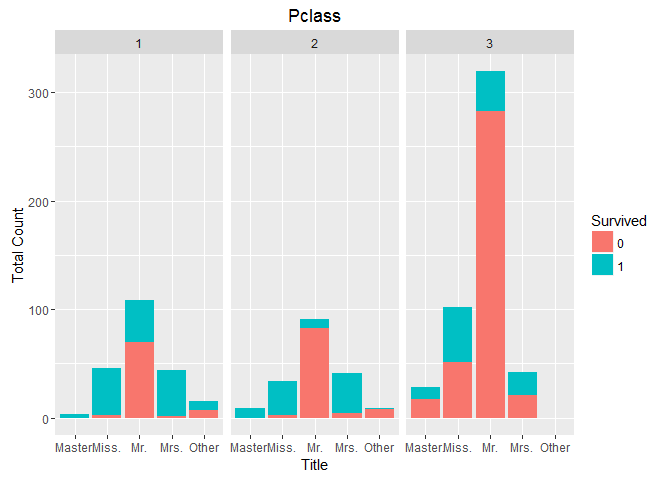
.. |image2| image:: TitanicDataAnalysis_Video7_files/figure-html/unnamed-chunk-4-1.png
.. |image3| image:: TitanicDataAnalysis_Video7_files/figure-html/unnamed-chunk-4-2.png
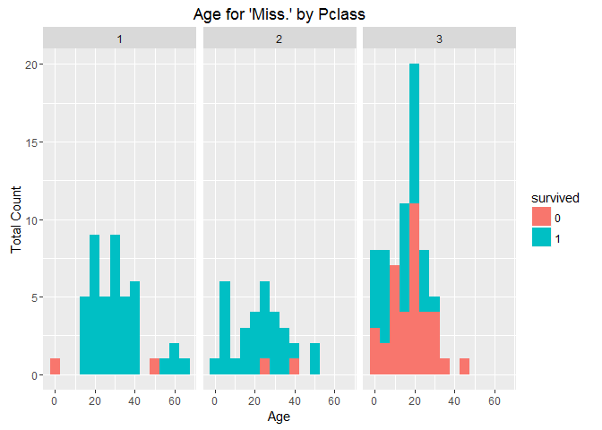
.. |image5| image:: TitanicDataAnalysis_Video7_files/figure-html/unnamed-chunk-4-4.png
.. |image6| image:: TitanicDataAnalysis_Video7_files/figure-html/unnamed-chunk-4-5.png
.. |image7| image:: TitanicDataAnalysis_Video7_files/figure-html/unnamed-chunk-4-6.png
.. |image8| image:: TitanicDataAnalysis_Video7_files/figure-html/unnamed-chunk-5-1.png
.. |image9| image:: TitanicDataAnalysis_Video7_files/figure-html/unnamed-chunk-5-2.png
.. |image10| image:: TitanicDataAnalysis_Video7_files/figure-html/unnamed-chunk-5-3.png
.. |image11| image:: TitanicDataAnalysis_Video7_files/figure-html/unnamed-chunk-5-4.png
.. |image12| image:: TitanicDataAnalysis_Video7_files/figure-html/unnamed-chunk-5-5.png
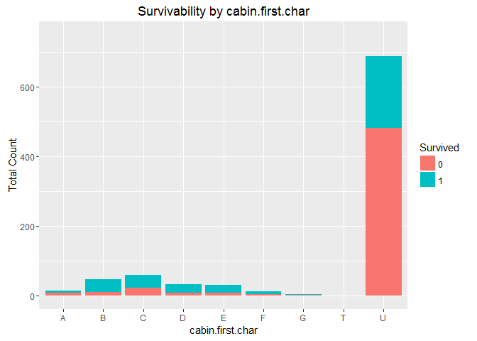
.. |image14| image:: TitanicDataAnalysis_Video7_files/figure-html/unnamed-chunk-5-7.png
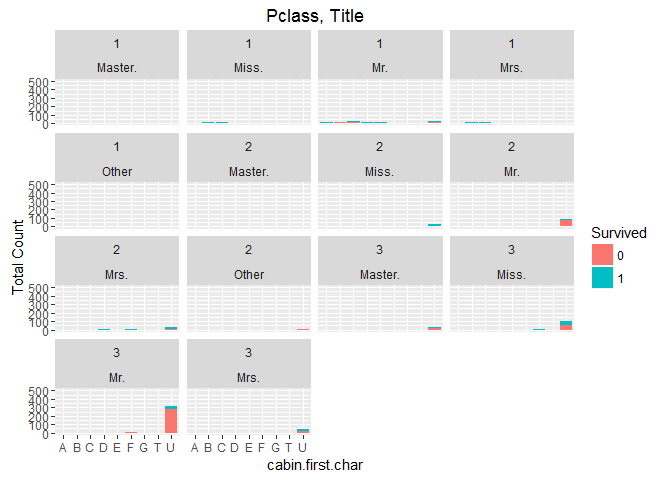
.. |image16| image:: TitanicDataAnalysis_Video7_files/figure-html/unnamed-chunk-5-9.png
.. |image17| image:: TitanicDataAnalysis_Video7_files/figure-html/unnamed-chunk-5-10.png
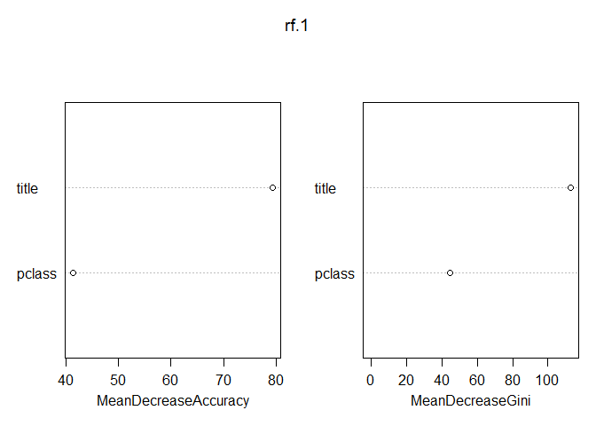
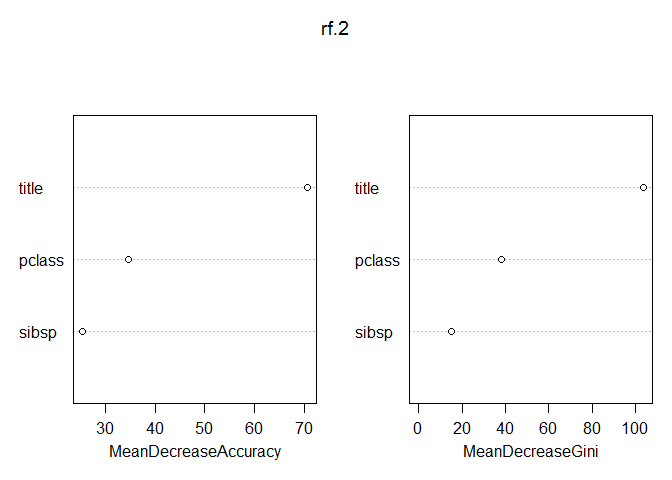
.. |image20| image:: TitanicDataAnalysis_Video7_files/figure-html/unnamed-chunk-9-1.png
.. |image21| image:: TitanicDataAnalysis_Video7_files/figure-html/unnamed-chunk-10-1.png
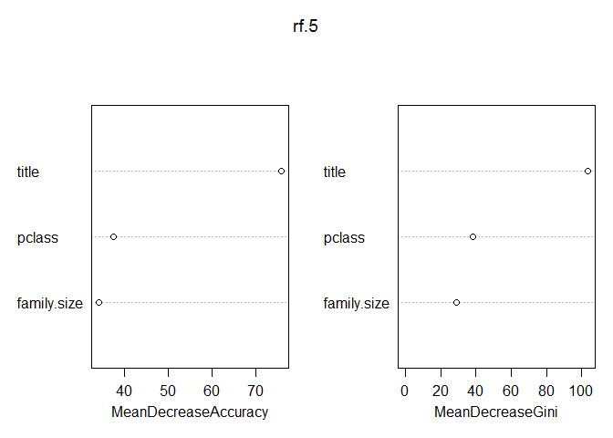
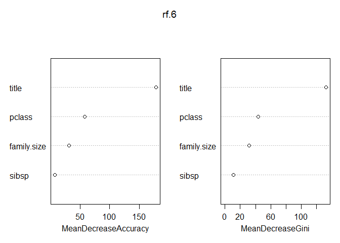
.. |image24| image:: TitanicDataAnalysis_Video7_files/figure-html/unnamed-chunk-13-1.png
.. |image25| image:: TitanicDataAnalysis_Video7_files/figure-html/unnamed-chunk-15-1.png
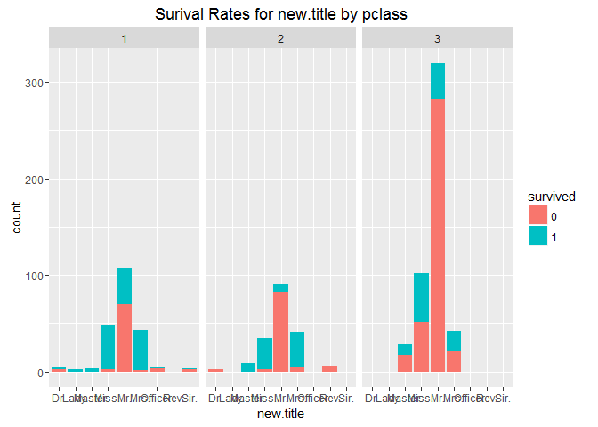
.. |image27| image:: TitanicDataAnalysis_Video7_files/figure-html/unnamed-chunk-15-3.png
.. |image28| image:: TitanicDataAnalysis_Video7_files/figure-html/unnamed-chunk-15-4.png
.. |image29| image:: TitanicDataAnalysis_Video7_files/figure-html/unnamed-chunk-15-5.png
.. |image30| image:: TitanicDataAnalysis_Video7_files/figure-html/unnamed-chunk-15-6.png
.. |image31| image:: TitanicDataAnalysis_Video7_files/figure-html/unnamed-chunk-15-7.png
.. |image32| image:: TitanicDataAnalysis_Video7_files/figure-html/unnamed-chunk-15-8.png
.. |image33| image:: TitanicDataAnalysis_Video7_files/figure-html/unnamed-chunk-16-1.png
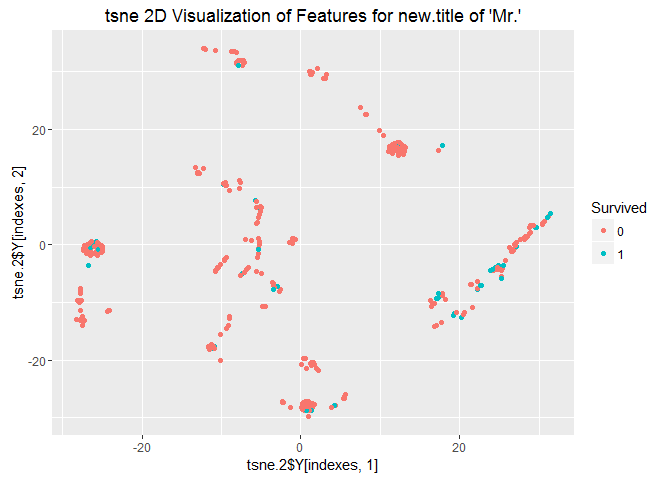
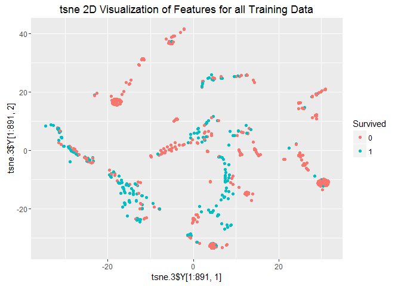

