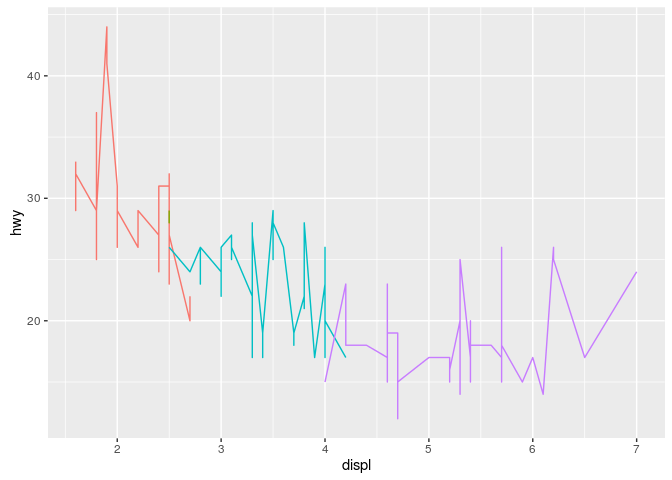
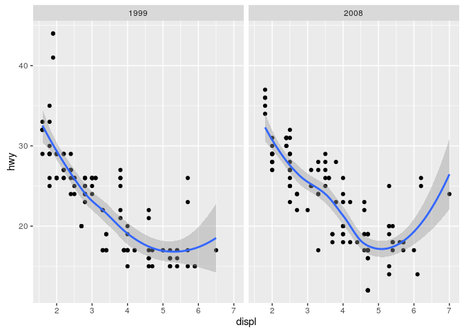

# Ch3. Mastering the Grammar

**NOTE** -- LOTS of stuffs on `qplot` is deprecated...I gave up working
for backward compatibility at this point...


```r
library(ggplot2)
```

# 3.2 Fuel economy date


```r
str(mpg)
```

```
## Classes 'tbl_df', 'tbl' and 'data.frame':	234 obs. of  11 variables:
##  $ manufacturer: chr  "audi" "audi" "audi" "audi" ...
##  $ model       : chr  "a4" "a4" "a4" "a4" ...
##  $ displ       : num  1.8 1.8 2 2 2.8 2.8 3.1 1.8 1.8 2 ...
##  $ year        : int  1999 1999 2008 2008 1999 1999 2008 1999 1999 2008 ...
##  $ cyl         : int  4 4 4 4 6 6 6 4 4 4 ...
##  $ trans       : chr  "auto(l5)" "manual(m5)" "manual(m6)" "auto(av)" ...
##  $ drv         : chr  "f" "f" "f" "f" ...
##  $ cty         : int  18 21 20 21 16 18 18 18 16 20 ...
##  $ hwy         : int  29 29 31 30 26 26 27 26 25 28 ...
##  $ fl          : chr  "p" "p" "p" "p" ...
##  $ class       : chr  "compact" "compact" "compact" "compact" ...
```

```r
print(xtable::xtable(head(mpg,n=10)), type='html')
```

<!-- html table generated in R 3.3.1 by xtable 1.8-2 package -->
<!-- Fri Nov  4 21:39:21 2016 -->
<table border=1>
<tr> <th>  </th> <th> manufacturer </th> <th> model </th> <th> displ </th> <th> year </th> <th> cyl </th> <th> trans </th> <th> drv </th> <th> cty </th> <th> hwy </th> <th> fl </th> <th> class </th>  </tr>
  <tr> <td align="right"> 1 </td> <td> audi </td> <td> a4 </td> <td align="right"> 1.80 </td> <td align="right"> 1999 </td> <td align="right">   4 </td> <td> auto(l5) </td> <td> f </td> <td align="right">  18 </td> <td align="right">  29 </td> <td> p </td> <td> compact </td> </tr>
  <tr> <td align="right"> 2 </td> <td> audi </td> <td> a4 </td> <td align="right"> 1.80 </td> <td align="right"> 1999 </td> <td align="right">   4 </td> <td> manual(m5) </td> <td> f </td> <td align="right">  21 </td> <td align="right">  29 </td> <td> p </td> <td> compact </td> </tr>
  <tr> <td align="right"> 3 </td> <td> audi </td> <td> a4 </td> <td align="right"> 2.00 </td> <td align="right"> 2008 </td> <td align="right">   4 </td> <td> manual(m6) </td> <td> f </td> <td align="right">  20 </td> <td align="right">  31 </td> <td> p </td> <td> compact </td> </tr>
  <tr> <td align="right"> 4 </td> <td> audi </td> <td> a4 </td> <td align="right"> 2.00 </td> <td align="right"> 2008 </td> <td align="right">   4 </td> <td> auto(av) </td> <td> f </td> <td align="right">  21 </td> <td align="right">  30 </td> <td> p </td> <td> compact </td> </tr>
  <tr> <td align="right"> 5 </td> <td> audi </td> <td> a4 </td> <td align="right"> 2.80 </td> <td align="right"> 1999 </td> <td align="right">   6 </td> <td> auto(l5) </td> <td> f </td> <td align="right">  16 </td> <td align="right">  26 </td> <td> p </td> <td> compact </td> </tr>
  <tr> <td align="right"> 6 </td> <td> audi </td> <td> a4 </td> <td align="right"> 2.80 </td> <td align="right"> 1999 </td> <td align="right">   6 </td> <td> manual(m5) </td> <td> f </td> <td align="right">  18 </td> <td align="right">  26 </td> <td> p </td> <td> compact </td> </tr>
  <tr> <td align="right"> 7 </td> <td> audi </td> <td> a4 </td> <td align="right"> 3.10 </td> <td align="right"> 2008 </td> <td align="right">   6 </td> <td> auto(av) </td> <td> f </td> <td align="right">  18 </td> <td align="right">  27 </td> <td> p </td> <td> compact </td> </tr>
  <tr> <td align="right"> 8 </td> <td> audi </td> <td> a4 quattro </td> <td align="right"> 1.80 </td> <td align="right"> 1999 </td> <td align="right">   4 </td> <td> manual(m5) </td> <td> 4 </td> <td align="right">  18 </td> <td align="right">  26 </td> <td> p </td> <td> compact </td> </tr>
  <tr> <td align="right"> 9 </td> <td> audi </td> <td> a4 quattro </td> <td align="right"> 1.80 </td> <td align="right"> 1999 </td> <td align="right">   4 </td> <td> auto(l5) </td> <td> 4 </td> <td align="right">  16 </td> <td align="right">  25 </td> <td> p </td> <td> compact </td> </tr>
  <tr> <td align="right"> 10 </td> <td> audi </td> <td> a4 quattro </td> <td align="right"> 2.00 </td> <td align="right"> 2008 </td> <td align="right">   4 </td> <td> manual(m6) </td> <td> 4 </td> <td align="right">  20 </td> <td align="right">  28 </td> <td> p </td> <td> compact </td> </tr>
   </table>

# 3.3 Building a scatterplot


```r
# A scatterplot of engine displacement in litres (displ) vs.  average
# highway miles per gallon (hwy).  Points are coloured according to
# number of cylinders.  This plot summarises the most important factor
# governing fuel economy: engine size.
qplot(displ, hwy, data = mpg, colour = factor(cyl))
```

<!-- -->

## Mapping aesthetics to data
another deprecated option...
replaced `opts(drop = "legend_box")` with `theme(legend.position="none")`


```r
# Instead of using points to represent the data, we could use other
# geoms like lines (left) or bars (right).  Neither of these geoms
# makes sense for this data, but they are still grammatically valid.

# below is deprecated
# qplot(displ, hwy, data=mpg, colour=factor(cyl), geom="line") + 
#   opts(drop = "legend_box")
qplot(displ, hwy, data=mpg, colour=factor(cyl), geom="line") +
  theme(legend.position="none")
```

<!-- -->

```r
# qplot(displ, hwy, data=mpg, colour=factor(cyl), geom="bar", 
#       stat="identity", position = "identity") + 
#   opts(drop = "legend_box")
#| couldn't get this one to work...
# qplot(displ, hwy, data=mpg, colour=factor(cyl), geom="bar") + 
#   geom_smooth(stat="identity", position = "identity") + 
#   theme(legend.position="none")

# More complicated plots don't have their own names.  This plot takes
# Figure~\ref{fig:mpg} and adds a regression line to each group.  What
# would you call this plot?
qplot(displ, hwy, data=mpg, colour=factor(cyl)) + 
geom_smooth(data= subset(mpg, cyl != 5), method="lm")
```

<!-- -->

# 3.4 A more complex plot


```r
# A more complex plot with facets and multiple layers.
qplot(displ, hwy, data=mpg, facets = . ~ year) + geom_smooth()
```

<!-- -->

Below, replaced `opts(keep = "legend_box")` with `theme(`


```r
# Examples of legends from four different scales.  From left to right:
# continuous variable mapped to size, and to colour, discrete variable
# mapped to shape, and to colour.  The ordering of scales seems
# upside-down, but this matches the labelling of the $y$-axis: small
# values occur at the bottom.
x <- 1:10
y <- factor(letters[1:5])
# qplot(x, x, size = x) + opts(keep = "legend_box")
qplot(x, x, size = x) #+ theme(legend.box = 'vertical')
```

<!-- -->

```r
# qplot(x, x, 1:10, colour = x)# + opts(keep = "legend_box")
# qplot(y, y, 1:10, shape = y) #+ opts(keep = "legend_box")
# qplot(y, y, 1:10, colour = y)# + opts(keep = "legend_box")
```

# 3.6 Data structures


```r
# Examples of axes and grid lines for three coordinate systems:
# Cartesian, semi-log and polar. The polar coordinate system
# illustrates the difficulties associated with non-Cartesian
# coordinates: it is hard to draw the axes well.
x1 <- c(1,10)
y1 <- c(1, 5)
p <- qplot(x1, y1, geom="blank", xlab=NULL, ylab=NULL) + theme_bw()
p 
```

<!-- -->

```r
p + coord_trans(y="log10")
```

<!-- -->

```r
p + coord_polar()
```

<!-- -->

```r
p <- qplot(displ, hwy, data = mpg, colour = factor(cyl))
summary(p)
```

```
## data: manufacturer, model, displ, year, cyl, trans, drv, cty, hwy,
##   fl, class [234x11]
## mapping:  colour = factor(cyl), x = displ, y = hwy
## faceting: facet_null() 
## -----------------------------------
## geom_point: na.rm = FALSE
## stat_identity: na.rm = FALSE
## position_identity
```

```r
# Save plot object to disk
save(p, file = "plot.rdata")
# Load from disk
load("plot.rdata")
# Save png to disk
ggsave("plot.png", width = 5, height = 5)
```


---
title: "mastery.R"
author: "takanori"
date: "Fri Nov  4 21:39:18 2016"
---
