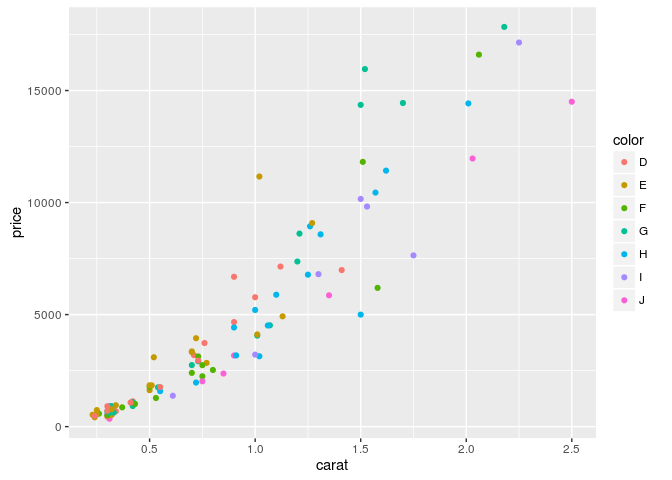
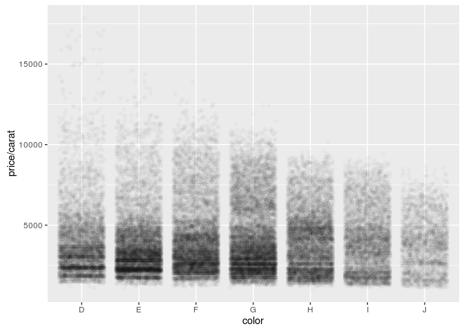
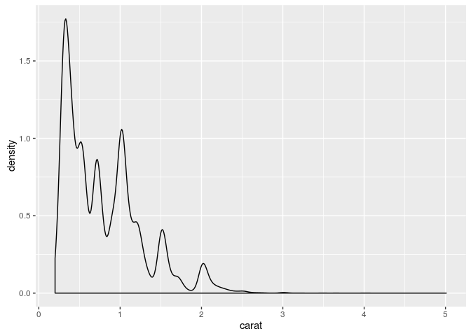
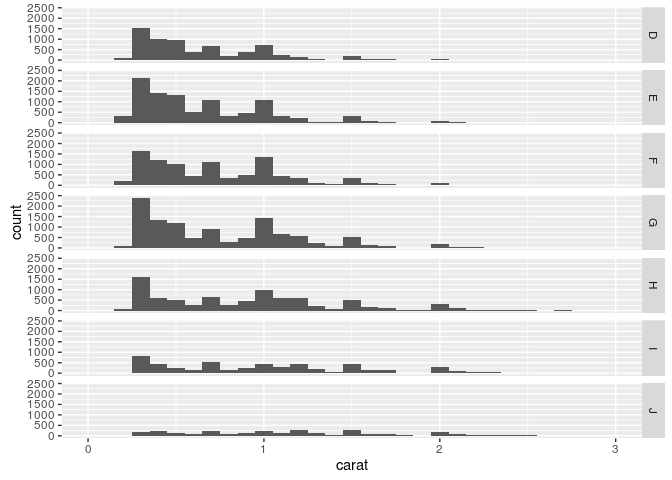
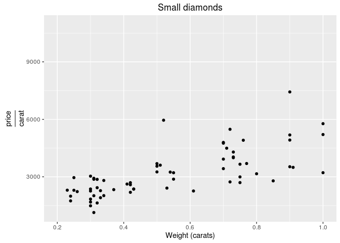

# Ch2. Getting startd with qplot


```r
library(ggplot2)

options(show.error.locations = TRUE)

set.seed(1410) # Make the sample reproducible
```

# The Diamonds dataset


```r
dsmall <- diamonds[sample(nrow(diamonds), 100), ]
str(dsmall)
```

```
## Classes 'tbl_df', 'tbl' and 'data.frame':	100 obs. of  10 variables:
##  $ carat  : num  1.35 0.3 0.75 0.26 0.33 1.52 0.32 2.25 0.25 1.02 ...
##  $ cut    : Ord.factor w/ 5 levels "Fair"<"Good"<..: 5 2 5 5 4 5 5 5 4 4 ...
##  $ color  : Ord.factor w/ 7 levels "D"<"E"<"F"<"G"<..: 7 4 3 3 5 4 4 6 2 5 ...
##  $ clarity: Ord.factor w/ 8 levels "I1"<"SI2"<"SI1"<..: 4 7 2 5 7 7 8 2 6 1 ...
##  $ depth  : num  61.4 64 59.2 60.9 61.4 62.4 61.3 62.4 62.5 62.5 ...
##  $ table  : num  57 57 60 57 59 55 54 57 59 60 ...
##  $ price  : int  5862 678 2248 580 752 15959 918 17143 740 3141 ...
##  $ x      : num  7.1 4.23 5.87 4.13 4.42 7.3 4.41 8.39 4.04 6.39 ...
##  $ y      : num  7.13 4.27 5.92 4.11 4.44 7.39 4.47 8.32 4.02 6.41 ...
##  $ z      : num  4.37 2.72 3.49 2.51 2.72 4.58 2.72 5.21 2.52 4 ...
```

```r
print(xtable::xtable(head(dsmall,n=10)), type='html')
```

<!-- html table generated in R 3.3.1 by xtable 1.8-2 package -->
<!-- Fri Nov  4 20:41:01 2016 -->
<table border=1>
<tr> <th>  </th> <th> carat </th> <th> cut </th> <th> color </th> <th> clarity </th> <th> depth </th> <th> table </th> <th> price </th> <th> x </th> <th> y </th> <th> z </th>  </tr>
  <tr> <td align="right"> 1 </td> <td align="right"> 1.35 </td> <td> Ideal </td> <td> J </td> <td> VS2 </td> <td align="right"> 61.40 </td> <td align="right"> 57.00 </td> <td align="right"> 5862 </td> <td align="right"> 7.10 </td> <td align="right"> 7.13 </td> <td align="right"> 4.37 </td> </tr>
  <tr> <td align="right"> 2 </td> <td align="right"> 0.30 </td> <td> Good </td> <td> G </td> <td> VVS1 </td> <td align="right"> 64.00 </td> <td align="right"> 57.00 </td> <td align="right"> 678 </td> <td align="right"> 4.23 </td> <td align="right"> 4.27 </td> <td align="right"> 2.72 </td> </tr>
  <tr> <td align="right"> 3 </td> <td align="right"> 0.75 </td> <td> Ideal </td> <td> F </td> <td> SI2 </td> <td align="right"> 59.20 </td> <td align="right"> 60.00 </td> <td align="right"> 2248 </td> <td align="right"> 5.87 </td> <td align="right"> 5.92 </td> <td align="right"> 3.49 </td> </tr>
  <tr> <td align="right"> 4 </td> <td align="right"> 0.26 </td> <td> Ideal </td> <td> F </td> <td> VS1 </td> <td align="right"> 60.90 </td> <td align="right"> 57.00 </td> <td align="right"> 580 </td> <td align="right"> 4.13 </td> <td align="right"> 4.11 </td> <td align="right"> 2.51 </td> </tr>
  <tr> <td align="right"> 5 </td> <td align="right"> 0.33 </td> <td> Premium </td> <td> H </td> <td> VVS1 </td> <td align="right"> 61.40 </td> <td align="right"> 59.00 </td> <td align="right"> 752 </td> <td align="right"> 4.42 </td> <td align="right"> 4.44 </td> <td align="right"> 2.72 </td> </tr>
  <tr> <td align="right"> 6 </td> <td align="right"> 1.52 </td> <td> Ideal </td> <td> G </td> <td> VVS1 </td> <td align="right"> 62.40 </td> <td align="right"> 55.00 </td> <td align="right"> 15959 </td> <td align="right"> 7.30 </td> <td align="right"> 7.39 </td> <td align="right"> 4.58 </td> </tr>
  <tr> <td align="right"> 7 </td> <td align="right"> 0.32 </td> <td> Ideal </td> <td> G </td> <td> IF </td> <td align="right"> 61.30 </td> <td align="right"> 54.00 </td> <td align="right"> 918 </td> <td align="right"> 4.41 </td> <td align="right"> 4.47 </td> <td align="right"> 2.72 </td> </tr>
  <tr> <td align="right"> 8 </td> <td align="right"> 2.25 </td> <td> Ideal </td> <td> I </td> <td> SI2 </td> <td align="right"> 62.40 </td> <td align="right"> 57.00 </td> <td align="right"> 17143 </td> <td align="right"> 8.39 </td> <td align="right"> 8.32 </td> <td align="right"> 5.21 </td> </tr>
  <tr> <td align="right"> 9 </td> <td align="right"> 0.25 </td> <td> Premium </td> <td> E </td> <td> VVS2 </td> <td align="right"> 62.50 </td> <td align="right"> 59.00 </td> <td align="right"> 740 </td> <td align="right"> 4.04 </td> <td align="right"> 4.02 </td> <td align="right"> 2.52 </td> </tr>
  <tr> <td align="right"> 10 </td> <td align="right"> 1.02 </td> <td> Premium </td> <td> H </td> <td> I1 </td> <td align="right"> 62.50 </td> <td align="right"> 60.00 </td> <td align="right"> 3141 </td> <td align="right"> 6.39 </td> <td align="right"> 6.41 </td> <td align="right"> 4.00 </td> </tr>
   </table>

# 2.3 Basic use


```r
qplot(carat, price, data = diamonds)
```

<!-- -->

```r
qplot(log(carat), log(price), data = diamonds)
```

<!-- -->

```r
qplot(carat, x * y * z, data = diamonds)
```

<!-- -->

# 2.4 Color, size, shape, and other aesthetic attributes


```r
# Mapping point colour to diamond colour (left), and point shape to cut
# quality (right).
qplot(carat, price, data = dsmall, colour = color)
```

<!-- -->

```r
qplot(carat, price, data = dsmall, shape = cut)
```

<!-- -->

```r
# Reducing the alpha value from 1/10 (left) to 1/100 (middle) to 1/200
# (right) makes it possible to see where the bulk of the points lie.
qplot(carat, price, data = diamonds, alpha = I(1/10))
```

<!-- -->

```r
qplot(carat, price, data = diamonds, alpha = I(1/100))
```

<!-- -->

```r
qplot(carat, price, data = diamonds, alpha = I(1/200))
```

<!-- -->

# 2.5 Plot geoms
## 2.5.1 Add a smoother to plot


```r
# Smooth curves add to scatterplots of carat vs.\ price. The dsmall
# dataset (left) and the full dataset (right).
qplot(carat, price, data = dsmall, geom = c("point", "smooth"))
```

<!-- -->

```r
qplot(carat, price, data = diamonds, geom = c("point", "smooth"))
```

<!-- -->

Code below needed some correction (to allow `span` to work).
See:

 - https://groups.google.com/forum/#!topic/ggplot2/XkpxtrH09DQ
 - http://stackoverflow.com/questions/35102453/r-not-plotting-says-unknown-parameter-method-ggplot2/35103164


```r
# The effect of the span parameter.  (Left) \code{span = 0.2}, and
# (right) \code{span = 1}.
qplot(carat, price, data = dsmall, geom = c("point", "smooth")) + 
  stat_smooth(span = 0.2)
```

<!-- -->

```r
qplot(carat, price, data = dsmall, geom = c("point", "smooth")) +  
  stat_smooth(span = 1)
```

<!-- -->

```r
# The effect of the formula parameter, using a generalised additive
# model as a smoother.  (Left) \code{formula = y ~ s(x)}, the default;
# (right) \code{formula = y ~ s(x, bs = "cs")}.
library(mgcv)
```

```
## Loading required package: nlme
```

```
## This is mgcv 1.8-14. For overview type 'help("mgcv-package")'.
```

```r
qplot(carat, price, data = dsmall, geom = c("point", "smooth")) + 
  geom_smooth(method = "gam", formula = y ~ s(x))
```

<!-- -->

```r
qplot(carat, price, data = dsmall, geom = c("point", "smooth")) +
  geom_smooth(method = "gam", formula = y ~ s(x, bs = "cs"))
```

<!-- -->

```r
# The effect of the formula parameter, using a linear model as a
# smoother.  (Left) \code{formula = y ~ x}, the default; (right)
# \code{formula = y ~ ns(x, 5)}.
library(splines)
qplot(carat, price, data = dsmall, geom = c("point", "smooth")) +
  geom_smooth(method = "lm")
```

<!-- -->

```r
qplot(carat, price, data = dsmall, geom = c("point", "smooth")) + 
  geom_smooth(method = "lm", formula = y ~ ns(x,5))
```

<!-- -->

## 2.5.2 Boxplots and jittered points


```r
# Using jittering (left) and boxplots (right) to investigate the
# distribution of price per carat, conditional on colour.  As the
# colour improves (from left to right) the spread of values decreases,
# but there is little change in the centre of the distribution.
qplot(color, price / carat, data = diamonds, geom = "jitter")
```

<!-- -->

```r
qplot(color, price / carat, data = diamonds, geom = "boxplot")
```

<!-- -->

```r
# Varying the alpha level.  From left to right: $1/5$, $1/50$, $1/200$.
# As the opacity decreases we begin to see where the bulk of the data
# lies.  However, the boxplot still does much better.
qplot(color, price / carat, data = diamonds, geom = "jitter",
      alpha = I(1 / 5))
```

<!-- -->

```r
qplot(color, price / carat, data = diamonds, geom = "jitter",
      alpha = I(1 / 50))
```

<!-- -->

```r
qplot(color, price / carat, data = diamonds, geom = "jitter",
      alpha = I(1 / 200))
```

<!-- -->

## 2.5.3 Histogram and density plots


```r
# Displaying the distribution of diamonds.  (Left) \code{geom =
# "histogram"} and (right) \code{geom = "density"}.
qplot(carat, data = diamonds, geom = "histogram")
```

```
## `stat_bin()` using `bins = 30`. Pick better value with `binwidth`.
```

<!-- -->

```r
qplot(carat, data = diamonds, geom = "density")
```

<!-- -->

```r
# Varying the bin width on a histogram of carat reveals interesting
# patterns.  Binwidths from left to right: 1, 0.1 and 0.01 carats. Only
# diamonds between 0 and 3 carats shown.
qplot(carat, data = diamonds, geom = "histogram", binwidth = 1, 
      xlim = c(0,3))
```

```
## Warning: Removed 32 rows containing non-finite values (stat_bin).
```

<!-- -->

```r
qplot(carat, data = diamonds, geom = "histogram", binwidth = 0.1,
      xlim = c(0,3))
```

```
## Warning: Removed 32 rows containing non-finite values (stat_bin).
```

<!-- -->

```r
qplot(carat, data = diamonds, geom = "histogram", binwidth = 0.01,
      xlim = c(0,3))
```

```
## Warning: Removed 32 rows containing non-finite values (stat_bin).
```

<!-- -->

```r
# Mapping a categorical variable to an aesthetic will automatically
# split up the geom by that variable.  (Left) Density plots are
# overlaid and (right) histograms are stacked.
qplot(carat, data = diamonds, geom = "density", colour = color)
```

<!-- -->

```r
qplot(carat, data = diamonds, geom = "histogram", fill = color)
```

```
## `stat_bin()` using `bins = 30`. Pick better value with `binwidth`.
```

<!-- -->

## 2.5.4 Bar charts


```r
# Bar charts of diamond colour.  The left plot shows counts and the
# right plot is weighted by \code{weight = carat} to show the total
# weight of diamonds of each colour.
qplot(color, data = diamonds, geom = "bar")
```

<!-- -->

```r
qplot(color, data = diamonds, geom = "bar", weight = carat) +
  scale_y_continuous("carat")
```

<!-- -->

## 2.5.5 Time series with line and path plots


```r
str(economics)
```

```
## Classes 'tbl_df', 'tbl' and 'data.frame':	574 obs. of  6 variables:
##  $ date    : Date, format: "1967-07-01" "1967-08-01" ...
##  $ pce     : num  507 510 516 513 518 ...
##  $ pop     : int  198712 198911 199113 199311 199498 199657 199808 199920 200056 200208 ...
##  $ psavert : num  12.5 12.5 11.7 12.5 12.5 12.1 11.7 12.2 11.6 12.2 ...
##  $ uempmed : num  4.5 4.7 4.6 4.9 4.7 4.8 5.1 4.5 4.1 4.6 ...
##  $ unemploy: int  2944 2945 2958 3143 3066 3018 2878 3001 2877 2709 ...
```

```r
print(xtable::xtable(head(economics,n=10)), type='html')
```

```
## Warning in formatC(x = structure(c(-915L, -884L, -853L, -823L, -792L,
## -762L, : class of 'x' was discarded
```

<!-- html table generated in R 3.3.1 by xtable 1.8-2 package -->
<!-- Fri Nov  4 20:41:25 2016 -->
<table border=1>
<tr> <th>  </th> <th> date </th> <th> pce </th> <th> pop </th> <th> psavert </th> <th> uempmed </th> <th> unemploy </th>  </tr>
  <tr> <td align="right"> 1 </td> <td align="right"> -915 </td> <td align="right"> 507.40 </td> <td align="right"> 198712 </td> <td align="right"> 12.50 </td> <td align="right"> 4.50 </td> <td align="right"> 2944 </td> </tr>
  <tr> <td align="right"> 2 </td> <td align="right"> -884 </td> <td align="right"> 510.50 </td> <td align="right"> 198911 </td> <td align="right"> 12.50 </td> <td align="right"> 4.70 </td> <td align="right"> 2945 </td> </tr>
  <tr> <td align="right"> 3 </td> <td align="right"> -853 </td> <td align="right"> 516.30 </td> <td align="right"> 199113 </td> <td align="right"> 11.70 </td> <td align="right"> 4.60 </td> <td align="right"> 2958 </td> </tr>
  <tr> <td align="right"> 4 </td> <td align="right"> -823 </td> <td align="right"> 512.90 </td> <td align="right"> 199311 </td> <td align="right"> 12.50 </td> <td align="right"> 4.90 </td> <td align="right"> 3143 </td> </tr>
  <tr> <td align="right"> 5 </td> <td align="right"> -792 </td> <td align="right"> 518.10 </td> <td align="right"> 199498 </td> <td align="right"> 12.50 </td> <td align="right"> 4.70 </td> <td align="right"> 3066 </td> </tr>
  <tr> <td align="right"> 6 </td> <td align="right"> -762 </td> <td align="right"> 525.80 </td> <td align="right"> 199657 </td> <td align="right"> 12.10 </td> <td align="right"> 4.80 </td> <td align="right"> 3018 </td> </tr>
  <tr> <td align="right"> 7 </td> <td align="right"> -731 </td> <td align="right"> 531.50 </td> <td align="right"> 199808 </td> <td align="right"> 11.70 </td> <td align="right"> 5.10 </td> <td align="right"> 2878 </td> </tr>
  <tr> <td align="right"> 8 </td> <td align="right"> -700 </td> <td align="right"> 534.20 </td> <td align="right"> 199920 </td> <td align="right"> 12.20 </td> <td align="right"> 4.50 </td> <td align="right"> 3001 </td> </tr>
  <tr> <td align="right"> 9 </td> <td align="right"> -671 </td> <td align="right"> 544.90 </td> <td align="right"> 200056 </td> <td align="right"> 11.60 </td> <td align="right"> 4.10 </td> <td align="right"> 2877 </td> </tr>
  <tr> <td align="right"> 10 </td> <td align="right"> -640 </td> <td align="right"> 544.60 </td> <td align="right"> 200208 </td> <td align="right"> 12.20 </td> <td align="right"> 4.60 </td> <td align="right"> 2709 </td> </tr>
   </table>

```r
# Two time series measuring amount of unemployment.  (Left) Percent of
# population that is unemployed and (right) median number of weeks
# unemployed.  Plots created with {\tt geom="line"}.
qplot(date, unemploy / pop, data = economics, geom = "line")
```

<!-- -->

```r
qplot(date, uempmed, data = economics, geom = "line")
```

<!-- -->

```r
# Path plots illustrating the relationship between percent of people
# unemployed and median length of unemployment.  (Left) Scatterplot
# with overlaid path.  (Right) Pure path plot coloured by year.
year <- function(x) as.POSIXlt(x)$year + 1900
qplot(unemploy / pop, uempmed, data = economics, 
      geom = c("point", "path"))
```

<!-- -->

`scale_area` deprecated; replaced with `scale_size`
(http://mfcovington.github.io/r_club/errata/2013/03/05/ch5-errata/)


```r
# qplot(unemploy / pop, uempmed, data = economics, 
#       geom = "path", colour = year(date)) + scale_area()
qplot(unemploy / pop, uempmed, data = economics, 
      geom = "path", colour = year(date)) + scale_size_area()
```

<!-- -->

# 2.6 Faceting


```r
# Histograms showing the distribution of carat conditional on colour.
# (Left) Bars show counts and (right) bars show densities (proportions
# of the whole).  The density plot makes it easier to compare
# distributions ignoring the relative abundance of diamonds within each
# colour. High-quality diamonds (colour D) are skewed towards small
# sizes, and as quality declines the distribution becomes more flat.
qplot(carat, data = diamonds, facets = color ~ ., 
      geom = "histogram", binwidth = 0.1, xlim = c(0, 3))
```

```
## Warning: Removed 32 rows containing non-finite values (stat_bin).
```

<!-- -->

```r
qplot(carat, ..density.., data = diamonds, facets = color ~ .,
      geom = "histogram", binwidth = 0.1, xlim = c(0, 3))
```

```
## Warning: Removed 32 rows containing non-finite values (stat_bin).
```

<!-- -->

```r
qplot(
  carat, price, data = dsmall, 
  xlab = "Price ($)", ylab = "Weight (carats)",  
  main = "Price-weight relationship"
)
```

<!-- -->

```r
qplot(
  carat, price/carat, data = dsmall, 
  ylab = expression(frac(price,carat)), 
  xlab = "Weight (carats)",  
  main="Small diamonds", 
  xlim = c(.2,1)
)
```

```
## Warning: Removed 35 rows containing missing values (geom_point).
```

<!-- -->

```r
qplot(carat, price, data = dsmall, log = "xy")
```

<!-- -->


---
title: "qplot.R"
author: "takanori"
date: "Fri Nov  4 20:41:00 2016"
---
