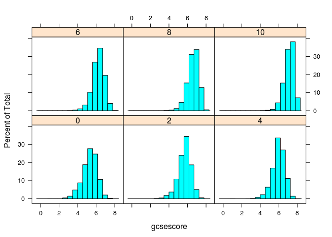

# Ch1 - Introduction


From http://lmdvr.r-forge.r-project.org/figures/figures.html


```r
library(lattice)

data(Chem97, package = "mlmRev")
xtabs( ~ score, data = Chem97)
```

```
## score
##    0    2    4    6    8   10 
## 3688 3627 4619 5739 6668 6681
```

```r
library("lattice")
```

## Figure 1.1 (conditional histogram)


```r
histogram(~ gcsescore | factor(score), data = Chem97)
```

<!-- -->

## Figure 1.2 (conditional density plot)


```r
densityplot(~ gcsescore | factor(score), data = Chem97, 
            plot.points = FALSE, ref = TRUE)
```

<!-- -->

## Figure 1.3 (grouped kde plot)


```r
densityplot(~ gcsescore, data = Chem97, groups = score,
            plot.points = FALSE, ref = TRUE,
            auto.key = list(columns = 3))
```

<!-- -->

## Figure 1.4 (conditional histogram and kde grouped in a single figure)


```r
tp1 <- histogram(~ gcsescore | factor(score), data = Chem97)
tp2 <- 
  densityplot(~ gcsescore, data = Chem97, groups = score,
              plot.points = FALSE,
              auto.key = list(space = "right", title = "score"))
class(tp2)
```

```
## [1] "trellis"
```

```r
summary(tp1)
```

```
## 
## Call:
## histogram(~gcsescore | factor(score), data = Chem97)
## 
## Number of observations:
## factor(score)
##    0    2    4    6    8   10 
## 3688 3627 4619 5739 6668 6681
```

```r
plot(tp1, split = c(1, 1, 1, 2))
plot(tp2, split = c(1, 2, 1, 2), newpage = FALSE)
```

<!-- -->


---
title: "ch1.R"
author: "takanori"
date: "Thu Nov  3 19:47:54 2016"
---
