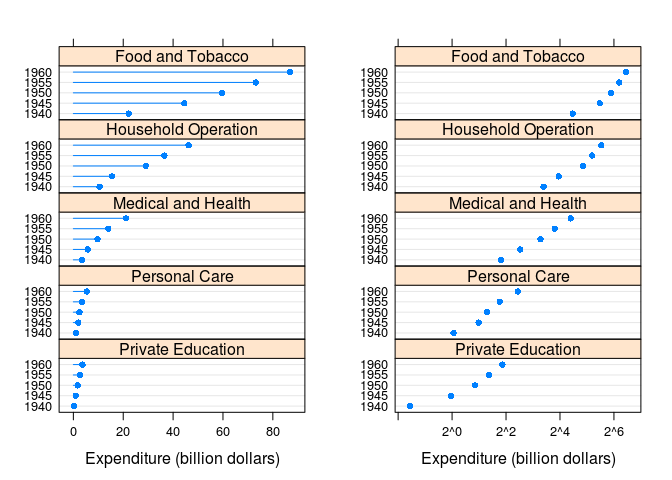
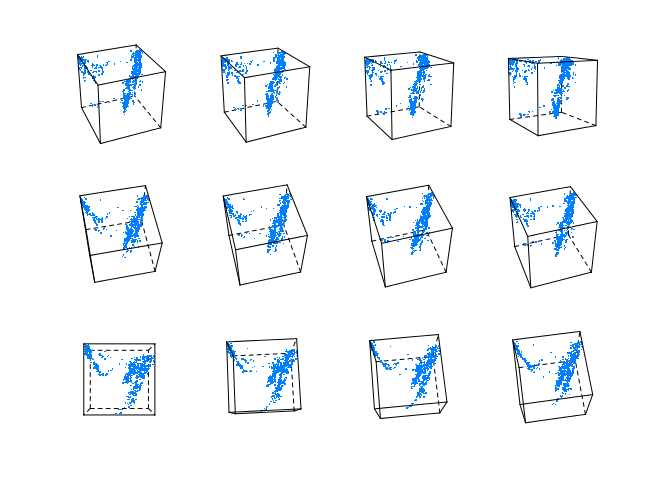

# Ch11 - Manipulating the *trellis* object


```r
library(lattice)
```

Topics covered:

- Methods for "trellis" objects
- Tukey mean-difference plot
- Other specialized manipulations


```r
methods(class = "trellis")
```

```
##  [1] dimnames<- dimnames   dim        plot       print      summary   
##  [7] tmd        [          t          update    
## see '?methods' for accessing help and source code
```

```r
methods(class = "shingle")
```

```
## [1] as.data.frame plot          print         [             summary      
## see '?methods' for accessing help and source code
```

```r
methods(generic.function = "barchart")
```

```
## [1] barchart.array*   barchart.default* barchart.formula* barchart.matrix* 
## [5] barchart.numeric* barchart.table*  
## see '?methods' for accessing help and source code
```

```r
dp.uspe <- 
  dotplot(t(USPersonalExpenditure), 
          groups = FALSE, 
          index.cond = function(x, y) median(x),
          layout = c(1, 5), 
          type = c("p", "h"),
          xlab = "Expenditure (billion dollars)")
dp.uspe.log <- 
  dotplot(t(USPersonalExpenditure), 
          groups = FALSE, 
          index.cond = function(x, y) median(x),
          layout = c(1, 5), 
          scales = list(x = list(log = 2)),
          xlab = "Expenditure (billion dollars)")
```

## Figure 11.1


```r
plot(dp.uspe,     split = c(1, 1, 2, 1), more = TRUE)
plot(dp.uspe.log, split = c(2, 1, 2, 1), more = FALSE)
```

<!-- -->

```r
state <- data.frame(state.x77, state.region, state.name)
state$state.name <- 
  with(state, reorder(reorder(state.name, Frost), 
                      as.numeric(state.region)))
dpfrost <- 
  dotplot(state.name ~ Frost | reorder(state.region, Frost),
          data = state, layout = c(1, 4),
          scales = list(y = list(relation = "free")))
summary(dpfrost)
```

```
## 
## Call:
## dotplot(state.name ~ Frost | reorder(state.region, Frost), data = state, 
##     layout = c(1, 4), scales = list(y = list(relation = "free")))
## 
## Number of observations:
## reorder(state.region, Frost)
##         South          West     Northeast North Central 
##            16            13             9            12
```

## Figure 11.2


```r
plot(dpfrost, 
     panel.height = list(x = c(16, 13, 9, 12), unit = "null"))
```

<!-- -->

## Figure 11.3


```r
update(trellis.last.object(), layout = c(1, 1))[2]
```

<!-- -->

```r
npanel <- 12
rot <- list(z = seq(0, 30, length = npanel), 
            x = seq(0, -80, length = npanel))
quakeLocs <-
  cloud(depth ~ long + lat, quakes, pch = ".", cex = 1.5,
        panel = function(..., screen) {
          pn <- panel.number()
          panel.cloud(..., screen = list(z = rot$z[pn], 
                                         x = rot$x[pn]))
        },
        xlab = NULL, ylab = NULL, zlab = NULL, 
        scales = list(draw = FALSE), zlim = c(690, 30), 
        par.settings = list(axis.line = list(col="transparent")))
```

## Figure 11.4


```r
quakeLocs[rep(1, npanel)]
```

<!-- -->

```r
data(Chem97, package="mlmRev")
ChemQQ <- 
  qq(gender ~ gcsescore | factor(score), Chem97, 
     f.value = ppoints(100), strip = strip.custom(style = 5))
```

## Figure 11.5


```r
tmd(ChemQQ)
```

<!-- -->

```r
library("latticeExtra")
```

```
## Loading required package: RColorBrewer
```

```r
data(biocAccess)
baxy <- xyplot(log10(counts) ~ hour | month + weekday, biocAccess,
               type = c("p", "a"), as.table = TRUE,
               pch = ".", cex = 2, col.line = "black")
dimnames(baxy)$month
```

```
## [1] "Jan" "Feb" "Mar" "Apr" "May"
```

```r
dimnames(baxy)$month <- month.name[1:5]
dimnames(baxy)
```

```
## $month
## [1] "January"  "February" "March"    "April"    "May"     
## 
## $weekday
## [1] "Monday"    "Tuesday"   "Wednesday" "Thursday"  "Friday"    "Saturday" 
## [7] "Sunday"
```

## Figure 11.6


```r
useOuterStrips(baxy)
```

<!-- -->


---
title: "ch11.R"
author: "takanori"
date: "Thu Nov  3 21:01:53 2016"
---
