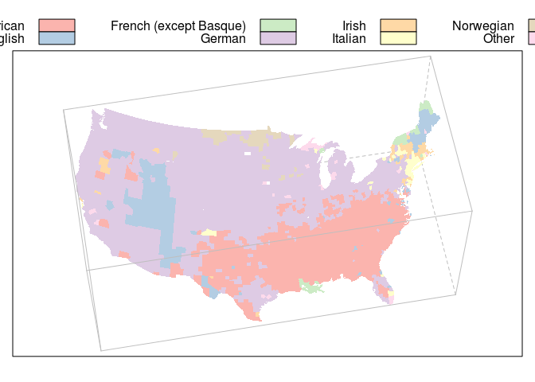

# Ch13 - Advanced Panel Functions


```r
library(lattice)
```

Topics covered:

- Built-in panel and accessors functions
- Examples


```r
panel.hypotrochoid <- function(r, d, cycles = 10, density = 30)
{
  if (missing(r)) r <- runif(1, 0.25, 0.75)
  if (missing(d)) d <- runif(1, 0.25 * r, r)
  t <- 2 * pi * seq(0, cycles, by = 1/density)
  x <- (1 - r) * cos(t) + d * cos((1 - r) * t / r)
  y <- (1 - r) * sin(t) - d * sin((1 - r) * t / r)
  panel.lines(x, y)
}
panel.hypocycloid <- function(x, y, cycles = x, density = 30) {
  panel.hypotrochoid(r = x / y, d = x / y, 
                     cycles = cycles, density = density)
}
prepanel.hypocycloid <- function(x, y) {
  list(xlim = c(-1, 1), ylim = c(-1, 1))
}
grid <- data.frame(p = 11:30, q = 10)
grid$k <- with(grid, factor(p / q))
```

## Figure 13.1


```r
xyplot(p ~ q | k, grid, aspect = 1, scales = list(draw = FALSE),
       prepanel = prepanel.hypocycloid, panel = panel.hypocycloid)
```

<!-- -->

```r
p <- xyplot(c(-1, 1) ~ c(-1, 1), aspect = 1, cycles = 15,
            scales = list(draw = FALSE), xlab = "", ylab = "",
            panel = panel.hypotrochoid)
set.seed(20070706)
```

## Figure 13.2


```r
p[rep(1, 42)]
```

<!-- -->

```r
library("logspline")
prepanel.ls <- function(x, n = 50, ...) {
  fit <- logspline(x)
  xx <- do.breaks(range(x), n)
  yy <- dlogspline(xx, fit)
  list(ylim = c(0, max(yy)))
}
panel.ls <- function(x, n = 50, ...) {
  fit <- logspline(x)
  xx <- do.breaks(range(x), n)
  yy <- dlogspline(xx, fit)
  panel.lines(xx, yy, ...)
}
faithful$Eruptions <- equal.count(faithful$eruptions, 4)
```

## Figure 13.3


```r
densityplot(~ waiting | Eruptions, data = faithful, 
            prepanel = prepanel.ls, panel = panel.ls)
```

<!-- -->

```r
panel.bwtufte <- function(x, y, coef = 1.5, ...) {
  x <- as.numeric(x); y <- as.numeric(y)
  ux <- sort(unique(x))
  blist <- tapply(y, factor(x, levels = ux), boxplot.stats, 
                  coef = coef, do.out = FALSE)
  blist.stats <- t(sapply(blist, "[[", "stats"))
  blist.out <- lapply(blist, "[[", "out")
  panel.points(y = blist.stats[, 3], x = ux, pch = 16, ...)
  panel.segments(x0 = rep(ux, 2),
                 y0 = c(blist.stats[, 1], blist.stats[, 5]),
                 x1 = rep(ux, 2),
                 y1 = c(blist.stats[, 2], blist.stats[, 4]),
                 ...)
}
data(Chem97, package = "mlmRev")
```

## Figure 13.4


```r
bwplot(gcsescore^2.34 ~ gender | factor(score), Chem97, 
       panel = panel.bwtufte, layout = c(6, 1),
       ylab = "Transformed GCSE score")
```

<!-- -->

```r
data(Cars93, package = "MASS")
cor.Cars93 <- 
  cor(Cars93[, !sapply(Cars93, is.factor)], use = "pair")
ord <- order.dendrogram(as.dendrogram(hclust(dist(cor.Cars93))))
panel.corrgram <- 
  function(x, y, z, subscripts, at, 
           level = 0.9, label = FALSE, ...) 
  {
    require("ellipse", quietly = TRUE)
    x <- as.numeric(x)[subscripts]
    y <- as.numeric(y)[subscripts]
    z <- as.numeric(z)[subscripts]
    zcol <- level.colors(z, at = at, ...)
    for (i in seq(along = z)) {
      ell <- ellipse(z[i], level = level, npoints = 50,
                     scale = c(.2, .2), centre = c(x[i], y[i]))
      panel.polygon(ell, col = zcol[i], border = zcol[i], ...)
    }
    if (label) 
      panel.text(x = x, y = y, lab = 100 * round(z, 2), cex = 0.8,
                 col = ifelse(z < 0, "white", "black"))
  }    
```

## Figure 13.5


```r
levelplot(cor.Cars93[ord, ord], at = do.breaks(c(-1.01, 1.01), 20), 
          xlab = NULL, ylab = NULL, colorkey = list(space = "top"),
          scales = list(x = list(rot = 90)),
          panel = panel.corrgram, label = TRUE)
```

```
## Warning in library(package, lib.loc = lib.loc, character.only = TRUE,
## logical.return = TRUE, : there is no package called 'ellipse'
```

<!-- -->

```r
panel.corrgram.2 <- 
  function(x, y, z, subscripts, at = pretty(z), scale = 0.8, ...) 
  {
    require("grid", quietly = TRUE)
    x <- as.numeric(x)[subscripts]
    y <- as.numeric(y)[subscripts]
    z <- as.numeric(z)[subscripts]
    zcol <- level.colors(z, at = at, ...)
    for (i in seq(along = z))
    {
      lims <- range(0, z[i])
      tval <- 2 * base::pi * 
        seq(from = lims[1], to = lims[2], by = 0.01)
      grid.polygon(x = x[i] + .5 * scale * c(0, sin(tval)),
                   y = y[i] + .5 * scale * c(0, cos(tval)),
                   default.units = "native", 
                   gp = gpar(fill = zcol[i]))
      grid.circle(x = x[i], y = y[i], r = .5 * scale, 
                  default.units = "native")
    }
  }
```

## Figure 13.6


```r
levelplot(cor.Cars93[ord, ord], xlab = NULL, ylab = NULL,
          at = do.breaks(c(-1.01, 1.01), 101),
          panel = panel.corrgram.2, 
          scales = list(x = list(rot = 90)),
          colorkey = list(space = "top"),
          col.regions = colorRampPalette(c("red", "white", "blue")))
```

<!-- -->

```r
panel.3d.contour <- 
  function(x, y, z, rot.mat, distance, 
           nlevels = 20, zlim.scaled, ...)
  {
    add.line <- trellis.par.get("add.line")
    panel.3dwire(x, y, z, rot.mat, distance, 
                 zlim.scaled = zlim.scaled, ...)
    clines <- 
      contourLines(x, y, matrix(z, nrow = length(x), byrow = TRUE),
                   nlevels = nlevels)
    for (ll in clines) {
      m <- ltransform3dto3d(rbind(ll$x, ll$y, zlim.scaled[2]), 
                            rot.mat, distance)
      panel.lines(m[1,], m[2,], col = add.line$col,
                  lty = add.line$lty, lwd = add.line$lwd)
    }
  }
```

## Figure 13.7


```r
wireframe(volcano, zlim = c(90, 250), nlevels = 10, 
          aspect = c(61/87, .3), panel.aspect = 0.6,
          panel.3d.wireframe = "panel.3d.contour", shade = TRUE,
          screen = list(z = 20, x = -60))
```

<!-- -->

```r
library("maps")
county.map <- map("county", plot = FALSE, fill = TRUE)
str(county.map)
```

```
## List of 4
##  $ x    : num [1:91033] -86.5 -86.5 -86.5 -86.6 -86.6 ...
##  $ y    : num [1:91033] 32.3 32.4 32.4 32.4 32.4 ...
##  $ range: num [1:4] -124.7 -67 25.1 49.4
##  $ names: chr [1:3085] "alabama,autauga" "alabama,baldwin" "alabama,barbour" "alabama,bibb" ...
##  - attr(*, "class")= chr "map"
```

```r
data(ancestry, package = "latticeExtra")
ancestry <- subset(ancestry, !duplicated(county))
rownames(ancestry) <- ancestry$county
freq <- table(ancestry$top)
keep <- names(freq)[freq > 10]
ancestry$mode <-
  with(ancestry,
       factor(ifelse(top %in% keep, top, "Other")))
modal.ancestry <- ancestry[county.map$names, "mode"]
library("RColorBrewer")
colors <- brewer.pal(n = nlevels(ancestry$mode), name = "Pastel1")
```

## Figure 13.8


```r
xyplot(y ~ x, county.map, aspect = "iso", 
       scales = list(draw = FALSE), xlab = "", ylab = "",
       par.settings = list(axis.line = list(col = "transparent")),
       col = colors[modal.ancestry], border = NA, 
       panel = panel.polygon,
       key =
         list(text = list(levels(modal.ancestry), adj = 1),
              rectangles = list(col = colors),
              x = 1, y = 0, corner = c(1, 0)))
```

<!-- -->

```r
rad <- function(x) { pi * x / 180 }
county.map$xx <- with(county.map, cos(rad(x)) * cos(rad(y)))
county.map$yy <- with(county.map, sin(rad(x)) * cos(rad(y)))
county.map$zz <- with(county.map, sin(rad(y)))
panel.3dpoly <- function (x, y, z, rot.mat = diag(4), distance, ...) 
{
  m <- ltransform3dto3d(rbind(x, y, z), rot.mat, distance)
  panel.polygon(x = m[1, ], y = m[2, ], ...)
}
aspect <-
  with(county.map,
       c(diff(range(yy, na.rm = TRUE)), 
         diff(range(zz, na.rm = TRUE))) /
         diff(range(xx, na.rm = TRUE)))
```

## Figure 13.9


```r
cloud(zz ~ xx * yy, county.map, par.box = list(col = "grey"),
      aspect = aspect, panel.aspect = 0.6, lwd = 0.01,
      panel.3d.cloud = panel.3dpoly, col = colors[modal.ancestry],
      screen = list(z = 10, x = -30),
      key = list(text = list(levels(modal.ancestry), adj = 1),
                 rectangles = list(col = colors), 
                 space = "top", columns = 4),
      scales = list(draw = FALSE), zoom = 1.1, 
      xlab = "", ylab = "", zlab = "")
```

<!-- -->

```r
library("latticeExtra")
```

```
## 
## Attaching package: 'latticeExtra'
```

```
## The following object is masked _by_ '.GlobalEnv':
## 
##     ancestry
```

```r
library("mapproj")
data(USCancerRates)
rng <- with(USCancerRates, 
            range(rate.male, rate.female, finite = TRUE))
nbreaks <- 50
breaks <- exp(do.breaks(log(rng), nbreaks))
```

## Figure 13.10


```r
mapplot(rownames(USCancerRates) ~ rate.male + rate.female,
        data = USCancerRates, breaks = breaks,
        map = map("county", plot = FALSE, fill = TRUE, 
                  projection = "tetra"),
        scales = list(draw = FALSE), xlab = "", 
        main = "Average yearly deaths due to cancer per 100000")
```

```
## Warning in (function (x, y, map, breaks, colramp, exact = FALSE,
## lwd = 0.5, : 64 unmatched regions: alaska,nome, alaska,wade hampton,
## alaska,haines, alaska,....
```

```
## Warning in (function (x, y, map, breaks, colramp, exact = FALSE,
## lwd = 0.5, : 64 unmatched regions: alaska,nome, alaska,wade hampton,
## alaska,haines, alaska,....
```

<!-- -->


---
title: "ch13.R"
author: "takanori"
date: "Thu Nov  3 21:05:24 2016"
---
