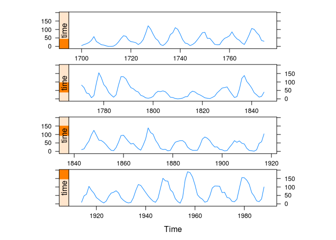
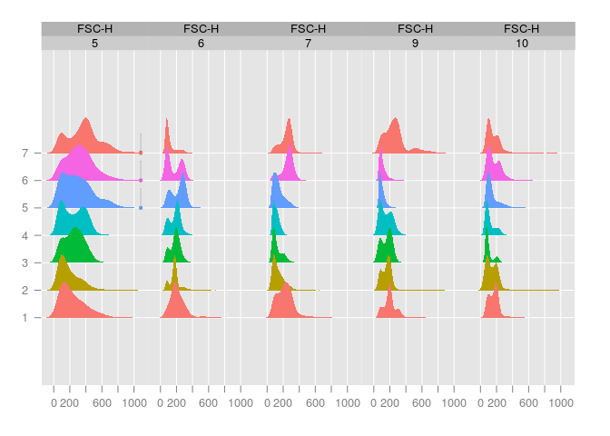

# Ch14 - New Trellis Displays


```r
library(lattice)
```

Topics covered:

- Examples of S3 and S4 methods
- Examples of new high level functions


```r
library("latticeExtra")
```

```
## Loading required package: RColorBrewer
```

## Figure 14.1


```r
xyplot(sunspot.year, aspect = "xy", 
       strip = FALSE, strip.left = TRUE,
       cut = list(number = 4, overlap = 0.05))
```

<!-- -->

```r
data(biocAccess, package = "latticeExtra")
ssd <- stl(ts(biocAccess$counts[1:(24 * 30 * 2)], frequency = 24), 
           "periodic")
```

## Figure 14.2


```r
xyplot(ssd, xlab = "Time (Days)")
```

<!-- -->

```r
library("flowViz")
```

```
## Loading required package: flowCore
```

```r
data(GvHD, package = "flowCore")
```

## Figure 14.3


```r
densityplot(Visit ~ `FSC-H` | Patient, data = GvHD)
```

<!-- -->

```r
library("hexbin")
data(NHANES)
```

## Figure 14.4


```r
hexbinplot(Hemoglobin ~ TIBC | Sex, data = NHANES, aspect = 0.8)
```

<!-- -->

```r
panel.piechart <-
  function(x, y, labels = as.character(y),
           edges = 200, radius = 0.8, clockwise = FALSE,
           init.angle = if(clockwise) 90 else 0,
           density = NULL, angle = 45, 
           col = superpose.polygon$col,
           border = superpose.polygon$border,
           lty = superpose.polygon$lty, ...)
  {
    stopifnot(require("gridBase"))
    superpose.polygon <- trellis.par.get("superpose.polygon")
    opar <- par(no.readonly = TRUE)
    on.exit(par(opar))
    if (panel.number() > 1) par(new = TRUE)
    par(fig = gridFIG(), omi = c(0, 0, 0, 0), mai = c(0, 0, 0, 0))
    pie(as.numeric(x), labels = labels, edges = edges, radius = radius,
        clockwise = clockwise, init.angle = init.angle, angle = angle,
        density = density, col = col, border  = border, lty = lty)
  }
piechart <- function(x, data = NULL, panel = "panel.piechart", ...)
{
  ocall <- sys.call(sys.parent())
  ocall[[1]] <- quote(piechart)
  ccall <- match.call()
  ccall$data <- data
  ccall$panel <- panel
  ccall$default.scales <- list(draw = FALSE)
  ccall[[1]] <- quote(lattice::barchart)
  ans <- eval.parent(ccall)
  ans$call <- ocall
  ans
}
```

## Figure 14.5


```r
par(new = TRUE)
```

```
## Warning in par(new = TRUE): calling par(new=TRUE) with no plot
```

```r
piechart(VADeaths, groups = FALSE, xlab = "")
```

```
## Loading required package: gridBase
```

```
## Warning in library(package, lib.loc = lib.loc, character.only = TRUE,
## logical.return = TRUE, : there is no package called 'gridBase'
```

```
## Loading required package: gridBase
```

```
## Warning in library(package, lib.loc = lib.loc, character.only = TRUE,
## logical.return = TRUE, : there is no package called 'gridBase'
```

```
## Loading required package: gridBase
```

```
## Warning in library(package, lib.loc = lib.loc, character.only = TRUE,
## logical.return = TRUE, : there is no package called 'gridBase'
```

```
## Loading required package: gridBase
```

```
## Warning in library(package, lib.loc = lib.loc, character.only = TRUE,
## logical.return = TRUE, : there is no package called 'gridBase'
```

<!-- -->


---
title: "ch14.R"
author: "takanori"
date: "Thu Nov  3 21:09:47 2016"
---
