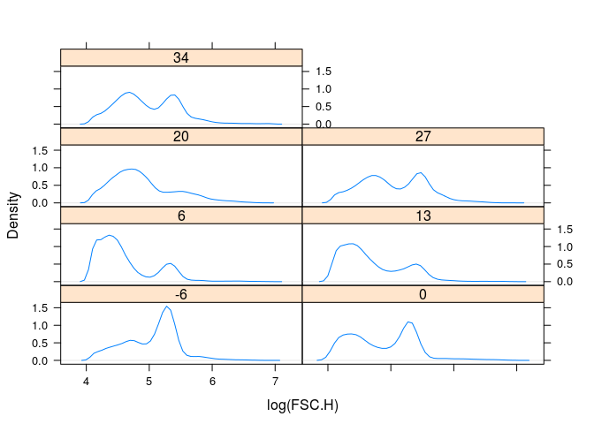
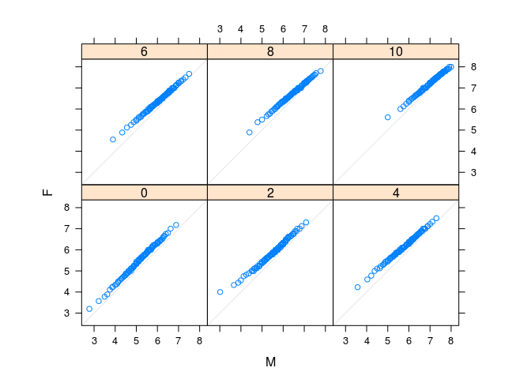
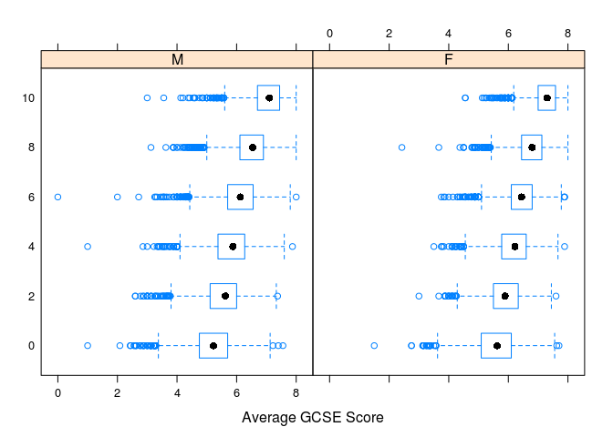
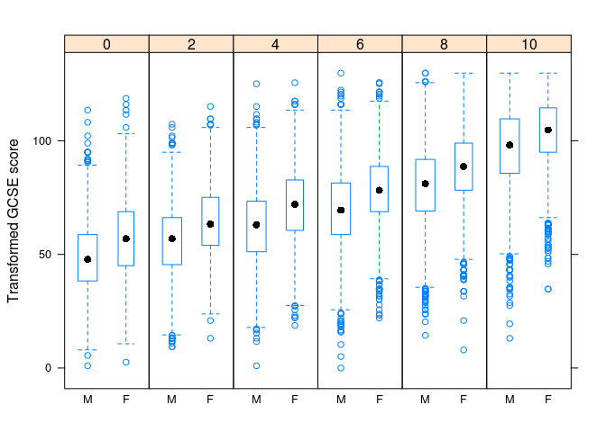

# Ch3 - Displaying Univariate Distributions


From http://lmdvr.r-forge.r-project.org/figures/figures.html


```r
library(lattice)
library("latticeExtra")
```

```
## Loading required package: RColorBrewer
```

```r
library(xtable)
```

# Datasets used in this Chapter
## faithful


```r
str(faithful)
```

```
## 'data.frame':	272 obs. of  2 variables:
##  $ eruptions: num  3.6 1.8 3.33 2.28 4.53 ...
##  $ waiting  : num  79 54 74 62 85 55 88 85 51 85 ...
```

```r
print(xtable(head(faithful,n=5)), type='html')
```

<!-- html table generated in R 3.3.1 by xtable 1.8-2 package -->
<!-- Thu Nov  3 20:17:35 2016 -->
<table border=1>
<tr> <th>  </th> <th> eruptions </th> <th> waiting </th>  </tr>
  <tr> <td align="right"> 1 </td> <td align="right"> 3.60 </td> <td align="right"> 79.00 </td> </tr>
  <tr> <td align="right"> 2 </td> <td align="right"> 1.80 </td> <td align="right"> 54.00 </td> </tr>
  <tr> <td align="right"> 3 </td> <td align="right"> 3.33 </td> <td align="right"> 74.00 </td> </tr>
  <tr> <td align="right"> 4 </td> <td align="right"> 2.28 </td> <td align="right"> 62.00 </td> </tr>
  <tr> <td align="right"> 5 </td> <td align="right"> 4.53 </td> <td align="right"> 85.00 </td> </tr>
   </table>

## gvhd10


```r
data(gvhd10)
str(gvhd10)
```

```
## 'data.frame':	113896 obs. of  8 variables:
##  $ FSC.H: num  548 213 205 119 474 198 267 60 69 552 ...
##  $ SSC.H: num  536 33 38 45 904 45 177 82 8 544 ...
##  $ FL1.H: num  1 2.13 4.11 1.55 170.86 ...
##  $ FL2.H: num  20 104 141 630 2203 ...
##  $ FL3.H: num  1 7.93 5.95 4.79 84.66 ...
##  $ FL2.A: num  8 23 30 148 812 28 29 105 12 5 ...
##  $ FL4.H: num  2.09 1 1 1.26 37.99 ...
##  $ Days : Factor w/ 7 levels "-6","0","6","13",..: 1 1 1 1 1 1 1 1 1 1 ...
```

```r
print(xtable(head(gvhd10,n=5)), type='html')
```

<!-- html table generated in R 3.3.1 by xtable 1.8-2 package -->
<!-- Thu Nov  3 20:17:35 2016 -->
<table border=1>
<tr> <th>  </th> <th> FSC.H </th> <th> SSC.H </th> <th> FL1.H </th> <th> FL2.H </th> <th> FL3.H </th> <th> FL2.A </th> <th> FL4.H </th> <th> Days </th>  </tr>
  <tr> <td align="right"> 1 </td> <td align="right"> 548.00 </td> <td align="right"> 536.00 </td> <td align="right"> 1.00 </td> <td align="right"> 20.05 </td> <td align="right"> 1.00 </td> <td align="right"> 8.00 </td> <td align="right"> 2.09 </td> <td> -6 </td> </tr>
  <tr> <td align="right"> 2 </td> <td align="right"> 213.00 </td> <td align="right"> 33.00 </td> <td align="right"> 2.13 </td> <td align="right"> 104.13 </td> <td align="right"> 7.93 </td> <td align="right"> 23.00 </td> <td align="right"> 1.00 </td> <td> -6 </td> </tr>
  <tr> <td align="right"> 3 </td> <td align="right"> 205.00 </td> <td align="right"> 38.00 </td> <td align="right"> 4.11 </td> <td align="right"> 141.43 </td> <td align="right"> 5.95 </td> <td align="right"> 30.00 </td> <td align="right"> 1.00 </td> <td> -6 </td> </tr>
  <tr> <td align="right"> 4 </td> <td align="right"> 119.00 </td> <td align="right"> 45.00 </td> <td align="right"> 1.55 </td> <td align="right"> 630.39 </td> <td align="right"> 4.79 </td> <td align="right"> 148.00 </td> <td align="right"> 1.26 </td> <td> -6 </td> </tr>
  <tr> <td align="right"> 5 </td> <td align="right"> 474.00 </td> <td align="right"> 904.00 </td> <td align="right"> 170.86 </td> <td align="right"> 2203.48 </td> <td align="right"> 84.66 </td> <td align="right"> 812.00 </td> <td align="right"> 37.99 </td> <td> -6 </td> </tr>
   </table>

## Chem97


```r
data(Chem97, package = "mlmRev")
str(Chem97)
```

```
## 'data.frame':	31022 obs. of  8 variables:
##  $ lea      : Factor w/ 131 levels "1","2","3","4",..: 1 1 1 1 1 1 1 1 1 1 ...
##  $ school   : Factor w/ 2410 levels "1","2","3","4",..: 1 1 1 1 1 1 1 1 1 1 ...
##  $ student  : Factor w/ 31022 levels "1","2","3","4",..: 1 2 3 4 5 6 7 8 9 10 ...
##  $ score    : num  4 10 10 10 8 10 6 8 4 10 ...
##  $ gender   : Factor w/ 2 levels "M","F": 2 2 2 2 2 2 2 2 2 2 ...
##  $ age      : num  3 -3 -4 -2 -1 4 1 4 3 0 ...
##  $ gcsescore: num  6.62 7.62 7.25 7.5 6.44 ...
##  $ gcsecnt  : num  0.339 1.339 0.964 1.214 0.158 ...
```

```r
print(xtable(head(Chem97,n=5)), type='html')
```

<!-- html table generated in R 3.3.1 by xtable 1.8-2 package -->
<!-- Thu Nov  3 20:17:36 2016 -->
<table border=1>
<tr> <th>  </th> <th> lea </th> <th> school </th> <th> student </th> <th> score </th> <th> gender </th> <th> age </th> <th> gcsescore </th> <th> gcsecnt </th>  </tr>
  <tr> <td align="right"> 1 </td> <td> 1 </td> <td> 1 </td> <td> 1 </td> <td align="right"> 4.00 </td> <td> F </td> <td align="right"> 3.00 </td> <td align="right"> 6.62 </td> <td align="right"> 0.34 </td> </tr>
  <tr> <td align="right"> 2 </td> <td> 1 </td> <td> 1 </td> <td> 2 </td> <td align="right"> 10.00 </td> <td> F </td> <td align="right"> -3.00 </td> <td align="right"> 7.62 </td> <td align="right"> 1.34 </td> </tr>
  <tr> <td align="right"> 3 </td> <td> 1 </td> <td> 1 </td> <td> 3 </td> <td align="right"> 10.00 </td> <td> F </td> <td align="right"> -4.00 </td> <td align="right"> 7.25 </td> <td align="right"> 0.96 </td> </tr>
  <tr> <td align="right"> 4 </td> <td> 1 </td> <td> 1 </td> <td> 4 </td> <td align="right"> 10.00 </td> <td> F </td> <td align="right"> -2.00 </td> <td align="right"> 7.50 </td> <td align="right"> 1.21 </td> </tr>
  <tr> <td align="right"> 5 </td> <td> 1 </td> <td> 1 </td> <td> 5 </td> <td align="right"> 8.00 </td> <td> F </td> <td align="right"> -1.00 </td> <td align="right"> 6.44 </td> <td align="right"> 0.16 </td> </tr>
   </table>

## quakes


```r
str(quakes)
```

```
## 'data.frame':	1000 obs. of  5 variables:
##  $ lat     : num  -20.4 -20.6 -26 -18 -20.4 ...
##  $ long    : num  182 181 184 182 182 ...
##  $ depth   : int  562 650 42 626 649 195 82 194 211 622 ...
##  $ mag     : num  4.8 4.2 5.4 4.1 4 4 4.8 4.4 4.7 4.3 ...
##  $ stations: int  41 15 43 19 11 12 43 15 35 19 ...
```

```r
print(xtable(head(quakes,n=5)), type='html')
```

<!-- html table generated in R 3.3.1 by xtable 1.8-2 package -->
<!-- Thu Nov  3 20:17:36 2016 -->
<table border=1>
<tr> <th>  </th> <th> lat </th> <th> long </th> <th> depth </th> <th> mag </th> <th> stations </th>  </tr>
  <tr> <td align="right"> 1 </td> <td align="right"> -20.42 </td> <td align="right"> 181.62 </td> <td align="right"> 562 </td> <td align="right"> 4.80 </td> <td align="right">  41 </td> </tr>
  <tr> <td align="right"> 2 </td> <td align="right"> -20.62 </td> <td align="right"> 181.03 </td> <td align="right"> 650 </td> <td align="right"> 4.20 </td> <td align="right">  15 </td> </tr>
  <tr> <td align="right"> 3 </td> <td align="right"> -26.00 </td> <td align="right"> 184.10 </td> <td align="right">  42 </td> <td align="right"> 5.40 </td> <td align="right">  43 </td> </tr>
  <tr> <td align="right"> 4 </td> <td align="right"> -17.97 </td> <td align="right"> 181.66 </td> <td align="right"> 626 </td> <td align="right"> 4.10 </td> <td align="right">  19 </td> </tr>
  <tr> <td align="right"> 5 </td> <td align="right"> -20.42 </td> <td align="right"> 181.96 </td> <td align="right"> 649 </td> <td align="right"> 4.00 </td> <td align="right">  11 </td> </tr>
   </table>

## barley


```r
str(barley)
```

```
## 'data.frame':	120 obs. of  4 variables:
##  $ yield  : num  27 48.9 27.4 39.9 33 ...
##  $ variety: Factor w/ 10 levels "Svansota","No. 462",..: 3 3 3 3 3 3 7 7 7 7 ...
##  $ year   : Factor w/ 2 levels "1932","1931": 2 2 2 2 2 2 2 2 2 2 ...
##  $ site   : Factor w/ 6 levels "Grand Rapids",..: 3 6 4 5 1 2 3 6 4 5 ...
```

```r
print(xtable(head(barley,n=5)), type='html')
```

<!-- html table generated in R 3.3.1 by xtable 1.8-2 package -->
<!-- Thu Nov  3 20:17:36 2016 -->
<table border=1>
<tr> <th>  </th> <th> yield </th> <th> variety </th> <th> year </th> <th> site </th>  </tr>
  <tr> <td align="right"> 1 </td> <td align="right"> 27.00 </td> <td> Manchuria </td> <td> 1931 </td> <td> University Farm </td> </tr>
  <tr> <td align="right"> 2 </td> <td align="right"> 48.87 </td> <td> Manchuria </td> <td> 1931 </td> <td> Waseca </td> </tr>
  <tr> <td align="right"> 3 </td> <td align="right"> 27.43 </td> <td> Manchuria </td> <td> 1931 </td> <td> Morris </td> </tr>
  <tr> <td align="right"> 4 </td> <td align="right"> 39.93 </td> <td> Manchuria </td> <td> 1931 </td> <td> Crookston </td> </tr>
  <tr> <td align="right"> 5 </td> <td align="right"> 32.97 </td> <td> Manchuria </td> <td> 1931 </td> <td> Grand Rapids </td> </tr>
   </table>

# Density plot
## Figure 3.1


```r
densityplot(~ eruptions, data = faithful)
```

<!-- -->

## Figure 3.2


```r
densityplot(~ eruptions, data = faithful, 
            kernel = "rect", bw = 0.2, plot.points = "rug", n = 200)
```

<!-- -->

## Figure 3.3


```r
densityplot(~log(FSC.H) | Days, data = gvhd10, 
            plot.points = FALSE, ref = TRUE, layout = c(2, 4))
```

<!-- -->

# Histograms
## Figure 3.4


```r
histogram(~log2(FSC.H) | Days, gvhd10, xlab = "log Forward Scatter",
          type = "density", nint = 50, layout = c(2, 4))
```

<!-- -->

# Normal QQ Plots
## Figure 3.5


```r
qqmath(~ gcsescore | factor(score), data = Chem97, 
       f.value = ppoints(100))
```

<!-- -->

## Figure 3.6


```r
qqmath(~ gcsescore | gender, Chem97, groups = score, aspect = "xy", 
       f.value = ppoints(100), auto.key = list(space = "right"),
       xlab = "Standard Normal Quantiles", 
       ylab = "Average GCSE Score")
```

<!-- -->

```r
Chem97.mod <- transform(Chem97, gcsescore.trans = gcsescore^2.34)
```

```r
str(Chem97.mod)
```

'data.frame':	31022 obs. of  9 variables:
 $ lea            : Factor w/ 131 levels "1","2","3","4",..: 1 1 1 1 1 1 1 1 1 1 ...
 $ school         : Factor w/ 2410 levels "1","2","3","4",..: 1 1 1 1 1 1 1 1 1 1 ...
 $ student        : Factor w/ 31022 levels "1","2","3","4",..: 1 2 3 4 5 6 7 8 9 10 ...
 $ score          : num  4 10 10 10 8 10 6 8 4 10 ...
 $ gender         : Factor w/ 2 levels "M","F": 2 2 2 2 2 2 2 2 2 2 ...
 $ age            : num  3 -3 -4 -2 -1 4 1 4 3 0 ...
 $ gcsescore      : num  6.62 7.62 7.25 7.5 6.44 ...
 $ gcsecnt        : num  0.339 1.339 0.964 1.214 0.158 ...
 $ gcsescore.trans: num  83.5 116 103.1 111.6 78.2 ...

```r
print(xtable(head(Chem97.mod,n=5)), type='html')
```

<!-- html table generated in R 3.3.1 by xtable 1.8-2 package -->
<!-- Thu Nov  3 20:17:37 2016 -->
<table border=1>
<tr> <th>  </th> <th> lea </th> <th> school </th> <th> student </th> <th> score </th> <th> gender </th> <th> age </th> <th> gcsescore </th> <th> gcsecnt </th> <th> gcsescore.trans </th>  </tr>
  <tr> <td align="right"> 1 </td> <td> 1 </td> <td> 1 </td> <td> 1 </td> <td align="right"> 4.00 </td> <td> F </td> <td align="right"> 3.00 </td> <td align="right"> 6.62 </td> <td align="right"> 0.34 </td> <td align="right"> 83.48 </td> </tr>
  <tr> <td align="right"> 2 </td> <td> 1 </td> <td> 1 </td> <td> 2 </td> <td align="right"> 10.00 </td> <td> F </td> <td align="right"> -3.00 </td> <td align="right"> 7.62 </td> <td align="right"> 1.34 </td> <td align="right"> 116.00 </td> </tr>
  <tr> <td align="right"> 3 </td> <td> 1 </td> <td> 1 </td> <td> 3 </td> <td align="right"> 10.00 </td> <td> F </td> <td align="right"> -4.00 </td> <td align="right"> 7.25 </td> <td align="right"> 0.96 </td> <td align="right"> 103.08 </td> </tr>
  <tr> <td align="right"> 4 </td> <td> 1 </td> <td> 1 </td> <td> 4 </td> <td align="right"> 10.00 </td> <td> F </td> <td align="right"> -2.00 </td> <td align="right"> 7.50 </td> <td align="right"> 1.21 </td> <td align="right"> 111.59 </td> </tr>
  <tr> <td align="right"> 5 </td> <td> 1 </td> <td> 1 </td> <td> 5 </td> <td align="right"> 8.00 </td> <td> F </td> <td align="right"> -1.00 </td> <td align="right"> 6.44 </td> <td align="right"> 0.16 </td> <td align="right"> 78.24 </td> </tr>
   </table>

## Figure 3.7


```r
qqmath(~ gcsescore.trans | gender, Chem97.mod, groups = score,
       f.value = ppoints(100), aspect = "xy",
       auto.key = list(space = "right", title = "score"), 
       xlab = "Standard Normal Quantiles", 
       ylab = "Transformed GCSE Score")
```

<!-- -->

```r
library("latticeExtra")
```

# The empirical CDF
## Figure 3.8


```r
ecdfplot(~ gcsescore | factor(score), data = Chem97, 
         groups = gender, auto.key = list(columns = 2),
         subset = gcsescore > 0, xlab = "Average GCSE Score")
```

<!-- -->

# Two-sample QQ-plots
## Figure 3.9


```r
qqmath(~ gcsescore | factor(score), data = Chem97, groups = gender, 
       auto.key = list(points = FALSE, lines = TRUE, columns = 2),
       subset = gcsescore > 0, type = "l", distribution = qunif, 
       prepanel = prepanel.qqmathline, aspect = "xy",
       xlab = "Standard Normal Quantiles", 
       ylab = "Average GCSE Score")
```

<!-- -->

## Figure 3.10


```r
qq(gender ~ gcsescore | factor(score), Chem97, 
   f.value = ppoints(100), aspect = 1)
```

<!-- -->

# Box-and-whisker plots
## Figure 3.11


```r
bwplot(factor(score) ~ gcsescore | gender, data = Chem97, 
       xlab = "Average GCSE Score")
```

<!-- -->

## Figure 3.12


```r
bwplot(gcsescore^2.34 ~ gender | factor(score), Chem97, 
       varwidth = TRUE, layout = c(6, 1),
       ylab = "Transformed GCSE score")
```

<!-- -->

## Figure 3.13


```r
bwplot(Days ~ log(FSC.H), data = gvhd10, 
       xlab = "log(Forward Scatter)", ylab = "Days Past Transplant")
```

<!-- -->

## Figure 3.14


```r
bwplot(Days ~ log(FSC.H), gvhd10, 
       panel = panel.violin, box.ratio = 3,
       xlab = "log(Forward Scatter)", 
       ylab = "Days Past Transplant")
```

<!-- -->

# Strip plot
## Figure 3.15


```r
stripplot(factor(mag) ~ depth, quakes)
```

<!-- -->

## Figure 3.16


```r
stripplot(depth ~ factor(mag), quakes, 
          jitter.data = TRUE, alpha = 0.6,
          xlab = "Magnitude (Richter)", ylab = "Depth (km)")
```

<!-- -->

## Figure 3.17


```r
stripplot(sqrt(abs(residuals(lm(yield~variety+year+site)))) ~ site, 
          data = barley, groups = year, jitter.data = TRUE,
          auto.key = list(points = TRUE, lines = TRUE, columns = 2),
          type = c("p", "a"), fun = median,
          ylab = expression(abs("Residual Barley Yield")^{1 / 2}))
```

<!-- -->


---
title: "ch3.R"
author: "takanori"
date: "Thu Nov  3 20:17:35 2016"
---
