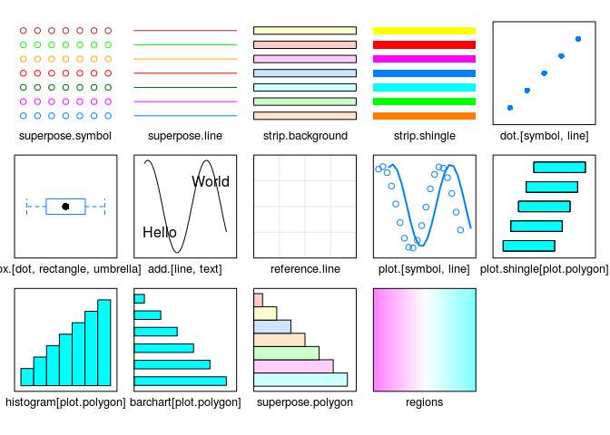

# Ch7 - Graphical Parameters and Other Settings


```r
library(lattice)
```

Topics covered:

- The graphical parameter system
- Themes, devices
- Initializing graphics devices
- Querying and modifying parameters
- Available parameters
- Non-graphical options
- Making customizations persistent


```r
vad.plot <- 
  dotplot(reorder(Var2, Freq) ~ Freq | Var1,
          data = as.data.frame.table(VADeaths), 
          origin = 0, type = c("p", "h"),
          main = "Death Rates in Virginia - 1940", 
          xlab = "Number of deaths per 100")
```

## Figure 7.1


```r
vad.plot
```

<!-- -->

```r
dot.line.settings <- trellis.par.get("dot.line")
str(dot.line.settings)
```

```
## List of 4
##  $ alpha: num 1
##  $ col  : chr "#e6e6e6"
##  $ lty  : num 1
##  $ lwd  : num 1
```

```r
dot.line.settings$col <- "transparent"
trellis.par.set("dot.line", dot.line.settings)
plot.line.settings <- trellis.par.get("plot.line")
str(plot.line.settings)
```

```
## List of 4
##  $ alpha: num 1
##  $ col  : chr "#0080ff"
##  $ lty  : num 1
##  $ lwd  : num 1
```

```r
plot.line.settings$lwd <- 2
trellis.par.set("plot.line", plot.line.settings)
```

## Figure 7.2


```r
vad.plot
```

<!-- -->

```r
panel.dotline <- 
  function(x, y, 
           col = dot.symbol$col, pch = dot.symbol$pch,
           cex = dot.symbol$cex, alpha = dot.symbol$alpha,
           col.line = plot.line$col, lty = plot.line$lty,
           lwd = plot.line$lwd, alpha.line = plot.line$alpha,
           ...)
  {
    dot.symbol <- trellis.par.get("dot.symbol")
    plot.line <- trellis.par.get("plot.line")
    panel.segments(0, y, x, y, col = col.line, lty = lty, 
                   lwd = lwd, alpha = alpha.line)
    panel.points(x, y, col = col, pch = pch, cex = cex, alpha = alpha)
  }
trellis.par.set(dot.line = dot.line.settings,
                plot.line = plot.line.settings)
trellis.par.set(dot.line = list(col = "transparent"),
                plot.line = list(lwd = 2))
trellis.par.set(list(dot.line = list(col = "transparent"),
                     plot.line = list(lwd = 2)))
```

## Figure 7.2 (alternative)


```r
update(vad.plot, 
       par.settings = list(dot.line = list(col = "transparent"),
                           plot.line = list(lwd = 2)))
```

<!-- -->

```r
tp <- trellis.par.get()
unusual <- 
  c("grid.pars", "fontsize", "clip", 
    "axis.components", 
    "layout.heights", "layout.widths")
for (u in unusual) tp[[u]] <- NULL
names.tp <- lapply(tp, names)
unames <- sort(unique(unlist(names.tp)))
ans <- matrix(0, nrow = length(names.tp), ncol = length(unames))
rownames(ans) <- names(names.tp)
colnames(ans) <- unames
for (i in seq(along = names.tp))
  ans[i, ] <- as.numeric(unames %in% names.tp[[i]])
ans <- ans[, order(-colSums(ans))]
ans <- ans[order(rowSums(ans)), ]
ans[ans == 0] <- NA
```

## Figure 7.3


```r
levelplot(t(ans), colorkey = FALSE, 
          scales = list(x = list(rot = 90)),
          panel = function(x, y, z, ...) {
            panel.abline(v = unique(as.numeric(x)), 
                         h = unique(as.numeric(y)), 
                         col = "darkgrey")
            panel.xyplot(x, y, pch = 16 * z, ...)
          },
          xlab = "Graphical parameters", 
          ylab = "Setting names")
```

<!-- -->

## Figure 7.4


```r
show.settings()
```

<!-- -->


---
title: "ch7.R"
author: "takanori"
date: "Thu Nov  3 20:45:23 2016"
---
