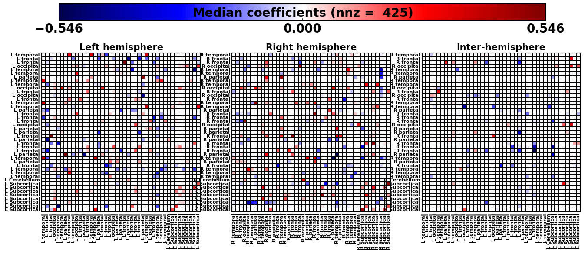
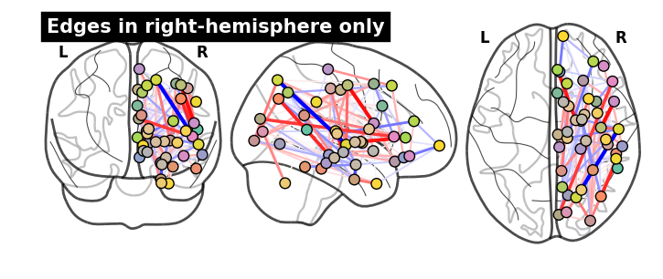
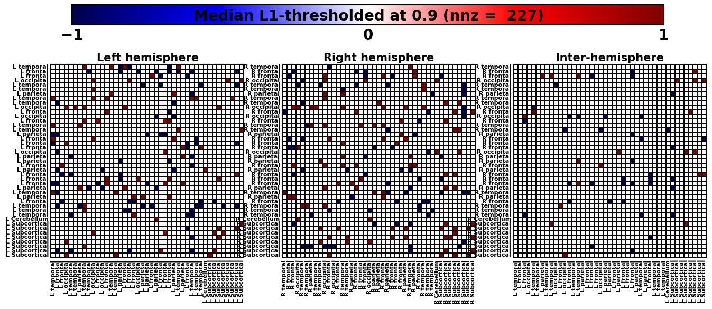
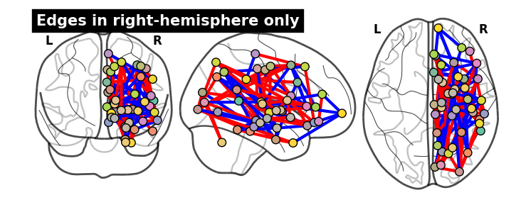

###########################################
PNC classification experiment results (old)
###########################################

This is results from an old experiment I ran, where I tried to classify the **gender** of a subject from the **PNC** dataset using structural brain connectivity features.

.. contents:: `Contents`
   :depth: 2
   :local:

.. code:: python

    from IPython.display import HTML
    
    HTML('''
    <form action="javascript:code_toggle()"><input type="submit" value="Click here to toggle on/off the raw code."></form>''')

What is this?
=============

(originally created 11/03/2015) - here, I go further and **analyze** the
result a bit more - I'll dig in the stability of model selection by
studying the gridsearch result

.. code:: python

    import numpy as np
    import matplotlib.pyplot as plt
    import matplotlib as mpl
    import cPickle as pickle
    import pandas as pd
    import os
    import sys
    
    import sklearn.metrics as skmetrics
    import warnings
    from IPython.display import display
    
    import tak.tak as tw
    import tak.data_io as twio
    reload(tw)
    reload(twio)
    
    from pandas import DataFrame as DF
    from pandas import Series as SR
    
    pd.set_option('precision', 4)

.. code:: python

    # pklname = "pnc_ncv10fold_acc_sklLogregL1_age_q1_rsouter336970_rsinner337862.pkl"
    pklname = 'pnc_ncv10fold_acc_sklLogregL1_age_q2_rsouter168519_rsinner50426.pkl'
    # pklname = 'pnc_ncv10fold_acc_sklLogregL1_age_q3_rsouter271477_rsinner175307.pkl'
    
    data_fullpath = "/home/takanori/work-local/tak-ace-ibis/python/analysis/pnc/"+\
                    "ncv_conn_random/dump/sklLogregL1/"+pklname

Load data
=========

.. code:: python

    with open(data_fullpath) as f:
        pkl_in = pickle.load(f)
    
    # assign variables to workspace
    for key,value in pkl_in.iteritems():
        globals()[key] = value

Show classification result
==========================

.. code:: python

    tw.clf_summary(ytrue,ypred)

.. raw:: html

    

    <table border="1" class="dataframe">
      <thead>
        <tr>
          <th></th>
          <th colspan="8" halign="left">scores</th>
          <th colspan="7" halign="left">counts</th>
        </tr>
        <tr>
          <th></th>
          <th>ACC</th>
          <th>TPR</th>
          <th>TNR</th>
          <th>FPR</th>
          <th>FNR</th>
          <th>F1</th>
          <th>PPV</th>
          <th>NPV</th>
          <th>TP</th>
          <th>TN</th>
          <th>FP</th>
          <th>FN</th>
          <th>P</th>
          <th>N</th>
          <th>ALL</th>
        </tr>
      </thead>
      <tbody>
        <tr>
          <th>value</th>
          <td>0.784</td>
          <td>0.754</td>
          <td>0.807</td>
          <td>0.142</td>
          <td>0.246</td>
          <td>0.748</td>
          <td>0.742</td>
          <td>0.816</td>
          <td>98</td>
          <td>142</td>
          <td>34</td>
          <td>32</td>
          <td>132</td>
          <td>174</td>
          <td>306</td>
        </tr>
      </tbody>
    </table>
    

.. code:: python

    df_results = tw.clf_summary(ytrue,ypred)
    
    fpr,tpr,auc = tw.roc(ytrue,score)
    
    plt.plot(fpr,tpr,label='(AUC = {:.4f})'.format(auc))
    plt.plot([0, 1], [0, 1], 'k--',label='random',lw=1)
    plt.xlabel('FPR')
    plt.ylabel('TPR')
    plt.title('')
    plt.legend(loc='best')
    plt.grid('on')

.. image:: pnc_study_feature_1104_onesession_files/pnc_study_feature_1104_onesession_12_0.png

Display median coefficients
===========================

**Get node info**

.. code:: python

    from nilearn.plotting import plot_connectome
    
    mni_coord = tw.get_mni_coord86()
    df_node = tw.get_node_info86()
    
    display(df_node.head(3))

.. raw:: html

    

    <table border="1" class="dataframe">
      <thead>
        <tr style="text-align: right;">
          <th></th>
          <th>label</th>
          <th>name_full</th>
          <th>lobes</th>
          <th>name_short</th>
          <th>system</th>
          <th>x</th>
          <th>y</th>
          <th>z</th>
          <th>hemisphere</th>
          <th>xmni</th>
          <th>ymni</th>
          <th>zmni</th>
        </tr>
      </thead>
      <tbody>
        <tr>
          <th>0</th>
          <td>1001</td>
          <td>ctx-lh-bankssts</td>
          <td>L temporal</td>
          <td>Bank of the Superior Temporal Sulcus</td>
          <td>auditory</td>
          <td>178</td>
          <td>158</td>
          <td>83</td>
          <td>L</td>
          <td>-54.15</td>
          <td>-45.20</td>
          <td>9.35</td>
        </tr>
        <tr>
          <th>1</th>
          <td>1002</td>
          <td>ctx-lh-caudalanteriorcingulate</td>
          <td>L frontal</td>
          <td>Caudal Anterior Cingulate</td>
          <td>cingulo-opercular</td>
          <td>130</td>
          <td>91</td>
          <td>102</td>
          <td>L</td>
          <td>-4.35</td>
          <td>17.15</td>
          <td>29.15</td>
        </tr>
        <tr>
          <th>2</th>
          <td>1003</td>
          <td>ctx-lh-caudalmiddlefrontal</td>
          <td>L frontal</td>
          <td>Caudal Middle Frontal</td>
          <td>fronto-parietal</td>
          <td>158</td>
          <td>101</td>
          <td>121</td>
          <td>L</td>
          <td>-36.45</td>
          <td>10.20</td>
          <td>47.45</td>
        </tr>
      </tbody>
    </table>
    

**Construct median weight vector for each age-group**

.. code:: python

    coef_ = []
    for clf_tuned in cv_summary['clf_tuned']:
        try:
            coef_.append(clf_tuned.coef_.ravel())
        except:
            # SPAMS toolbox: I assigned w_ for coefficient....fix this in future version?
            coef_.append(clf_tuned.w_.ravel())
            
    # convert list to ndarray
    coef_array = np.vstack(coef_).T
    # print coef_array.shape
    
    coef_median = np.median(coef_array,axis=1)

Display median connmat
======================

.. code:: python

    reload(tw)
    #=== decide on x/y ticks === #
    # tick = df_node.lobes.values
    # tick = df_node.label.values
    # tick = df_node.name_full.values
    # tick = df_node.name_short.values
    tick = df_node.system.values
    
    
    tick = df_node.system.values
    
    plt.figure(figsize=(12,10))
    tw.imconnmat(coef_median,tick,tick)
    plt.colorbar(fraction=0.046, pad=0.04, ticks=tw.cbar_ticks())
    plt.title('Median coefficients (nnz = {:4})'.format(np.count_nonzero(coef_median)),
             fontsize=24)
    
    tw.imconnmat_hemi_subplot_86(coef_median,suptitle='Median coefficients (nnz = {:4})'.format(np.count_nonzero(coef_median)))

.. image:: pnc_study_feature_1104_onesession_files/pnc_study_feature_1104_onesession_19_0.png

Glass-brain
===========

-  for further brain space analysis, I should display these in BNV in
   Matlab

.. code:: python

    _ = plot_connectome(tw.sqform(coef_median), mni_coord, node_size=70, 
                        title='(nnz = {:4})'.format(np.count_nonzero(coef_median)))
    
    # also show interhemisphere
    W=tw.sqform(coef_median)
    
    _ = plot_connectome(W[:43,:43], mni_coord[:43], node_size=70, 
                        title='Edges in left-hemisphere only')
    
    _ = plot_connectome(W[43:,43:], mni_coord[43:], node_size=70, 
                        title='Edges in right-hemisphere only')
    # 
    W_inter = W
    W_inter[:43,:43] = 0
    W_inter[43:,43:] = 0
    _ = plot_connectome(W_inter, mni_coord, node_size=70, 
                        title='Interhemisphere edges only')

.. image:: pnc_study_feature_1104_onesession_files/pnc_study_feature_1104_onesession_21_0.png

.. image:: pnc_study_feature_1104_onesession_files/pnc_study_feature_1104_onesession_21_1.png

.. image:: pnc_study_feature_1104_onesession_files/pnc_study_feature_1104_onesession_21_3.png

Thresholded median value (experimental)
=======================================

Trinarized median connmat after thresholding
============================================

.. code:: python

    thresh = 0.9
    coef_thresh = tw.threshold_L1conc(coef_median, thresh)
    
    # triinarize?
    coef_thresh[coef_thresh>0] = +1
    coef_thresh[coef_thresh<0] = -1
    
    plt.figure(figsize=(12,10))
    tw.imconnmat(coef_thresh,tick,tick)
    plt.colorbar(fraction=0.046, pad=0.04, ticks=tw.cbar_ticks())
    
    titlestr = ('Median L1-thresholded at {:2} (nnz = {:4})'.
                  format(thresh,np.count_nonzero(coef_thresh)))
    
    plt.title(titlestr,fontsize=24)
    
    tw.imconnmat_hemi_subplot_86(coef_thresh,suptitle=titlestr)

.. image:: pnc_study_feature_1104_onesession_files/pnc_study_feature_1104_onesession_24_0.png

Glassbrain
==========

.. code:: python

    _ = plot_connectome(tw.sqform(coef_thresh), mni_coord, node_size=70, 
                        title='(nnz = {:4})'.format(np.count_nonzero(coef_thresh)))
    
    # also show interhemisphere
    W=tw.sqform(coef_thresh)
    
    _ = plot_connectome(W[:43,:43], mni_coord[:43], node_size=70, 
                        title='Edges in left-hemisphere only')
    
    _ = plot_connectome(W[43:,43:], mni_coord[43:], node_size=70, 
                        title='Edges in right-hemisphere only')
    # 
    W_inter = W
    W_inter[:43,:43] = 0
    W_inter[43:,43:] = 0
    _ = plot_connectome(W_inter, mni_coord, node_size=70, 
                        title='Interhemisphere edges only')

.. image:: pnc_study_feature_1104_onesession_files/pnc_study_feature_1104_onesession_26_0.png

.. image:: pnc_study_feature_1104_onesession_files/pnc_study_feature_1104_onesession_26_1.png

.. image:: pnc_study_feature_1104_onesession_files/pnc_study_feature_1104_onesession_26_3.png

